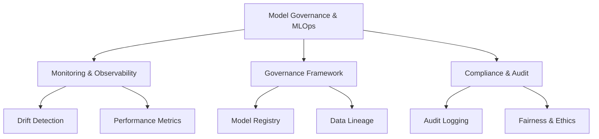

# Model Governance & MLOps (30% of Exam)

Master model monitoring, drift detection, governance frameworks, and compliance for production ML systems.

## Topics Overview

## Section Contents

| File | Topic | Priority |
| :--- | :--- | :--- |
| [01-model-monitoring-observability.md](01-model-monitoring-observability.md) | Performance tracking, data/model drift, metrics | High |
| [02-drift-detection-remediation.md](02-drift-detection-remediation.md) | Drift types, detection strategies, responses | High |
| [03-governance-frameworks.md](03-governance-frameworks.md) | Model governance, APIs, registry, versioning | High |
| [04-compliance-audit-logging.md](04-compliance-audit-logging.md) | Audit trails, compliance frameworks, fairness | High |

## Key Concepts

- **Model Drift**: Performance degradation due to data distribution changes
- **Data Drift**: Changes in input feature distributions
- **Prediction Drift**: Changes in model output distributions
- **Governance**: Process for managing model lifecycle and compliance
- **Audit Trail**: Complete record of model changes and access
- **Fairness**: Ensuring models don't discriminate based on protected attributes

## Related Resources

- [MLflow Basics](../../../shared/fundamentals/mlflow-basics.md)
- [Delta Lake Basics](../../../shared/fundamentals/delta-lake-basics.md)
- [Unity Catalog Quick Ref](../../../shared/cheat-sheets/unity-catalog-quick-ref.md)

## Next Steps

Complete practice questions and mock exams to solidify your knowledge.

---

**[← Back to Certification](../README.md)**
