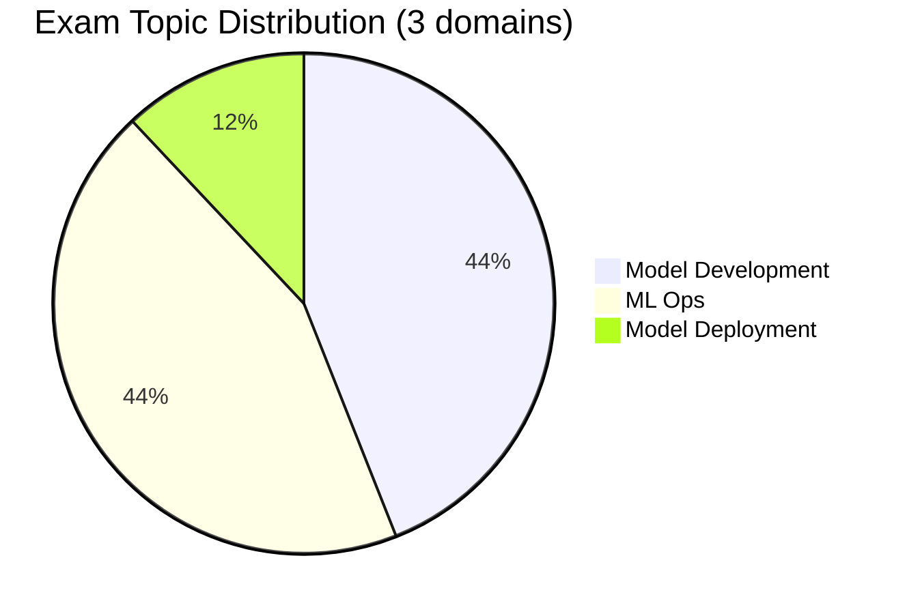

# Databricks Machine Learning Professional

> [!important]
> **What changed in the September 2025 exam guide**
>
> - Consolidated to **3 domains** (was 4): Model Development 44 %, ML Ops 44 %, Model Deployment 12 %
> - "Solution & Data Monitoring" responsibilities now sit inside **ML Ops** (44 %)
> - **Model Development** weighted equally at 44 % — advanced feature engineering, hyperparameter tuning, SparkML pipelines, distributed training
> - Pass / fail — **the September 2025 exam guide does not publish a numeric passing score**
>
> The official source of truth: [Databricks Certified Machine Learning Professional](https://www.databricks.com/learn/certification/machine-learning-professional). The folder structure in this guide now matches the official 3-domain blueprint 1 : 1.

## Exam Overview

| Detail              | Information                                        |
| ------------------- | -------------------------------------------------- |
| **Certification**   | Databricks Certified Machine Learning Professional |
| **Exam guide**      | September 2025                                     |
| **Scored questions**| 59 multiple-choice                                 |
| **Duration**        | 120 minutes                                        |
| **Result**          | Pass / fail (no numeric threshold in the September 2025 exam guide) |
| **Languages**       | English                                            |
| **Code in stems**   | Python                                             |
| **Experience**      | 1+ years building enterprise-scale ML on Databricks (recommended) |
| **Recertification** | Every 2 years — see [Renewal Guide](../../shared/appendix/renewal-guide.md) |
| **Cost**            | $200 USD                                           |
| **Delivery**        | Online proctored or test center                    |

## Exam Domain Weights (official — September 2025)

## Study Topics

| Section | Weight | Focus |
| :--- | :---: | :--- |
| [01 — Model Development](./01-model-development/README.md) | 44 % | Advanced feature engineering, Feature Store, hyperparameter tuning |
| [02 — ML Ops](./02-ml-ops/README.md) | 44 % | Registry, lifecycle orchestration, monitoring, drift, governance, compliance |
| [03 — Model Deployment](./03-model-deployment/README.md) | 12 % | Mosaic AI Model Serving, A/B testing, canary deploys |

### Practice & Resources

| Resource                                                        | Description                              |
| --------------------------------------------------------------- | ---------------------------------------- |
| [Practice Questions](./resources/practice-questions/README.md)  | Topic-specific practice questions        |
| [Mock Exam 1](./resources/mock-exam/README.md)                  | Full-length practice exam                |
| [Mock Exam 2](./resources/mock-exam-2/README.md)                | Alternative practice exam                |
| [Exam Tips](./resources/exam-tips.md)                           | Exam strategies and tips                 |
| [Official Links](./resources/official-links.md)                 | Documentation and resources              |

## Interview Preparation

After completing this certification, explore:

- [Interview Prep Resource](../../shared/interview-prep/README.md) - Advanced ML systems design, governance, and production architecture

## Prerequisites

- Complete [ML Associate](../ml-associate/README.md) certification first
- Review shared fundamentals:
  - [Spark Fundamentals](../../shared/fundamentals/spark-fundamentals.md)
  - [MLflow Basics](../../shared/fundamentals/mlflow-basics.md)

## Study Progress Tracker

- [ ] Domain 01 — Model Development (advanced feature eng + hyperparameter tuning)
- [ ] Domain 02 — ML Ops (registry, monitoring, drift, governance)
- [ ] Domain 03 — Model Deployment (Model Serving, A/B, canary)
- [ ] Run Hands-on Lab 04 (MLflow + Model Registry in UC)

## Official Resources

- [Databricks Certification Page](https://www.databricks.com/learn/certification/machine-learning-professional)
- [Databricks ML Documentation](https://docs.databricks.com/machine-learning/)
