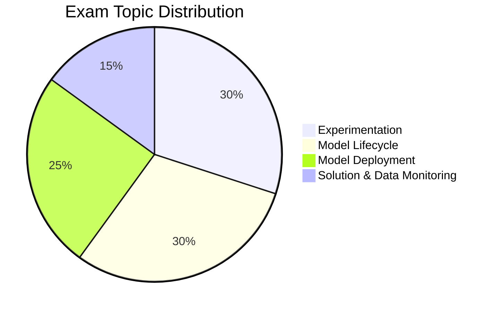

# Databricks Machine Learning Professional

## Exam Overview

| Detail             | Information                                        |
| ------------------ | -------------------------------------------------- |
| **Certification**  | Databricks Certified Machine Learning Professional |
| **Questions**      | ~60 multiple-choice                                |
| **Duration**       | 120 minutes                                        |
| **Passing Score**  | 70%                                                |
| **Languages**      | Python                                             |
| **Experience**     | 1+ years with Databricks ML                        |
| **Recertification**| Every 2 years                                      |
| **Cost**           | $200 USD                                           |

## Exam Domain Weights

## Study Topics

### Core Topics (By Exam Weight)

| Section                                                                | Weight | Topics                                          |
| ---------------------------------------------------------------------- | ------ | ----------------------------------------------- |
| [01-Advanced Feature Engineering](01-advanced-feature-engineering/README.md) | 20%    | Feature store, optimization, ML operations      |
| [02-Hyperparameter Optimization](02-hyperparameter-optimization/README.md) | 20%    | Tuning strategies, AutoML, optimization         |
| [03-Model Production Lifecycle](03-model-production-lifecycle/README.md)   | 30%    | MLflow, registry, versioning, serving           |
| [04-Model Governance & MLOps](04-model-governance-mlops/README.md)        | 30%    | Monitoring, governance, drift detection, logging |

### Practice & Resources

| Resource                                                | Description                              |
| ------------------------------------------------------- | ---------------------------------------- |
| [Practice Questions](resources/practice-questions/README.md)    | Topic-specific practice questions        |
| [Mock Exam 1](resources/mock-exam/README.md)                    | Full-length practice exam                |
| [Mock Exam 2](resources/mock-exam-2/README.md)                  | Alternative practice exam                |
| [Exam Tips](resources/exam-tips.md)                    | Exam strategies and tips                 |
| [Official Links](resources/official-links.md)          | Documentation and resources              |

## Interview Preparation

After completing this certification, explore:

- [Interview Prep Resource](../../shared/interview-prep/README.md) - Advanced ML systems design, governance, and production architecture

## Prerequisites

- Complete [ML Associate](../ml-associate/README.md) certification first
- Review shared fundamentals:
  - [Spark Fundamentals](../../shared/fundamentals/spark-fundamentals.md)
  - [MLflow Basics](../../shared/fundamentals/mlflow-basics.md)

## Study Progress Tracker

- [ ] Advanced feature engineering
- [ ] MLOps best practices
- [ ] Model deployment patterns
- [ ] Monitoring and drift detection
- [ ] Production ML systems

## Official Resources

- [Databricks Certification Page](https://www.databricks.com/learn/certification/machine-learning-professional)
- [Databricks ML Documentation](https://docs.databricks.com/machine-learning/)
