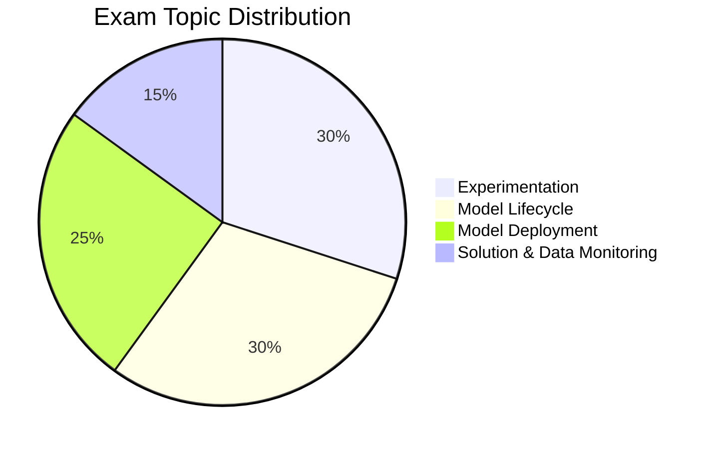

---
tags:
  - databricks
  - certification
  - machine-learning
aliases:
  - ML Professional
---

# Databricks Machine Learning Professional

## Exam Overview

| Detail            | Information                                        |
| ----------------- | -------------------------------------------------- |
| **Certification** | Databricks Certified Machine Learning Professional |
| **Questions**     | ~60 multiple-choice                                |
| **Duration**      | 120 minutes                                        |
| **Passing Score** | 70%                                                |
| **Languages**     | Python                                             |
| **Experience**    | 1+ years with Databricks ML                        |
| **Recertification**| Every 2 years                                      |
| **Cost**          | $200 USD                                           |

## Exam Domain Weights

## Study Topics

| Section          | Weight | Topics                                             |
| ---------------- | ------ | -------------------------------------------------- |
| Experimentation  | 30%    | Feature engineering, AutoML, hyperparameter tuning |
| Model Lifecycle  | 30%    | MLflow, model registry, versioning                 |
| Model Deployment | 25%    | Model serving, batch inference, real-time          |
| Monitoring       | 15%    | Drift detection, performance monitoring            |

## Prerequisites

- Complete [ML Associate](../ml-associate/README.md) certification first
- Review shared fundamentals:
  - [Spark Fundamentals](../../shared/fundamentals/spark-fundamentals.md)

## Study Progress Tracker

- [ ] Advanced feature engineering
- [ ] MLOps best practices
- [ ] Model deployment patterns
- [ ] Monitoring and drift detection
- [ ] Production ML systems

## Official Resources

- [Databricks Certification Page](https://www.databricks.com/learn/certification/machine-learning-professional)
- [Databricks ML Documentation](https://docs.databricks.com/machine-learning/)
