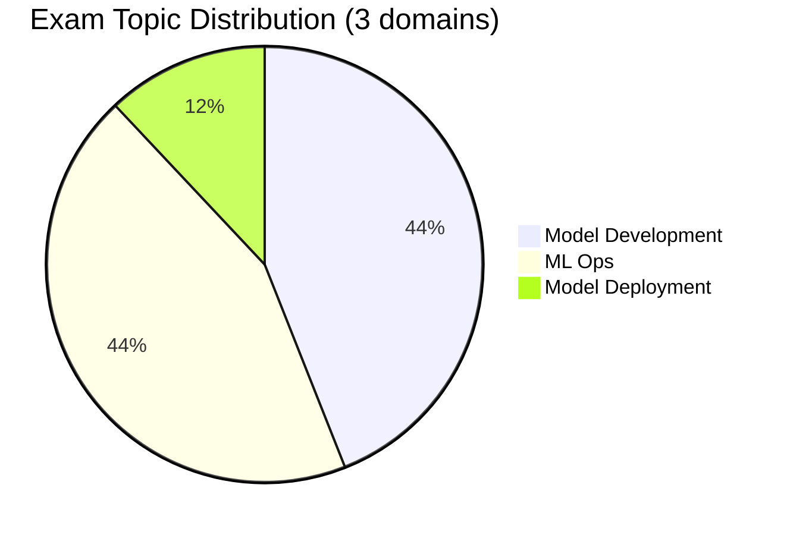

# Databricks Machine Learning Professional

> [!important]
> **What changed in the September 2025 exam guide**
>
> - Consolidated to **3 domains** (was 4): Model Development, ML Ops, Model Deployment
> - "Solution & Data Monitoring" responsibilities now sit inside **ML Ops** (44 %)
> - **Model Development** weighted equally at 44 % — advanced feature engineering, hyperparameter tuning, SparkML pipelines, distributed training
> - Pass / fail — **Databricks no longer publishes a numeric passing score**
>
> The official source of truth: [Databricks Certified Machine Learning Professional](https://www.databricks.com/learn/certification/machine-learning-professional). Topic folders in this guide track the prior 4-domain structure; reorganisation is on the [guide roadmap](../../README.md#roadmap-for-the-guide-itself).

## Exam Overview

| Detail              | Information                                        |
| ------------------- | -------------------------------------------------- |
| **Certification**   | Databricks Certified Machine Learning Professional |
| **Exam guide**      | September 2025                                     |
| **Scored questions**| 59 multiple-choice                                 |
| **Duration**        | 120 minutes                                        |
| **Result**          | Pass / fail (no published threshold)               |
| **Languages**       | English                                            |
| **Code in stems**   | Python                                             |
| **Experience**      | 1+ years building enterprise-scale ML on Databricks (recommended) |
| **Recertification** | Every 2 years                                      |
| **Cost**            | $200 USD                                           |
| **Delivery**        | Online proctored or test center                    |

## Exam Domain Weights (official — September 2025)

| Domain | Weight |
| :--- | :---: |
| Model Development | 44 % |
| ML Ops | 44 % |
| Model Deployment | 12 % |

## Study Topics

The guide's existing topic folders predate the September 2025 consolidation. The table below cross-references which folder covers which official domain.

### Topic folders in this guide

| Section                                                                | Covers (official domains) |
| ---------------------------------------------------------------------- | ------------------------- |
| [01-Advanced Feature Engineering](01-advanced-feature-engineering/README.md) | Model Development (feature engineering, Feature Store) |
| [02-Hyperparameter Optimization](02-hyperparameter-optimization/README.md)   | Model Development (tuning, AutoML, optimization) |
| [03-Model Production Lifecycle](03-model-production-lifecycle/README.md)     | ML Ops (MLflow registry, versioning) · Model Deployment (Model Serving) |
| [04-Model Governance & MLOps](04-model-governance-mlops/README.md)           | ML Ops (monitoring, governance, drift detection, logging) |

### Practice & Resources

| Resource                                                        | Description                              |
| --------------------------------------------------------------- | ---------------------------------------- |
| [Practice Questions](resources/practice-questions/README.md)    | Topic-specific practice questions        |
| [Mock Exam 1](resources/mock-exam/README.md)                    | Full-length practice exam                |
| [Mock Exam 2](resources/mock-exam-2/README.md)                  | Alternative practice exam                |
| [Exam Tips](resources/exam-tips.md)                             | Exam strategies and tips                 |
| [Official Links](resources/official-links.md)                   | Documentation and resources              |

## Interview Preparation

After completing this certification, explore:

- [Interview Prep Resource](../../shared/interview-prep/README.md) - Advanced ML systems design, governance, and production architecture

## Prerequisites

- Complete [ML Associate](../ml-associate/README.md) certification first
- Review shared fundamentals:
  - [Spark Fundamentals](../../shared/fundamentals/spark-fundamentals.md)
  - [MLflow Basics](../../shared/fundamentals/mlflow-basics.md)

## Study Progress Tracker

- [ ] Advanced feature engineering and Feature Store at scale
- [ ] Distributed training with SparkML
- [ ] MLOps best practices (CI/CD for models, automated retraining)
- [ ] Model deployment patterns (batch, streaming, real-time serving)
- [ ] Monitoring and drift detection
- [ ] Production ML systems and governance with Unity Catalog

## Official Resources

- [Databricks Certification Page](https://www.databricks.com/learn/certification/machine-learning-professional)
- [Databricks ML Documentation](https://docs.databricks.com/machine-learning/)
