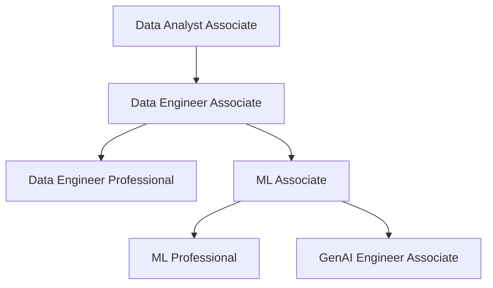

# Learning Paths

This directory contains recommended learning paths for progressing through Databricks certifications.

## Available Paths

| Path                                         | Description                             |
| -------------------------------------------- | --------------------------------------- |
| [Master Roadmap](master-roadmap.md)             | Visual progression across all 6 certs   |
| [Data Engineer Path](data-engineer-path.md)     | Associate → Professional progression    |
| [ML Engineer Path](ml-engineer-path.md)         | ML Associate → Professional progression |
| [Data Analyst Path](data-analyst-path.md)       | Data Analyst Associate preparation      |
| [GenAI Engineer Path](genai-path.md)            | GenAI Engineer Associate preparation    |

## Certification Overview

## Recommended Order

### For Data Engineers

1. **Data Engineer Associate** - Foundation
2. **Data Engineer Professional** - Advanced

### For Data Analysts

1. **Data Analyst Associate** - SQL and dashboards focus

### For ML Engineers

1. **ML Associate** - Foundation
2. **ML Professional** - Advanced MLOps

### For GenAI Engineers

1. **GenAI Engineer Associate** - LLMs and RAG

## Shared Knowledge

Many certifications share common concepts. Review the [shared fundamentals](../shared/fundamentals/README.md) before starting any certification path.
