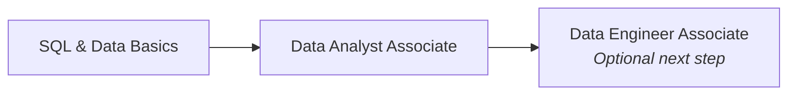

---
tags:
  - databricks
  - learning-path
  - data-analyst
aliases:
  - Data Analyst Learning Path
---

# Data Analyst Learning Path

A recommended progression for preparing for the Databricks Certified Data Analyst Associate exam.

## Path Overview



## Prerequisites

Before starting, you should have:

- Intermediate SQL knowledge (JOINs, GROUP BY, window functions, subqueries)
- Experience with spreadsheets or BI tools (Excel, Tableau, Power BI)
- Basic understanding of databases and data warehousing concepts
- Familiarity with charting and data visualization principles

## Phase 1: Shared Fundamentals

| Topic | Priority | Link |
| :--- | :--- | :--- |
| Platform Architecture | High | [Platform Architecture](../shared/fundamentals/platform-architecture.md) |
| Databricks Workspace | High | [Databricks Workspace](../shared/fundamentals/databricks-workspace.md) |
| SQL Essentials | High | [SQL Essentials](../shared/fundamentals/sql-essentials.md) |
| Delta Lake Basics | Medium | [Delta Lake Basics](../shared/fundamentals/delta-lake-basics.md) |
| Unity Catalog Basics | Medium | [Unity Catalog Basics](../shared/fundamentals/unity-catalog-basics.md) |

## Phase 2: Exam Domain Preparation

The Data Analyst Associate exam covers these domains:

| Domain | Weight | Key Topics |
| :--- | :--- | :--- |
| Databricks SQL | ~25% | SQL warehouses, query editor, history |
| Data Visualization | ~20% | Chart types, dashboards, query-based visuals |
| Dashboard Building | ~20% | Dashboard layout, refresh schedules, alerts |
| Data Management | ~15% | Delta tables, schemas, Unity Catalog |
| SQL in the Lakehouse | ~20% | Advanced SQL, window functions, performance |

### Databricks SQL

Key concepts:

- SQL Warehouses — serverless vs classic, sizing, auto-stop
- Query editor — saving, scheduling, parameterization
- Query history and performance debugging
- SQL endpoints vs compute clusters

### Data Visualization

- Chart types and when to use them:
  - Bar/column charts — comparisons, categories
  - Line charts — trends over time
  - Scatter plots — correlations
  - Maps — geographic data
  - Pie/donut — proportions (use sparingly)
- Counter and pivot table visualizations
- Formatting, colors, and accessibility

### Dashboard Building

```text
Dashboard
├── Text widgets (markdown descriptions)
├── Visualization widgets (linked to queries)
│   ├── Auto-refresh settings
│   └── Parameters and filters
└── Alerts (threshold-based notifications)
```

Key skills:

- Create parameterized queries with `{{parameter_name}}` syntax
- Set dashboard auto-refresh schedules
- Configure query-based alerts with email/Slack notifications
- Publish and share dashboards with appropriate permissions

### SQL in the Lakehouse

```sql
-- Window functions (frequently tested)
SELECT
    user_id,
    sale_date,
    amount,
    SUM(amount) OVER (
        PARTITION BY user_id
        ORDER BY sale_date
        ROWS BETWEEN UNBOUNDED PRECEDING AND CURRENT ROW
    ) AS running_total,
    RANK() OVER (PARTITION BY region ORDER BY amount DESC) AS rank_in_region
FROM sales;

-- CTEs for readable queries
WITH monthly_totals AS (
    SELECT
        DATE_TRUNC('month', sale_date) AS month,
        region,
        SUM(amount) AS total
    FROM sales
    GROUP BY 1, 2
)
SELECT month, region, total,
       total / SUM(total) OVER (PARTITION BY month) AS share_of_month
FROM monthly_totals;
```

## Phase 3: Practice and Exam Preparation

### Recommended Study Activities

1. **Hands-on Databricks SQL** — Build at least 3 dashboards from scratch using real datasets
2. **SQL practice** — Focus on window functions, CTEs, and multi-table joins
3. **Warehouse configuration** — Understand auto-stop, scaling, and T-shirt sizing
4. **Alert setup** — Create threshold alerts from query results

### Quick Reference

| Cheat Sheet | Topic |
| :--- | :--- |
| [SQL Functions](../shared/cheat-sheets/sql-functions.md) | String, date, aggregation functions |
| [Delta Lake Commands](../shared/cheat-sheets/delta-lake-commands.md) | Table operations |
| [Unity Catalog Quick Reference](../shared/cheat-sheets/unity-catalog-quick-ref.md) | Permissions and grants |

## Key Numbers to Remember

| Setting | Value | Notes |
| :--- | :--- | :--- |
| SQL Warehouse auto-stop | 10 min default | Configurable per warehouse |
| Max dashboard refresh | 1 second | Minimum auto-refresh interval |
| Default query cache TTL | 15 minutes | Configurable per query |
| Serverless warehouse startup | ~5 seconds | vs ~2-3 minutes for classic |

## Exam Tips

1. **SQL Warehouse vs Cluster** — Databricks SQL uses SQL Warehouses (optimized for BI), not general-purpose clusters
2. **Serverless vs Classic** — Serverless starts faster and scales automatically; classic requires upfront cluster config
3. **Alert thresholds** — Alerts are based on query result values (e.g., "row count > 0" or "metric > threshold")
4. **Parameters syntax** — `{{param_name}}` in queries, rendered as dropdowns or text inputs in dashboards
5. **Sharing dashboards** — Use "Manage Permissions" to control view/edit access; link sharing has limited controls
6. **Result cache** — Databricks SQL caches query results; understand when cache is invalidated (data change, TTL)
7. **Chart best practices** — Bar for categories, line for time series, scatter for correlation — expect exam scenarios testing chart type selection

## Related Topics

- [Data Analyst Associate Certification](../certifications/data-analyst-associate/README.md)
- [SQL Essentials](../shared/fundamentals/sql-essentials.md)
- [SQL Functions Cheat Sheet](../shared/cheat-sheets/sql-functions.md)
- [Data Engineer Path](./data-engineer-path.md)
