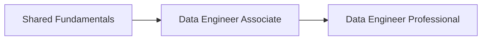

---
tags:
  - databricks
  - learning-path
  - data-engineer
aliases:
  - DE Learning Path
---

# Data Engineer Learning Path

A recommended progression from Data Engineer Associate to Data Engineer Professional.

## Path Overview

## Prerequisites

Before starting, you should have:

- Basic SQL knowledge (SELECT, JOIN, GROUP BY, subqueries)
- Familiarity with Python or Scala
- Understanding of cloud storage concepts (S3, ADLS, GCS)
- Basic data pipeline concepts (ETL vs ELT)

## Phase 1: Shared Fundamentals

Start with the core concepts that apply across both certifications.

| Topic | Priority | Link |
| ----- | -------- | ---- |
| Platform Architecture | High | [Platform Architecture](../shared/fundamentals/platform-architecture.md) |
| Databricks Workspace | High | [Databricks Workspace](../shared/fundamentals/databricks-workspace.md) |
| Delta Lake Basics | High | [Delta Lake Basics](../shared/fundamentals/delta-lake-basics.md) |
| Spark Fundamentals | High | [Spark Fundamentals](../shared/fundamentals/spark-fundamentals.md) |
| Medallion Architecture | High | [Medallion Architecture](../shared/fundamentals/medallion-architecture.md) |
| Unity Catalog Basics | Medium | [Unity Catalog Basics](../shared/fundamentals/unity-catalog-basics.md) |
| SQL Essentials | Medium | [SQL Essentials](../shared/fundamentals/sql-essentials.md) |

## Phase 2: Data Engineer Associate

Focus areas based on exam weight:

| Domain | Weight | Key Topics |
| ------ | ------ | ---------- |
| Databricks Lakehouse Platform | 24% | Architecture, Delta Lake, multi-hop |
| ELT with Spark SQL and Python | 29% | Transformations, joins, SQL queries |
| Incremental Data Processing | 16% | Structured Streaming, Auto Loader |
| Production Pipelines | 11% | DLT, jobs, task orchestration |
| Data Governance | 20% | Unity Catalog, access control |

See the full study guide: [Data Engineer Associate](../certifications/data-engineer-associate/README.md)

### Recommended Cheat Sheets

- [Delta Lake Commands](../shared/cheat-sheets/delta-lake-commands.md)
- [SQL Functions](../shared/cheat-sheets/sql-functions.md)
- [Unity Catalog Quick Reference](../shared/cheat-sheets/unity-catalog-quick-ref.md)

## Phase 3: Data Engineer Professional

After passing the Associate exam, advance to Professional topics:

| Domain | Weight | Key Topics |
| ------ | ------ | ---------- |
| Data Processing | 30% | Advanced ETL, CDC, streaming, deduplication |
| Databricks Tooling | 20% | CLI, REST API, compute management |
| Data Modeling | 15% | SCD patterns, partitioning strategies |
| Security & Governance | 10% | Advanced Unity Catalog, data sharing |
| Monitoring & Logging | 10% | System tables, Spark UI debugging |
| Testing & Deployment | 10% | Asset Bundles, CI/CD, Git integration |

See the full study guide: [Data Engineer Professional](../certifications/data-engineer-professional/README.md)

### Additional Resources

- [Practice Questions](../certifications/data-engineer-professional/resources/practice-questions/README.md)
- [Mock Exam](../certifications/data-engineer-professional/resources/mock-exam/README.md)
- [Exam Tips](../certifications/data-engineer-professional/resources/exam-tips.md)
- [Official Links](../certifications/data-engineer-professional/resources/official-links.md)

## Study Tips

1. **Hands-on practice** - Use the Databricks Community Edition for free clusters
2. **Focus on Delta Lake** - It appears heavily in both exams
3. **Understand "why"** - The Professional exam tests decision-making, not just syntax
4. **Review error messages** - See [Common Errors](../shared/appendix/error-messages.md)
5. **Use cheat sheets** for final review before exam day

## Official Resources

- [Databricks Certifications](https://www.databricks.com/learn/certification)
- [Databricks Academy](https://www.databricks.com/learn/training)
- [Exam Registration](https://www.databricks.com/learn/certification)
