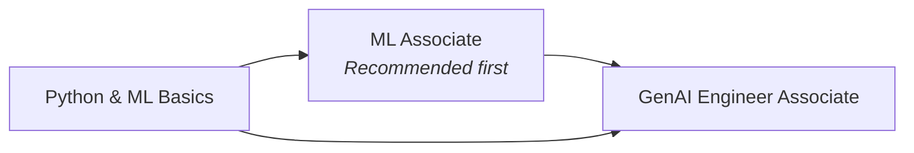
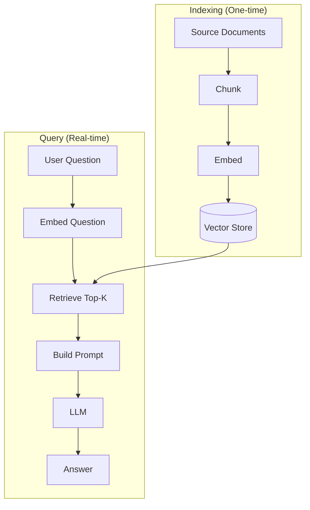

---
tags:
  - databricks
  - learning-path
  - generative-ai
  - genai-engineer
aliases:
  - GenAI Learning Path
---

# GenAI Engineer Learning Path

A recommended progression for preparing for the Databricks Certified Generative AI Engineer Associate exam.

## Path Overview



## Prerequisites

Before starting, you should have:

- Intermediate Python skills (functions, classes, list comprehensions, error handling)
- Familiarity with REST APIs and JSON data
- Basic understanding of machine learning concepts (training, inference, embeddings)
- Some exposure to LLMs (ChatGPT, Claude, or similar)

## Phase 1: Shared Fundamentals

| Topic | Priority | Link |
| :--- | :--- | :--- |
| Platform Architecture | High | [Platform Architecture](../shared/fundamentals/platform-architecture.md) |
| RAG & Vector Search Basics | High | [RAG & Vector Search Basics](../shared/fundamentals/rag-vector-search-basics.md) |
| MLflow Basics | High | [MLflow Basics](../shared/fundamentals/mlflow-basics.md) |
| Python Essentials | High | [Python Essentials](../shared/fundamentals/python-essentials.md) |
| Unity Catalog Basics | Medium | [Unity Catalog Basics](../shared/fundamentals/unity-catalog-basics.md) |

## Phase 2: Exam Domain Preparation

The GenAI Engineer Associate exam covers these domains:

| Domain | Weight | Key Topics |
| :--- | :--- | :--- |
| Design Applications | ~30% | RAG architecture, chunking, prompt design |
| Data Preparation | ~20% | Vector Search indexing, embedding models |
| Application Development | ~30% | Databricks SDK, Model Serving, chains |
| Responsible AI | ~10% | Bias, safety, evaluation, governance |
| Deployment & Monitoring | ~10% | CI/CD for AI, drift, feedback loops |

### RAG Architecture

The core GenAI exam pattern is building RAG (Retrieval-Augmented Generation) applications:



Key decisions in RAG design:

- **Chunking strategy** — Fixed-size (512-1024 tokens), sentence, recursive, or document-aware
- **Overlap** — 10-20% overlap between chunks preserves context at boundaries
- **Embedding model** — Must be the same model for indexing AND querying
- **Retrieval** — Top-K similarity search, optionally with metadata filters

### Databricks Vector Search

```python
from databricks.vector_search.client import VectorSearchClient

client = VectorSearchClient()

# Create Delta Sync index (auto-syncs from Delta table)
client.create_delta_sync_index(
    endpoint_name="my-vs-endpoint",
    index_name="prod_catalog.ml.docs_index",
    source_table_name="prod_catalog.ml.docs_chunked",
    primary_key="chunk_id",
    embedding_source_column="chunk_text",
    embedding_model_endpoint_name="databricks-gte-large-en"
)

# Query
results = client.get_index(
    endpoint_name="my-vs-endpoint",
    index_name="prod_catalog.ml.docs_index"
).similarity_search(
    query_text="How do I use Auto Loader?",
    columns=["chunk_text", "source_url"],
    num_results=5
)
```

### Foundation Models on Databricks

Databricks provides hosted foundation models via Model Serving endpoints:

| Model Family | Use Case |
| :--- | :--- |
| `databricks-meta-llama-3-1-70b-instruct` | Chat, Q&A, summarization |
| `databricks-meta-llama-3-1-405b-instruct` | Complex reasoning |
| `databricks-gte-large-en` | Text embeddings |
| `databricks-bge-large-en` | Text embeddings (alternative) |
| `databricks-mixtral-8x7b-instruct` | Cost-efficient chat |

```python
import mlflow.deployments

client = mlflow.deployments.get_deploy_client("databricks")

response = client.predict(
    endpoint="databricks-meta-llama-3-1-70b-instruct",
    inputs={
        "messages": [
            {"role": "system", "content": "You are a helpful assistant."},
            {"role": "user", "content": "Explain Delta Lake in 2 sentences."}
        ],
        "max_tokens": 200,
        "temperature": 0.1
    }
)
answer = response["choices"][0]["message"]["content"]
```

### Model Serving

Databricks Model Serving deploys MLflow-logged models — including LangChain chains and custom
`pyfunc` wrappers — as scalable REST endpoints.

```python
import mlflow.pyfunc


class RAGModel(mlflow.pyfunc.PythonModel):
    def load_context(self, context):
        self.chain = mlflow.langchain.load_model(context.artifacts["chain_path"])

    def predict(self, context, model_input):
        question = model_input["question"].iloc[0]
        return self.chain({"query": question})["result"]


with mlflow.start_run():
    mlflow.pyfunc.log_model(
        artifact_path="rag_pyfunc",
        python_model=RAGModel(),
        artifacts={"chain_path": "./rag_chain"},
        registered_model_name="prod_catalog.ml.rag_pyfunc"
    )
```

Key concepts:

- **Serverless endpoints** — auto-scale to zero; best for variable or unpredictable traffic
- **Provisioned throughput** — dedicated GPU capacity; best for consistent high-traffic production
- **Inference tables** — auto-log every request/response to a Delta table for auditing and monitoring
- **OpenAI-compatible API** — all served models expose a `/invocations` endpoint using the OpenAI message format

### LangChain with Databricks

```python
from langchain_community.chat_models import ChatDatabricks
from langchain_community.vectorstores import DatabricksVectorSearch
from langchain.chains import RetrievalQA

# LLM
llm = ChatDatabricks(
    endpoint="databricks-meta-llama-3-1-70b-instruct",
    max_tokens=500
)

# Vector store retriever
vs_index = DatabricksVectorSearch(
    endpoint="my-vs-endpoint",
    index_name="prod_catalog.ml.docs_index",
    columns=["chunk_text"]
)
retriever = vs_index.as_retriever(search_kwargs={"k": 4})

# RAG chain
rag_chain = RetrievalQA.from_chain_type(
    llm=llm,
    chain_type="stuff",
    retriever=retriever,
    return_source_documents=True
)
```

### Prompt Engineering

Key prompt patterns:

```python
# System + user message structure
messages = [
    {
        "role": "system",
        "content": "You are an expert Databricks engineer. Answer only based on the provided context. If unsure, say 'I don't know'."
    },
    {
        "role": "user",
        "content": f"""Context:
{retrieved_context}

Question: {user_question}

Answer:"""
    }
]
```

Best practices:

- Be specific in system prompts about persona and constraints
- Include "If unsure, say 'I don't know'" to reduce hallucination
- Use temperature 0–0.2 for factual/consistent answers; 0.7–1.0 for creative tasks
- Provide few-shot examples for complex output formatting

### Responsible AI

| Risk | Mitigation |
| :--- | :--- |
| Hallucination | Ground responses in retrieved context (RAG); evaluate faithfulness |
| Bias | Diverse training data; evaluate across demographic groups |
| Prompt injection | Validate and sanitize user inputs; use guardrails |
| Data leakage | Isolate sensitive data; use Unity Catalog permissions |
| Model drift | Monitor output quality; set up feedback loops |

## Phase 3: Deployment and Monitoring

### Logging an LLM App with MLflow

```python
import mlflow

mlflow.set_experiment("/GenAI/rag-chatbot")

with mlflow.start_run():
    # Log config
    mlflow.log_params({
        "llm_endpoint": "databricks-llama-3-70b",
        "embedding_model": "databricks-gte-large-en",
        "chunk_size": 512,
        "top_k": 5
    })

    # Log evaluation metrics
    mlflow.log_metrics({
        "faithfulness": 0.91,
        "answer_relevance": 0.87,
        "context_recall": 0.84
    })

    # Log the chain as a model
    mlflow.langchain.log_model(rag_chain, "rag_chain",
                               registered_model_name="prod_catalog.ml.rag_chatbot")
```

### Evaluation with MLflow

```python
import mlflow

eval_data = spark.table("prod_catalog.eval.rag_test_set").toPandas()

results = mlflow.evaluate(
    model=rag_chain,
    data=eval_data,
    targets="ground_truth",
    model_type="question-answering",
    extra_metrics=[mlflow.metrics.genai.faithfulness()]
)
```

### CI/CD and Monitoring for AI Apps

Deploy and maintain AI apps using standard Databricks DevOps patterns:

- **Databricks Asset Bundles** — version-control serving endpoint configs; deploy with `databricks bundle deploy`
- **Inference tables** — enable on a serving endpoint to auto-log every request and response to a Delta table
- **Feedback loops** — collect user ratings, store in Delta, use as signal for prompt tuning or retrieval re-ranking
- **Drift detection** — monitor output distributions (answer length, topic distribution) over time; alert when metrics degrade

```python
from databricks.sdk import WorkspaceClient

w = WorkspaceClient()
w.serving_endpoints.patch(
    name="my-rag-endpoint",
    inference_table_config={
        "enabled": True,
        "catalog_name": "prod_catalog",
        "schema_name": "ml",
        "table_name_prefix": "rag_inference"
    }
)
```

### Recommended Study Activities

1. Build an end-to-end RAG app: chunk documents → embed → index with Databricks Vector Search → query with LangChain
2. Evaluate your RAG app with `mlflow.evaluate()` using `mlflow.metrics.genai.faithfulness()`
3. Deploy a custom chain to a Model Serving endpoint and query it via REST API
4. Practice prompt engineering: write system prompts, add few-shot examples, tune `temperature`

### Quick Reference

| Cheat Sheet | Topics |
| :--- | :--- |
| [MLflow Quick Reference](../shared/cheat-sheets/mlflow-quick-ref.md) | Tracking, model registry, inference APIs |
| [PySpark API Quick Reference](../shared/cheat-sheets/pyspark-api-quick-ref.md) | DataFrame operations for data prep |
| [RAG & Vector Search Basics](../shared/fundamentals/rag-vector-search-basics.md) | Embeddings, chunking, similarity metrics |

## Key Numbers to Remember

| Setting | Value | Notes |
| :--- | :--- | :--- |
| Recommended chunk size | 512–1024 tokens | With 10-20% overlap |
| Vector Search index types | 2 | Delta Sync, Direct Vector Access |
| Default top-K retrieval | 3–5 chunks | More = richer context, slower |
| Temperature for factual Q&A | 0.0–0.2 | Lower = more deterministic |
| Foundation model name format | `databricks-<model-name>` | e.g., `databricks-gte-large-en` |

## Exam Tips

1. **RAG vs fine-tuning** — RAG = retrieval at inference time (no retraining); fine-tuning = train model weights (expensive, for behavior/style)
2. **Same embedding model** — Must use the same embedding model for indexing and querying; mixing models breaks semantic search
3. **Delta Sync index** — Automatically syncs from Delta table; Direct Vector Access requires manual updates via API
4. **Chunking tradeoffs** — Too small = lost context; too large = reduced precision in retrieval
5. **Faithfulness metric** — Measures whether the answer is grounded in the retrieved context (not just whether it sounds right)
6. **Guardrails** — Use input validation and output filtering to prevent prompt injection and harmful outputs
7. **MLflow for LLM apps** — Use `mlflow.langchain.log_model()` to log chains; evaluate with `mlflow.evaluate()`

## Related Topics

- [GenAI Engineer Associate Certification](../certifications/genai-engineer-associate/README.md)
- [RAG & Vector Search Basics](../shared/fundamentals/rag-vector-search-basics.md)
- [MLflow Basics](../shared/fundamentals/mlflow-basics.md)
- [ML Engineer Path](./ml-engineer-path.md)
- [Python Essentials](../shared/fundamentals/python-essentials.md)
