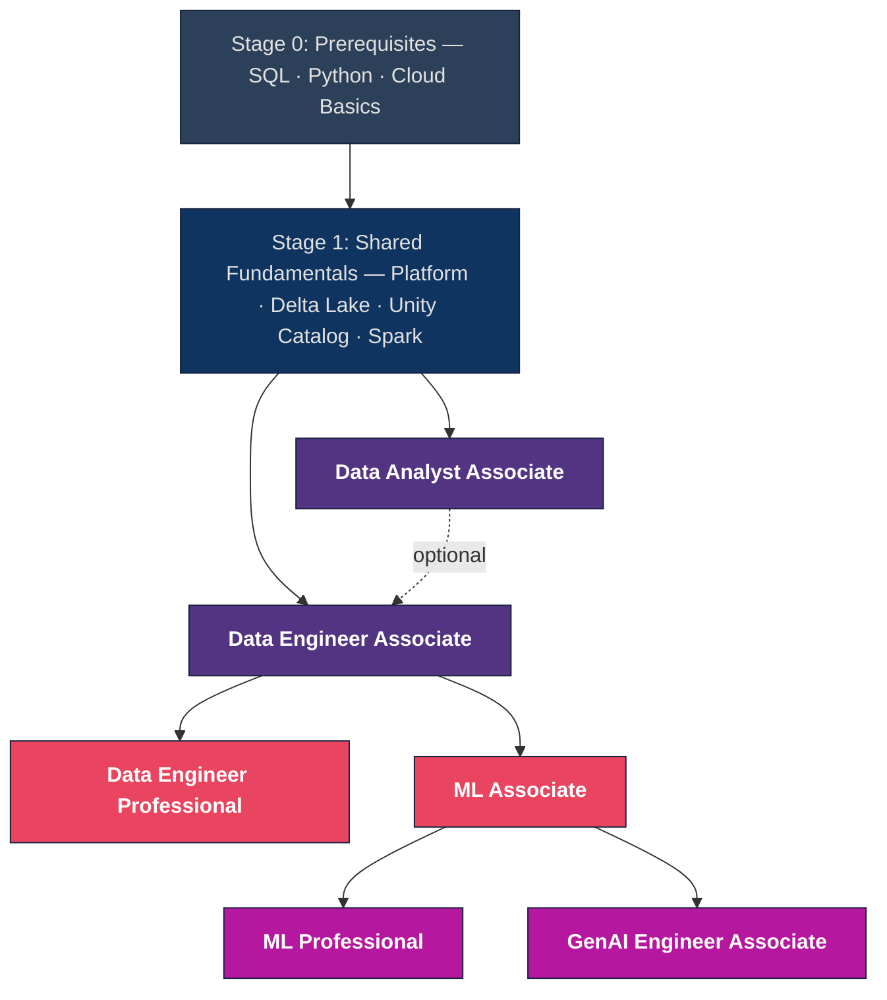

# Master Certification Roadmap

A step-by-step visual guide through all 6 Databricks certifications — from prerequisites to advanced specializations.

## How to Use This Roadmap

- **Follow top-to-bottom** — each stage builds on the previous one
- **Pick your track** — you don't need all 6 certs; use the decision table below to choose your path
- **Check the boxes** — each topic links to study materials; work through them in order

## Certification Progression

## Certification Quick Reference

| Certification | Level | Questions | Duration | Pass | Language | Prerequisites |
|:---|:---|:---:|:---:|:---:|:---|:---|
| Data Analyst Associate | Associate | 45 | 90 min | 70% | SQL | SQL basics |
| Data Engineer Associate | Associate | 45 | 90 min | 70% | Python, SQL | SQL + Python basics |
| Data Engineer Professional | Professional | 60 | 120 min | 70% | Python, SQL | DE Associate recommended |
| ML Associate | Associate | 45 | 90 min | 70% | Python | Python + stats basics |
| ML Professional | Professional | 60 | 120 min | 70% | Python | ML Associate recommended |
| GenAI Engineer Associate | Associate | 45 | 90 min | 70% | Python | Python + ML basics |

## Which Path Should I Choose?

| If you are... | Start with | Then |
|:---|:---|:---|
| A SQL analyst / BI user | Data Analyst Associate | Optionally Data Engineer Associate |
| A data engineer (most common) | Data Engineer Associate | Data Engineer Professional |
| An ML engineer | Data Engineer Associate or ML Associate | ML Professional |
| Building LLM / RAG apps | ML Associate (recommended) | GenAI Engineer Associate |
| New to Databricks entirely | Data Engineer Associate | Choose your specialization |

---

## Stage 0: Prerequisites

Skills you need before starting any Databricks certification path.

| Skill | Needed For | You're Ready When... | Learn Here |
|:---|:---|:---|:---|
| SQL (SELECT, JOIN, GROUP BY, subqueries, window functions) | All certs | You can write a multi-table JOIN with GROUP BY from memory | [SQL Essentials](../shared/fundamentals/sql-essentials.md) · [SQLBolt](https://sqlbolt.com/) · [Mode SQL Tutorial](https://mode.com/sql-tutorial) |
| Python (functions, classes, list comprehensions, error handling) | DE, ML, GenAI | You can write a decorator or context manager | [Python Essentials](../shared/fundamentals/python-essentials.md) · [Python Essentials 2](../shared/fundamentals/python-essentials-2.md) · [Real Python](https://realpython.com/) |
| Cloud storage concepts (S3, ADLS, GCS) | DE certs | You understand object storage vs. block storage | [Platform Architecture](../shared/fundamentals/platform-architecture.md) · [AWS S3 Docs](https://docs.aws.amazon.com/s3/) |
| Statistics basics (mean, variance, distributions) | ML, GenAI | You can explain the bias-variance tradeoff | [Khan Academy Statistics](https://www.khanacademy.org/math/statistics-probability) · [StatQuest YouTube](https://www.youtube.com/@statquest) |
| ETL vs. ELT concepts | DE certs | You know when to transform before vs. after loading | [Medallion Architecture](../shared/fundamentals/medallion-architecture.md) · [Delta Lake Basics](../shared/fundamentals/delta-lake-basics.md) |

---

## Stage 1: Shared Fundamentals

Review these before starting any certification. Check off topics as you complete them.

### Universal (All Certifications)

| # | Topic | Link | Used By |
|:---:|:---|:---|:---|
| 1 | Platform Architecture | [platform-architecture.md](../shared/fundamentals/platform-architecture.md) | All |
| 2 | Databricks Workspace | [databricks-workspace.md](../shared/fundamentals/databricks-workspace.md) | All |
| 3 | Unity Catalog Basics | [unity-catalog-basics.md](../shared/fundamentals/unity-catalog-basics.md) | All |

### DE / DA Track Fundamentals

| # | Topic | Link | Used By |
|:---:|:---|:---|:---|
| 4 | Delta Lake Basics | [delta-lake-basics.md](../shared/fundamentals/delta-lake-basics.md) | DEA, DEP, DAA |
| 5 | Spark Fundamentals | [spark-fundamentals.md](../shared/fundamentals/spark-fundamentals.md) | DEA, DEP, MLA |
| 6 | SQL Essentials | [sql-essentials.md](../shared/fundamentals/sql-essentials.md) | DAA, DEA |
| 7 | Medallion Architecture | [medallion-architecture.md](../shared/fundamentals/medallion-architecture.md) | DEA, DEP |
| 8 | Streaming Fundamentals | [streaming-fundamentals.md](../shared/fundamentals/streaming-fundamentals.md) | DEA, DEP |
| 9 | Open Table Formats | [open-table-formats.md](../shared/fundamentals/open-table-formats.md) | DEA, DEP |
| 10 | Python Essentials (Part 1) | [python-essentials.md](../shared/fundamentals/python-essentials.md) | DEA, DEP, MLA, GenAI |
| 11 | Python Essentials (Part 2) | [python-essentials-2.md](../shared/fundamentals/python-essentials-2.md) | DEA, DEP, MLA, GenAI |

### ML / GenAI Track Fundamentals

| # | Topic | Link | Used By |
|:---:|:---|:---|:---|
| 12 | MLflow Basics | [mlflow-basics.md](../shared/fundamentals/mlflow-basics.md) | MLA, MLP, GenAI |
| 13 | Feature Engineering Basics | [feature-engineering-basics.md](../shared/fundamentals/feature-engineering-basics.md) | MLA, MLP |
| 14 | RAG & Vector Search Basics | [rag-vector-search-basics.md](../shared/fundamentals/rag-vector-search-basics.md) | GenAI |

---

## Stage 2: Entry Certifications

Choose one (or both) based on your path.

### Data Engineer Associate

[Full Study Guide](../certifications/data-engineer-associate/README.md) | [Exam Tips](../certifications/data-engineer-associate/resources/exam-tips.md)

**Study order (highest exam weight first):**

| Order | Domain (Weight) | Study Materials |
|:---:|:---|:---|
| 1 | ELT with Spark SQL & Python (29%) | [02-etl-spark-sql](../certifications/data-engineer-associate/02-etl-spark-sql/README.md) |
| 2 | Lakehouse Platform (24%) | [01-lakehouse-platform](../certifications/data-engineer-associate/01-lakehouse-platform/README.md) |
| 3 | Incremental Data Processing (22%) | [03-delta-lake](../certifications/data-engineer-associate/03-delta-lake/README.md) |
| 4 | Production Pipelines (16%) | [04-workflows-orchestration](../certifications/data-engineer-associate/04-workflows-orchestration/README.md) |
| 5 | Data Governance (9%) | [05-data-governance](../certifications/data-engineer-associate/05-data-governance/README.md) |

**Practice & Review:**

- [Practice Questions](../certifications/data-engineer-associate/resources/practice-questions/README.md)
- [Mock Exam 1](../certifications/data-engineer-associate/resources/mock-exam/README.md) | [Mock Exam 2](../certifications/data-engineer-associate/resources/mock-exam-2/README.md)

### Data Analyst Associate

[Full Study Guide](../certifications/data-analyst-associate/README.md) | [Exam Tips](../certifications/data-analyst-associate/resources/exam-tips.md)

**Study order (highest exam weight first):**

| Order | Domain (Weight) | Study Materials |
|:---:|:---|:---|
| 1 | Databricks SQL (~25%) | [01-databricks-sql](../certifications/data-analyst-associate/01-databricks-sql/README.md) |
| 2 | Data Visualization (~20%) | [04-dashboards-visualization](../certifications/data-analyst-associate/04-dashboards-visualization/README.md) |
| 3 | SQL in the Lakehouse (~20%) | [03-sql-queries](../certifications/data-analyst-associate/03-sql-queries/README.md) |
| 4 | Dashboard Building (~20%) | [04-dashboards-visualization](../certifications/data-analyst-associate/04-dashboards-visualization/README.md) |
| 5 | Data Management (~15%) | [02-data-management](../certifications/data-analyst-associate/02-data-management/README.md) |

**Practice & Review:**

- [Practice Questions](../certifications/data-analyst-associate/resources/practice-questions/README.md)
- [Mock Exam 1](../certifications/data-analyst-associate/resources/mock-exam/README.md) | [Mock Exam 2](../certifications/data-analyst-associate/resources/mock-exam-2/README.md)

---

## Stage 3: Specialization

After completing an entry certification, choose your specialization.

### Data Engineer Professional

[Full Study Guide](../certifications/data-engineer-professional/README.md) | [Exam Tips](../certifications/data-engineer-professional/resources/exam-tips.md) | Prereq: DE Associate

**Study order (highest exam weight first):**

| Order | Domain (Weight) | Study Materials |
|:---:|:---|:---|
| 1 | Data Processing (30%) | [01-data-processing](../certifications/data-engineer-professional/01-data-processing/README.md) |
| 2 | Databricks Tooling (20%) | [02-databricks-tooling](../certifications/data-engineer-professional/02-databricks-tooling/README.md) |
| 3 | Data Modeling (15%) | [03-data-modeling](../certifications/data-engineer-professional/03-data-modeling/README.md) |
| 4 | Security & Governance (10%) | [04-security-governance](../certifications/data-engineer-professional/04-security-governance/README.md) |
| 5 | Monitoring & Logging (10%) | [05-monitoring-logging](../certifications/data-engineer-professional/05-monitoring-logging/README.md) |
| 6 | Testing & Deployment (10%) | [06-testing-deployment](../certifications/data-engineer-professional/06-testing-deployment/README.md) |
| 7 | Lakeflow Pipelines | [07-lakeflow-pipelines](../certifications/data-engineer-professional/07-lakeflow-pipelines/README.md) |
| 8 | Performance Optimization | [08-performance-optimization](../certifications/data-engineer-professional/08-performance-optimization/README.md) |

**Practice & Review:**

- [Practice Questions](../certifications/data-engineer-professional/resources/practice-questions/README.md)
- [Mock Exam 1](../certifications/data-engineer-professional/resources/mock-exam/README.md) | [Mock Exam 2](../certifications/data-engineer-professional/resources/mock-exam-2/README.md)
- [Cheat Sheets](../certifications/data-engineer-professional/resources/cheat-sheets/README.md)

### ML Associate

[Full Study Guide](../certifications/ml-associate/README.md) | [Exam Tips](../certifications/ml-associate/resources/exam-tips.md) | Prereq: Python + stats

**Study order (highest exam weight first):**

| Order | Domain (Weight) | Study Materials |
|:---:|:---|:---|
| 1 | Feature Engineering / Spark ML (33%) | [03-feature-engineering](../certifications/ml-associate/03-feature-engineering/README.md) |
| 2 | Databricks ML (29%) | [01-databricks-ml](../certifications/ml-associate/01-databricks-ml/README.md) |
| 3 | ML Workflows (29%) | [02-ml-workflows](../certifications/ml-associate/02-ml-workflows/README.md) |
| 4 | MLflow Deployment (9%) | [04-mlflow-deployment](../certifications/ml-associate/04-mlflow-deployment/README.md) |

**Practice & Review:**

- [Practice Questions](../certifications/ml-associate/resources/practice-questions/README.md)
- [Mock Exam 1](../certifications/ml-associate/resources/mock-exam/README.md) | [Mock Exam 2](../certifications/ml-associate/resources/mock-exam-2/README.md)

---

## Stage 4: Advanced Certifications

Choose based on your career direction after Stage 3.

### ML Professional

[Full Study Guide](../certifications/ml-professional/README.md) | [Exam Tips](../certifications/ml-professional/resources/exam-tips.md) | Prereq: ML Associate

**Study order (highest exam weight first):**

| Order | Domain (Weight) | Study Materials |
|:---:|:---|:---|
| 1 | Deployment (35%) | [03-model-production-lifecycle](../certifications/ml-professional/03-model-production-lifecycle/README.md) |
| 2 | Monitoring (25%) | [04-model-governance-mlops](../certifications/ml-professional/04-model-governance-mlops/README.md) |
| 3 | Solution Design (20%) | [01-advanced-feature-engineering](../certifications/ml-professional/01-advanced-feature-engineering/README.md) |
| 4 | Experimentation (20%) | [02-hyperparameter-optimization](../certifications/ml-professional/02-hyperparameter-optimization/README.md) |

**Practice & Review:**

- [Practice Questions](../certifications/ml-professional/resources/practice-questions/README.md)
- [Mock Exam 1](../certifications/ml-professional/resources/mock-exam/README.md) | [Mock Exam 2](../certifications/ml-professional/resources/mock-exam-2/README.md)

### GenAI Engineer Associate

[Full Study Guide](../certifications/genai-engineer-associate/README.md) | [Exam Tips](../certifications/genai-engineer-associate/resources/exam-tips.md) | Prereq: Python + ML basics

**Study order (highest exam weight first):**

| Order | Domain (Weight) | Study Materials |
|:---:|:---|:---|
| 1 | Build RAG Solutions (40%) | [01-rag-architecture](../certifications/genai-engineer-associate/01-rag-architecture/README.md) |
| 2 | Design RAG Solutions (30%) | [02-vector-search-embeddings](../certifications/genai-engineer-associate/02-vector-search-embeddings/README.md) |
| 3 | Evaluate & Govern (15%) | [03-llm-application-development](../certifications/genai-engineer-associate/03-llm-application-development/README.md) |
| 4 | Assemble & Deploy (15%) | [04-databricks-genai-tools](../certifications/genai-engineer-associate/04-databricks-genai-tools/README.md) |

**Practice & Review:**

- [Practice Questions](../certifications/genai-engineer-associate/resources/practice-questions/README.md)
- [Mock Exam 1](../certifications/genai-engineer-associate/resources/mock-exam/README.md) | [Mock Exam 2](../certifications/genai-engineer-associate/resources/mock-exam-2/README.md)

---

## Quick Reference & Review Materials

### Cheat Sheets

| Cheat Sheet | Best For |
|:---|:---|
| [Delta Lake Commands](../shared/cheat-sheets/delta-lake-commands.md) | DEA, DEP |
| [SQL Functions](../shared/cheat-sheets/sql-functions.md) | DAA, DEA |
| [Unity Catalog Quick Ref](../shared/cheat-sheets/unity-catalog-quick-ref.md) | All |
| [PySpark API Quick Ref](../shared/cheat-sheets/pyspark-api-quick-ref.md) | DEA, DEP, MLA |
| [Spark Configurations](../shared/cheat-sheets/spark-configurations.md) | DEP |
| [DLT / Lakeflow Quick Ref](../shared/cheat-sheets/dlt-quick-ref.md) | DEP |
| [Auto Loader Quick Ref](../shared/cheat-sheets/auto-loader-quick-ref.md) | DEA, DEP |
| [Streaming Quick Ref](../shared/cheat-sheets/streaming-quick-ref.md) | DEP |
| [MLflow Quick Ref](../shared/cheat-sheets/mlflow-quick-ref.md) | MLA, MLP, GenAI |
| [Performance Optimization](../shared/cheat-sheets/performance-optimization.md) | DEP |
| [DESCRIBE & SHOW Commands](../shared/cheat-sheets/describe-show-commands.md) | DEA, DEP |

### Code Examples

| Example Set | Link |
|:---|:---|
| Python: Delta Lake Operations | [delta_lake_operations.md](../shared/code-examples/python/delta_lake_operations.md) |
| Python: Streaming | [streaming_examples.md](../shared/code-examples/python/streaming_examples.md) |
| Python: CDC & Deduplication | [cdc_and_deduplication.md](../shared/code-examples/python/cdc_and_deduplication.md) |
| Python: Feature Store & Vector Search | [feature_store_and_vector_search.md](../shared/code-examples/python/feature_store_and_vector_search.md) |
| Python: Patterns | [python_patterns.md](../shared/code-examples/python/python_patterns.md) |
| Python: Unity Catalog Setup | [unity_catalog_setup.md](../shared/code-examples/python/unity_catalog_setup.md) |
| SQL: Delta Lake Operations | [delta_lake_operations.md](../shared/code-examples/sql/delta_lake_operations.md) |
| SQL: Window Functions | [window_functions.md](../shared/code-examples/sql/window_functions.md) |
| SQL: CTE Patterns | [cte_patterns.md](../shared/code-examples/sql/cte_patterns.md) |
| SQL: CDC Merge Patterns | [cdc_merge_patterns.md](../shared/code-examples/sql/cdc_merge_patterns.md) |

### Deep Review

| Resource | Link |
|:---|:---|
| Interview Prep | [interview-prep](../shared/interview-prep/README.md) |
| Glossary | [glossary.md](../shared/appendix/glossary.md) |
| Comparison Tables | [comparison-tables.md](../shared/appendix/comparison-tables.md) |
| Error Messages | [error-messages.md](../shared/appendix/error-messages.md) |
| Performance Troubleshooting | [performance-troubleshooting.md](../shared/appendix/performance-troubleshooting.md) |

---

**[← Back to Learning Paths](./README.md) | [↑ Repository Home](../README.md)**
