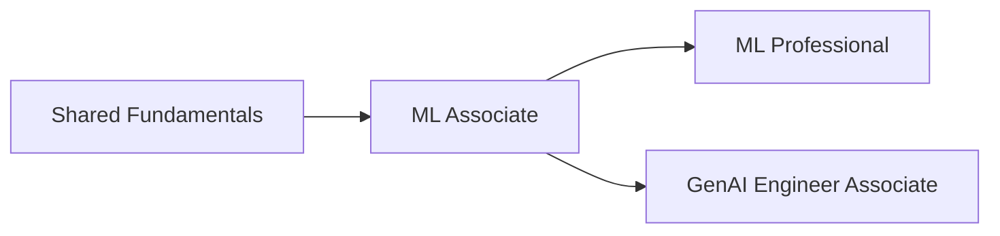

---
tags:
  - databricks
  - learning-path
  - machine-learning
aliases:
  - ML Learning Path
---

# ML Engineer Learning Path

A recommended progression from ML Associate through ML Professional, with an optional GenAI Engineer branch.

## Path Overview

## Prerequisites

Before starting, you should have:

- Python proficiency (functions, classes, libraries)
- Statistics and linear algebra basics
- Understanding of supervised and unsupervised learning concepts
- Familiarity with pandas and scikit-learn
- Basic SQL knowledge

## Phase 1: Shared Fundamentals

Start with the core platform concepts relevant to ML workloads.

| Topic | Priority | Link |
| ----- | -------- | ---- |
| Platform Architecture | High | [Platform Architecture](../shared/fundamentals/platform-architecture.md) |
| Databricks Workspace | High | [Databricks Workspace](../shared/fundamentals/databricks-workspace.md) |
| Spark Fundamentals | High | [Spark Fundamentals](../shared/fundamentals/spark-fundamentals.md) |
| Delta Lake Basics | Medium | [Delta Lake Basics](../shared/fundamentals/delta-lake-basics.md) |
| Unity Catalog Basics | Medium | [Unity Catalog Basics](../shared/fundamentals/unity-catalog-basics.md) |

## Phase 2: ML Associate

Focus areas based on exam weight:

| Domain | Weight | Key Topics |
| ------ | ------ | ---------- |
| Databricks ML | 29% | ML Runtime, AutoML, Feature Store |
| ML Workflows | 29% | Data prep, feature engineering, model training |
| MLflow | 22% | Experiment tracking, model registry, model serving |
| Scalable ML | 20% | Distributed training, hyperparameter tuning, Spark ML |

See the full study guide: [ML Associate](../certifications/ml-associate/README.md)

### Key Concepts

- MLflow experiment tracking and model logging
- Feature Store for feature management and reuse
- Hyperparameter tuning with Hyperopt
- Spark ML pipelines (Transformers, Estimators)
- AutoML for baseline model creation

## Phase 3: Choose Your Path

After ML Associate, you can pursue either or both certifications:

### Option A: ML Professional

For deeper MLOps and production ML expertise.

| Domain | Weight | Key Topics |
| ------ | ------ | ---------- |
| Deployment | 35% | Model serving, A/B testing, batch inference |
| Monitoring | 25% | Drift detection, model performance tracking |
| Solution Design | 20% | Architecture patterns, scalability |
| Experimentation | 20% | Advanced experiment design, feature engineering |

See the full study guide: [ML Professional](../certifications/ml-professional/README.md)

### Option B: GenAI Engineer Associate

For LLM application development and RAG architectures.

| Domain | Weight | Key Topics |
| ------ | ------ | ---------- |
| Design RAG Applications | 30% | Chunking, embedding, retrieval strategies |
| Build Data Pipelines | 24% | Vector search, data preparation |
| Build Multi-Stage Reasoning | 18% | Prompt chaining, agents, tool use |
| Assemble and Deploy | 16% | Model serving, endpoint management |
| Governance | 12% | Safety, responsible AI, guardrails |

See the full study guide: [GenAI Engineer Associate](../certifications/genai-engineer-associate/README.md)

### Key Technologies

- Databricks Vector Search
- Foundation Model APIs
- LangChain integration
- Model Serving endpoints

## Study Tips

1. **Use notebooks** - Databricks notebooks are ideal for ML experimentation
2. **Learn MLflow thoroughly** - It is central to both ML certifications
3. **Practice with real data** - Use Databricks sample datasets
4. **Understand trade-offs** - Professional exams test architecture decisions
5. **Review glossary** - See [Glossary](../shared/appendix/glossary.md)

## Related Paths

- [Data Engineer Path](data-engineer-path.md) - Recommended if you need stronger data engineering fundamentals

## Official Resources

- [Databricks Certifications](https://www.databricks.com/learn/certification)
- [Databricks Academy](https://www.databricks.com/learn/training)
- [MLflow Documentation](https://mlflow.org/docs/latest/index.html)
