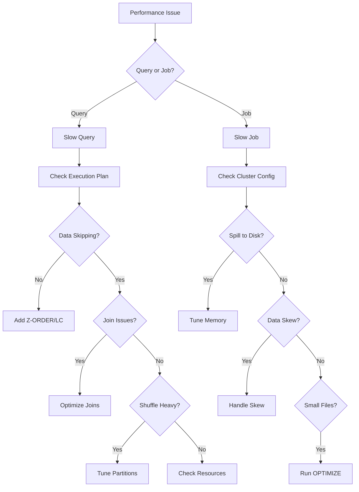

# Performance Troubleshooting Guide

A diagnostic guide for identifying and resolving common Databricks performance issues.

## Troubleshooting Flowchart



## Slow Queries

### Symptom: Query Takes Minutes Instead of Seconds

**Diagnostic Steps:**

```sql
-- Step 1: Check execution plan
EXPLAIN EXTENDED
SELECT * FROM my_table WHERE col = 'value';

-- Look for:
-- - Full table scans (Scan parquet)
-- - Missing partition pruning
-- - Large shuffles
```

**Common Causes and Solutions:**

| Cause | Indicator | Solution |
| ----- | --------- | -------- |
| No data skipping | Full scan in plan | Add Z-ORDER on filter columns |
| Missing partitioning | Scans all partitions | Add partition predicate |
| Wrong join strategy | BroadcastNestedLoop | Force broadcast or increase threshold |
| Too many files | High task count | Run OPTIMIZE |

### Check Data Skipping Effectiveness

```sql
-- Verify file statistics
DESCRIBE DETAIL my_table;

-- Check if data skipping works
-- Run query and check Spark UI for "files pruned" metric

-- Add Z-ORDER if not present
OPTIMIZE my_table ZORDER BY (frequently_filtered_column);
```

## High Shuffle Spill

### Symptom: Spill to Disk in Spark UI

**Diagnostic Steps:**

```python
# Check current memory settings
print(spark.conf.get("spark.executor.memory"))
print(spark.conf.get("spark.memory.fraction"))

# Check shuffle partition count vs data size
df.rdd.getNumPartitions()
```

**Solutions:**

```python
# Solution 1: Increase partitions to reduce per-partition size
spark.conf.set("spark.sql.shuffle.partitions", 500)

# Solution 2: Increase memory fraction for execution
spark.conf.set("spark.memory.fraction", "0.8")

# Solution 3: Use larger cluster instance type
# (Configure at cluster level)
```

### Spill Tuning Reference

| Data Size | Recommended Partitions | Executor Memory |
| --------- | ---------------------- | --------------- |
| < 10 GB | 50-100 | 4 GB |
| 10-100 GB | 200-500 | 8-16 GB |
| 100 GB - 1 TB | 500-2000 | 16-32 GB |
| > 1 TB | 2000-10000 | 32+ GB |

## Small File Problem

### Symptom: Thousands of Tiny Files

**Diagnostic Steps:**

```sql
-- Check file count and sizes
DESCRIBE DETAIL my_table;

-- Look for:
-- numFiles: High number (>1000 for small table)
-- sizeInBytes: Compare with numFiles
-- Average file size = sizeInBytes / numFiles
```

**Solutions:**

```sql
-- Solution 1: Run OPTIMIZE
OPTIMIZE my_table;

-- Solution 2: Enable auto-optimize for writes
ALTER TABLE my_table
SET TBLPROPERTIES (
    'delta.autoOptimize.optimizeWrite' = 'true',
    'delta.autoOptimize.autoCompact' = 'true'
);

-- Solution 3: Schedule regular OPTIMIZE
-- Create job to run: OPTIMIZE my_table WHERE date >= current_date() - 7
```

### File Size Guidelines

| Current State | Action |
| ------------- | ------ |
| Avg < 32 MB | OPTIMIZE immediately |
| Avg 32-128 MB | Schedule OPTIMIZE |
| Avg 128 MB - 1 GB | Good for streaming |
| Avg ~1 GB | Optimal for batch |
| Avg > 2 GB | Consider partitioning |

## Skewed Joins

### Symptom: Most Tasks Fast, Few Tasks Very Slow

**Diagnostic Steps:**

```python
# Check for skew in join key
df.groupBy("join_key").count().orderBy(desc("count")).show(20)

# Check task durations in Spark UI
# Look for tasks taking 10x+ longer than median
```

**Solutions:**

```python
# Solution 1: Enable AQE skew handling (usually already on)
spark.conf.set("spark.sql.adaptive.enabled", "true")
spark.conf.set("spark.sql.adaptive.skewJoin.enabled", "true")

# Solution 2: Lower skew detection threshold
spark.conf.set(
    "spark.sql.adaptive.skewJoin.skewedPartitionThresholdInBytes",
    "128MB"
)

# Solution 3: Manual salting for extreme skew
from pyspark.sql.functions import concat, lit, rand

# Add salt to skewed table
df_salted = df.withColumn("join_key_salted",
    concat(col("join_key"), lit("_"), (rand() * 10).cast("int"))
)
```

### Skew Detection Quick Check

```sql
-- Find skewed keys
SELECT
    join_column,
    COUNT(*) as cnt,
    COUNT(*) * 100.0 / SUM(COUNT(*)) OVER () as pct
FROM my_table
GROUP BY join_column
ORDER BY cnt DESC
LIMIT 20;

-- If top key has >10% of data, consider salting
```

## Out of Memory (OOM) Errors

### Symptom: Executor or Driver OOM

**Diagnostic Steps:**

```python
# Check what's consuming memory
# In Spark UI: Executors tab > Memory usage

# Common causes:
# Broadcast too large
# Collect() on large dataset
# State in streaming
# Too few partitions
```

**Solutions:**

```python
# Solution 1: Disable broadcast for large tables
spark.conf.set("spark.sql.autoBroadcastJoinThreshold", "-1")

# Solution 2: Increase partitions
spark.conf.set("spark.sql.shuffle.partitions", 1000)

# Solution 3: Avoid collect() on large data
# Bad:
large_list = df.collect()  # OOM!

# Good:
df.write.format("delta").save(output_path)

# Solution 4: Use disk-based operations
spark.conf.set("spark.memory.fraction", "0.4")  # More spill room
```

### OOM Prevention Checklist

- [ ] Avoid `collect()` on large DataFrames
- [ ] Set broadcast threshold appropriately
- [ ] Use iterator-based processing for large datasets
- [ ] Monitor driver memory for aggregations
- [ ] Check state size for streaming queries

## Slow Cluster Startup

### Symptom: Cluster Takes Minutes to Start

**Diagnostic Steps:**

- Check cluster event logs
- Verify instance availability in cloud region
- Check for spot instance interruptions

**Solutions:**

| Solution | Startup Improvement |
| -------- | ------------------- |
| Instance Pools | 30-60 seconds |
| Smaller initial cluster | Faster scaling |
| On-demand vs Spot | More reliable start |
| Pre-warmed pools | Near-instant |

```python
# Use instance pool in cluster config
# pools provide pre-allocated instances

# Or use serverless for instant start
spark.conf.set("spark.databricks.cluster.profile", "serverless")
```

## Query Plan Analysis

### Reading EXPLAIN Output

```sql
EXPLAIN EXTENDED SELECT * FROM orders o
JOIN customers c ON o.customer_id = c.id
WHERE o.order_date > '2024-01-01';
```

**Key Things to Look For:**

| Plan Element | Good Sign | Bad Sign |
| ------------ | --------- | -------- |
| Scan | `PushedFilters`, `PartitionFilters` | No filters pushed |
| Join | `BroadcastHashJoin` (small table) | `BroadcastNestedLoopJoin` |
| Shuffle | `AQEShuffleRead coalesced` | Many shuffle exchanges |
| Files | `DataFilters` present | Full table scan |

### Using Query Profile

```sql
-- In Databricks SQL, use Query Profile
-- Shows: Time per operation, rows processed, spill metrics

-- For notebooks, use Spark UI
-- Jobs > Stages > Tasks > Event Timeline
```

## System Tables for Diagnostics

### Query History Analysis

```sql
-- Find slow queries
SELECT
    statement_text,
    total_duration_ms,
    rows_produced,
    bytes_read
FROM system.query.history
WHERE start_time > current_timestamp() - INTERVAL 1 DAY
    AND total_duration_ms > 60000  -- > 1 minute
ORDER BY total_duration_ms DESC
LIMIT 20;
```

### Cluster Utilization

```sql
-- Check cluster usage patterns
SELECT
    cluster_id,
    AVG(cpu_utilization) as avg_cpu,
    AVG(memory_utilization) as avg_memory,
    COUNT(*) as sample_count
FROM system.compute.cluster_metrics
WHERE timestamp > current_timestamp() - INTERVAL 7 DAY
GROUP BY cluster_id;
```

## Quick Reference: First Steps

| Symptom | First Diagnostic | Quick Fix |
| ------- | ---------------- | --------- |
| Slow query | `EXPLAIN EXTENDED` | Add Z-ORDER |
| High spill | Spark UI > Stages | Increase partitions |
| Small files | `DESCRIBE DETAIL` | Run OPTIMIZE |
| Skewed join | Group by join key | Enable AQE skew handling |
| OOM | Check broadcast size | Disable broadcast |
| Slow startup | Event logs | Use instance pool |
| Streaming lag | Query progress | Increase trigger interval |

## Diagnostic Commands Summary

```sql
-- Table health
DESCRIBE DETAIL table_name;
DESCRIBE HISTORY table_name;

-- Query analysis
EXPLAIN EXTENDED <query>;
EXPLAIN COST <query>;

-- File statistics
SELECT * FROM table_name._delta_log;
```

```python
# Runtime diagnostics
spark.conf.get("spark.sql.shuffle.partitions")
df.rdd.getNumPartitions()
df.explain(mode="extended")

# Streaming diagnostics
query.lastProgress
query.status
```
