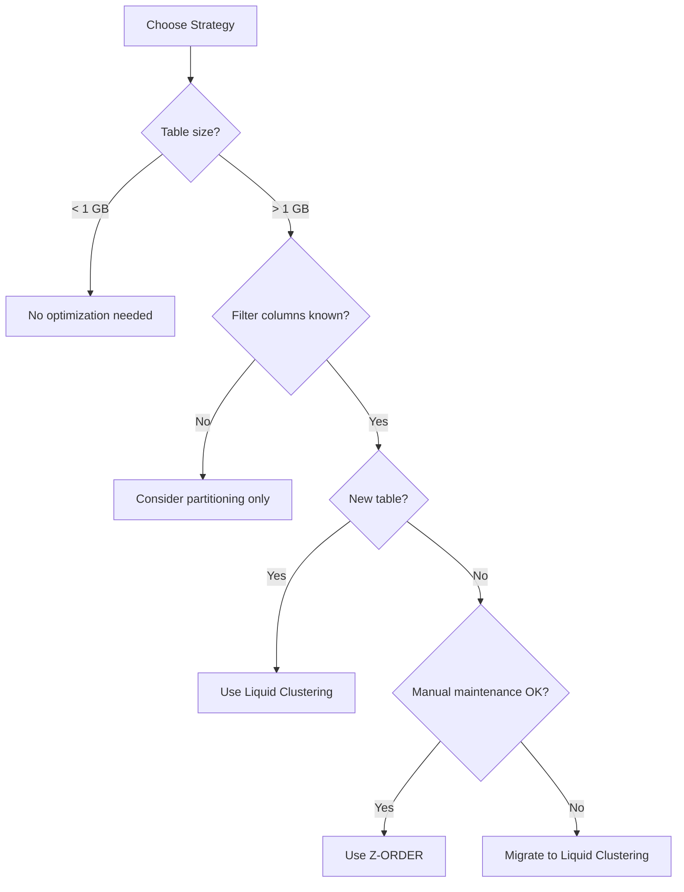

# Performance Optimization Cheat Sheet

Quick reference for Databricks performance tuning decisions and configurations.

## Target File Sizes

| Workload | Target Size | Configuration |
| -------- | ----------- | ------------- |
| General batch | 1 GB | Default OPTIMIZE |
| Streaming | 128 MB | `spark.databricks.delta.optimizeWrite.fileSize` |
| Highly filtered queries | 32-128 MB | Manual tuning |
| Small tables (< 1 GB) | Don't OPTIMIZE | Leave as-is |

## Z-ORDER vs Liquid Clustering vs Partitioning



### Decision Table

| Scenario | Recommendation |
| -------- | -------------- |
| New table, multiple filter columns | Liquid Clustering |
| Existing table, infrequent queries | Z-ORDER with scheduled OPTIMIZE |
| Single low-cardinality filter column | Partitioning |
| Time-series with date filters | Partition by date + Z-ORDER other columns |
| Ad-hoc query patterns | Liquid Clustering (auto-adapts) |

## Key Spark Configurations

### Must-Know Defaults

| Configuration | Default | When to Change |
| ------------- | ------- | -------------- |
| `spark.sql.shuffle.partitions` | 200 | Small data: 8-50, Large data: 500-2000 |
| `spark.sql.adaptive.enabled` | true | Never disable |
| `spark.sql.autoBroadcastJoinThreshold` | 10 MB | Increase for small dimension tables |
| `spark.databricks.delta.optimizeWrite.enabled` | true | Keep enabled |
| `spark.databricks.delta.autoCompact.enabled` | false | Enable for streaming |

### Quick Tuning by Data Size

```python
# Small data (< 1 GB)
spark.conf.set("spark.sql.shuffle.partitions", 8)

# Medium data (1-100 GB)
spark.conf.set("spark.sql.shuffle.partitions", 200)  # default

# Large data (> 100 GB)
spark.conf.set("spark.sql.shuffle.partitions", 2000)
spark.conf.set("spark.sql.autoBroadcastJoinThreshold", "-1")
```

## OPTIMIZE / VACUUM Guidelines

### OPTIMIZE Frequency

| Write Pattern | OPTIMIZE Frequency |
| ------------- | ------------------ |
| Batch (daily) | After each batch |
| Streaming (continuous) | Every 1-4 hours (or use auto-compact) |
| Streaming (micro-batch) | Every 6-24 hours |
| Infrequent writes | Weekly or before heavy reads |

### VACUUM Retention

| Scenario | Minimum Retention |
| -------- | ----------------- |
| Default (safe) | 168 hours (7 days) |
| Active time travel needs | 720 hours (30 days) |
| Aggressive cleanup | 24 hours (requires safety check disabled) |
| Compliance requirements | Check data retention policy |

```sql
-- Standard VACUUM
VACUUM table_name RETAIN 168 HOURS;

-- Preview what will be deleted
VACUUM table_name DRY RUN;

-- Check table file metrics
DESCRIBE DETAIL table_name;
```

## Join Optimization Quick Reference

| Join Type | When to Use | Trigger |
| --------- | ----------- | ------- |
| Broadcast Hash | Small table (< 10 MB) joins large | Automatic or `broadcast()` hint |
| Sort Merge | Both tables large, sorted | Default for large joins |
| Shuffle Hash | Medium tables, no sorting needed | AQE may choose |

```python
# Force broadcast
from pyspark.sql.functions import broadcast
result = large_df.join(broadcast(small_df), "key")
```

## Cost Optimization Checklist

### Cluster Selection

- [ ] Use **Job Clusters** for scheduled jobs (40-60% cheaper than all-purpose)
- [ ] Use **Spot Instances** for fault-tolerant workloads (up to 90% savings)
- [ ] Enable **Autoscaling** with appropriate min/max workers
- [ ] Use **Instance Pools** for frequently started clusters

### Compute Right-Sizing

- [ ] Start small, scale based on metrics
- [ ] Monitor cluster utilization in Ganglia/Metrics
- [ ] Use Photon for supported workloads (better price/performance)
- [ ] Consider Serverless SQL for ad-hoc queries

### Storage and I/O

- [ ] Run OPTIMIZE on frequently queried tables
- [ ] Use appropriate file format (Delta preferred)
- [ ] Partition large tables by query patterns
- [ ] Cache frequently accessed DataFrames

## Common Anti-Patterns

| Anti-Pattern | Problem | Solution |
| ------------ | ------- | -------- |
| Too many shuffle partitions | Overhead, small files | Use AQE or set based on data size |
| Over-partitioning | Too many small files | Max 10K partitions, use Z-ORDER |
| Broadcasting large tables | OOM errors | Set threshold or disable broadcast |
| Caching everything | Memory pressure | Cache only reused DataFrames |
| OPTIMIZE too frequently | Write amplification | Balance with read patterns |
| Z-ORDER on too many columns | Diminishing returns | Max 3-4 columns |

## Performance Diagnostics Commands

```sql
-- Check table statistics
DESCRIBE DETAIL table_name;

-- View table history
DESCRIBE HISTORY table_name;

-- Analyze query plan
EXPLAIN EXTENDED SELECT * FROM table_name WHERE col = 'value';

-- Check file count and sizes
SELECT COUNT(*) as num_files,
       SUM(size)/1024/1024/1024 as size_gb
FROM (DESCRIBE DETAIL table_name);
```

```python
# Monitor query execution
df.explain(mode="extended")

# Check partition count
df.rdd.getNumPartitions()

# View Spark configurations
spark.conf.get("spark.sql.shuffle.partitions")
```

## Key Numbers to Remember

| Metric | Value |
| ------ | ----- |
| Target file size (batch) | 1 GB |
| Target file size (streaming) | 128 MB |
| Default VACUUM retention | 168 hours (7 days) |
| Max practical Z-ORDER columns | 3-4 |
| Default shuffle partitions | 200 |
| Broadcast threshold | 10 MB |
| AQE skew threshold | 256 MB |
