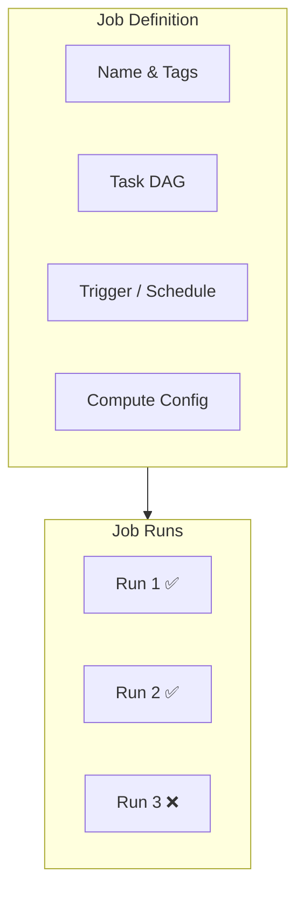
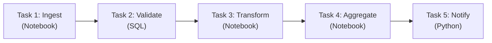
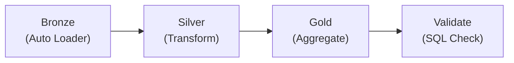
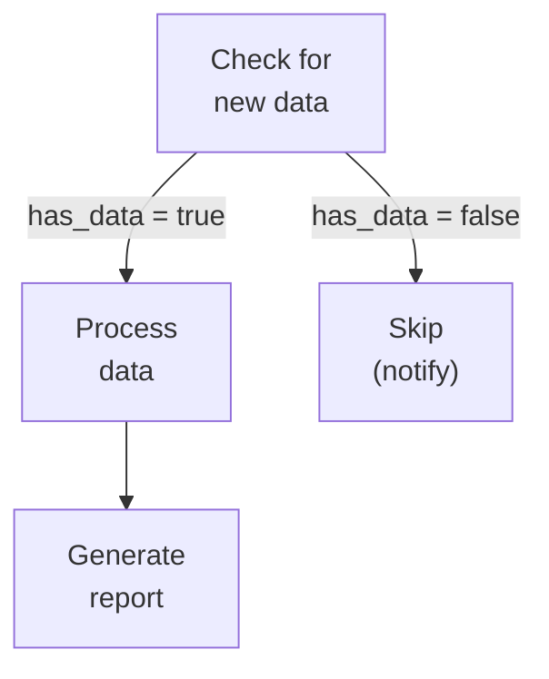
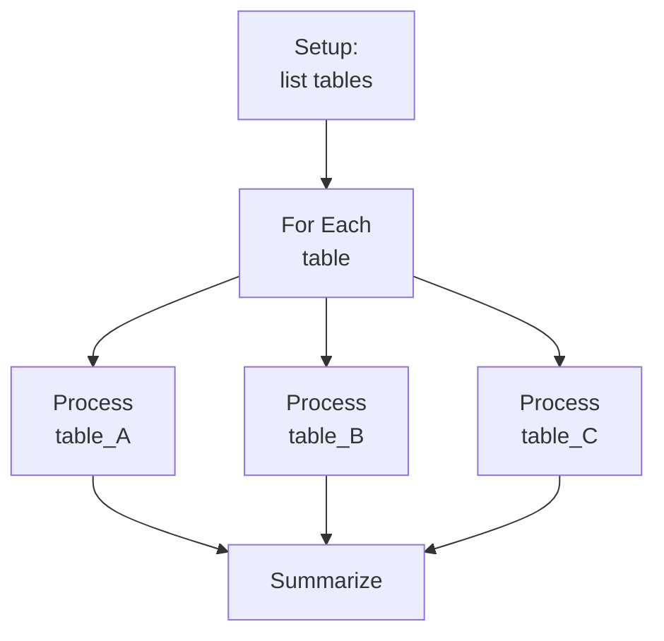

---
tags:
  - jobs
  - workflows
  - orchestration
  - fundamentals
  - data-engineering
aliases:
  - Databricks Jobs
  - Workflows
  - Job Orchestration
---

# Databricks Jobs and Workflows

Databricks Jobs are the primary mechanism for scheduling and orchestrating production workloads. A Job is a collection of tasks with defined dependencies, triggers, and compute configurations.

## What is a Job?

A **Job** wraps one or more **tasks** into an execution unit that can be triggered manually, on a schedule, or in response to events. Each run of a job produces a **run** with logs, metrics, and status.



## Task Types

| Task Type | Use Case | Example |
|:---|:---|:---|
| Notebook | Most common — runs a Databricks notebook | ETL pipeline step |
| Python script | Run a `.py` file from workspace or Repos | Data validation script |
| SQL | Execute a SQL statement or file | Aggregation query |
| JAR | Run a compiled Spark JAR | Legacy Java/Scala workloads |
| dbt | Run dbt models | dbt Cloud or dbt Core tasks |
| Lakeflow/DLT Pipeline | Trigger a DLT pipeline update | Medallion pipeline refresh |
| If/Else condition | Branch based on task value | Skip steps if no new data |
| For Each | Loop over a list | Process multiple tables |

## Task Dependencies (DAG)

Tasks in a job form a **Directed Acyclic Graph (DAG)** — each task can depend on one or more upstream tasks.



### Dependency Options

| Option | Behavior |
|:---|:---|
| All succeeded | Task runs only if all upstream tasks succeed (default) |
| At least one succeeded | Task runs if any upstream task succeeds |
| None failed | Task runs if no upstream task failed (skipped is OK) |
| All done | Task runs regardless of upstream status |
| At least one failed | Task runs if any upstream task failed (for error-handling tasks) |

## Triggers and Scheduling

### Schedule Types

| Trigger | Description | When to Use |
|:---|:---|:---|
| Manual | Run on demand via UI, CLI, or API | Ad-hoc or testing |
| Cron schedule | Standard cron expression | Recurring batch jobs (daily, hourly) |
| Continuous | Restarts immediately after each run completes | Near-real-time processing |
| File arrival | Triggers when new files land in a specified location | Event-driven ingestion |

### Cron Expression Examples

| Cron | Meaning |
|:---|:---|
| `0 0 * * *` | Daily at midnight UTC |
| `0 */2 * * *` | Every 2 hours |
| `0 8 * * 1-5` | Weekdays at 8 AM UTC |
| `0 0 1 * *` | First day of each month |

### File Arrival Trigger

```python
# Configured in the job definition (UI or JSON)
# Watches a cloud storage path for new files
# Triggers when files appear in the specified location
```

Key properties:

- **URL**: cloud storage path to monitor (e.g., `s3://bucket/path/`)
- **Min time between triggers**: cooldown period to batch arrivals
- **Wait after last file**: grace period before triggering

## Compute Configuration

Each task can use its own compute or share a **job cluster**:

| Compute Option | Description | Cost |
|:---|:---|:---|
| Job cluster (new) | Dedicated cluster created for the run, terminated after | Lowest cost — no idle time |
| Job cluster (shared) | Reused across tasks in the same run | Good for multi-task jobs |
| Existing all-purpose cluster | Uses a running interactive cluster | Higher cost — always running |
| Serverless | Managed compute, no cluster config needed | Pay per task, fast startup |

### Job Cluster vs All-Purpose

| Aspect | Job Cluster | All-Purpose Cluster |
|:---|:---|:---|
| Lifecycle | Created at run start, terminated at end | Always running (until manually stopped) |
| Cost | Pay only during run | Pay while running, even idle |
| Use case | Production jobs | Development and interactive work |
| Autoscaling | Configured per job | Configured per cluster |

## Job Parameters

### Passing Parameters

```python
# Define widgets in the notebook
dbutils.widgets.text("env", "dev")
dbutils.widgets.text("date", "2024-01-01")

# Read parameter values
env = dbutils.widgets.get("env")
date = dbutils.widgets.get("date")
```

### Task Values (Passing Data Between Tasks)

```python
# In Task 1: set a value
dbutils.jobs.taskValues.set(key="row_count", value=12345)

# In Task 2 (downstream): get the value
count = dbutils.jobs.taskValues.get(
    taskKey="task_1",
    key="row_count",
    default=0
)
```

Task values allow tasks to communicate without external storage.

## Error Handling and Retries

### Retry Configuration

| Setting | Description |
|:---|:---|
| Max retries | Number of times to retry a failed task (0 = no retry) |
| Min retry interval | Wait time between retries (seconds) |
| Retry on timeout | Whether to retry if the task times out |

### Timeout Settings

- **Task timeout**: maximum duration for a single task
- **Job timeout**: maximum duration for the entire job run

### Alerts and Notifications

| Event | Notification Options |
|:---|:---|
| Job start | Email, webhook, PagerDuty |
| Job success | Email, webhook, PagerDuty |
| Job failure | Email, webhook, PagerDuty |
| Duration exceeded | Email (when run exceeds expected time) |

## Monitoring and Observability

### Run Status

| Status | Meaning |
|:---|:---|
| Pending | Waiting for compute resources |
| Running | Task is executing |
| Succeeded | Task completed successfully |
| Failed | Task failed (check logs) |
| Timed out | Task exceeded its timeout limit |
| Skipped | Task was skipped due to dependency conditions |
| Canceled | User or system canceled the run |

### Key Monitoring Approaches

- **Workflows UI**: visual DAG with task status, duration, and logs
- **System tables**: `system.workflow.job_run_timeline` for historical analysis
- **REST API**: programmatic access to run status and logs
- **Email/webhook alerts**: real-time notifications

## Common Patterns

### Pattern 1: Medallion Pipeline Job



### Pattern 2: Conditional Branching



### Pattern 3: For Each Loop



## Jobs API (REST)

### Create a Job

```python
import requests

payload = {
    "name": "my-etl-job",
    "tasks": [{
        "task_key": "ingest",
        "notebook_task": {
            "notebook_path": "/Repos/prod/etl/ingest"
        },
        "new_cluster": {
            "spark_version": "14.3.x-scala2.12",
            "num_workers": 2
        }
    }],
    "schedule": {
        "quartz_cron_expression": "0 0 8 * * ?",
        "timezone_id": "UTC"
    }
}
```

### Trigger a Run

```python
# Run a job immediately
response = requests.post(
    f"{host}/api/2.1/jobs/run-now",
    headers=headers,
    json={"job_id": 12345}
)
```

## Practice Questions

> [!question] Question 1
> A data engineer has a job with three tasks: Ingest, Transform, and Aggregate. The Transform task should run only if Ingest succeeds, but Aggregate should run regardless of whether Transform succeeds or fails. Which dependency condition should be set on the Aggregate task?
>
> A) All succeeded
> B) At least one succeeded
> C) None failed
> D) All done

> [!success]- Answer
> **Correct Answer: D**
>
> `All done` runs the task regardless of upstream status. This is useful for cleanup or notification tasks that must always execute.

> [!question] Question 2
> A data engineer needs a job that processes new files as they land in cloud storage. The job should wait at least 5 minutes after the last file arrives before starting. Which trigger type should they use?
>
> A) Cron schedule with 5-minute interval
> B) Continuous trigger
> C) File arrival trigger
> D) Manual trigger with API call

> [!success]- Answer
> **Correct Answer: C**
>
> The file arrival trigger monitors a storage location and can be configured with a "wait after last file" grace period, making it ideal for event-driven ingestion.

> [!question] Question 3
> A data engineer wants Task 2 to read the number of records processed by Task 1. What is the recommended approach?
>
> A) Write the count to a Delta table and read it in Task 2
> B) Use `dbutils.jobs.taskValues.set()` in Task 1 and `dbutils.jobs.taskValues.get()` in Task 2
> C) Use shared notebook variables
> D) Pass the value through job parameters

> [!success]- Answer
> **Correct Answer: B**
>
> `dbutils.jobs.taskValues` is the native mechanism for passing small values between tasks in the same job run. It avoids external storage and is purpose-built for inter-task communication.

---

**[↑ Back to Fundamentals](./README.md)**
