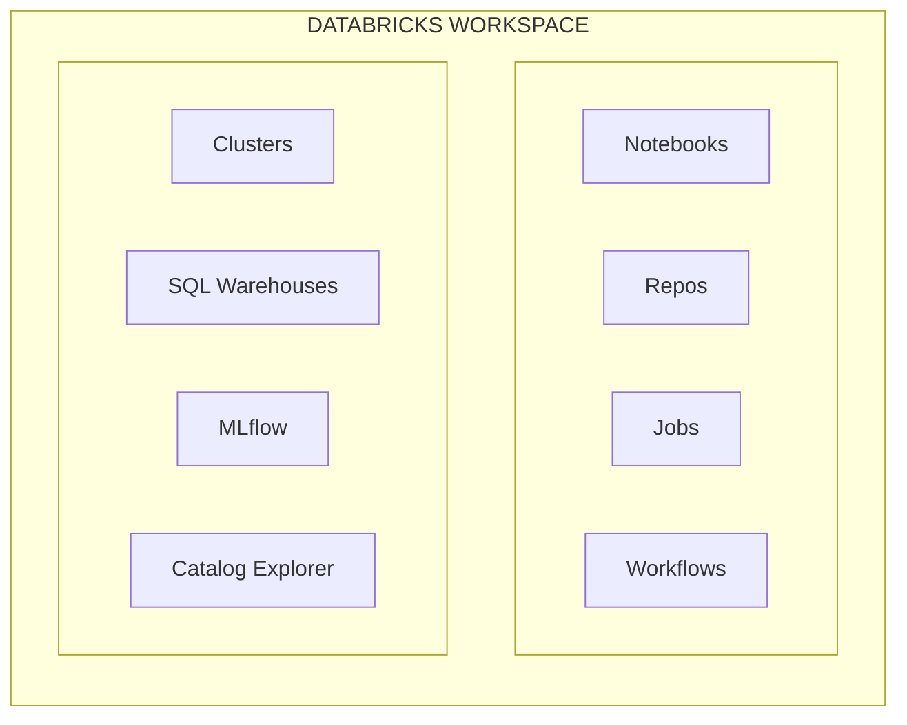
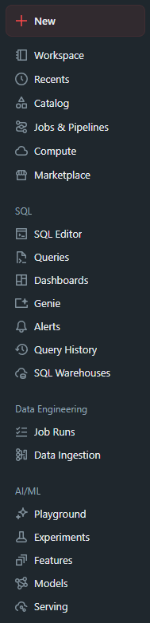
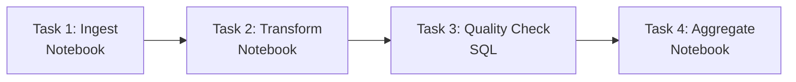
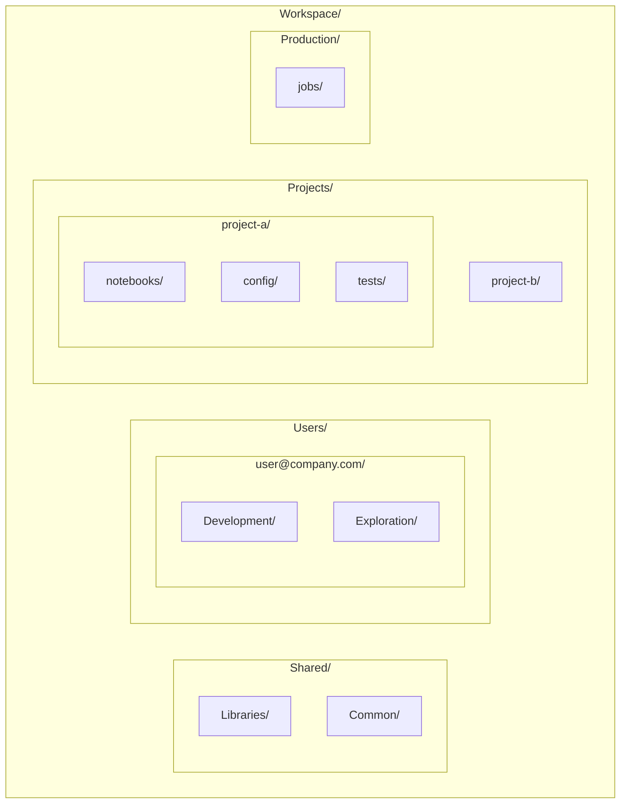
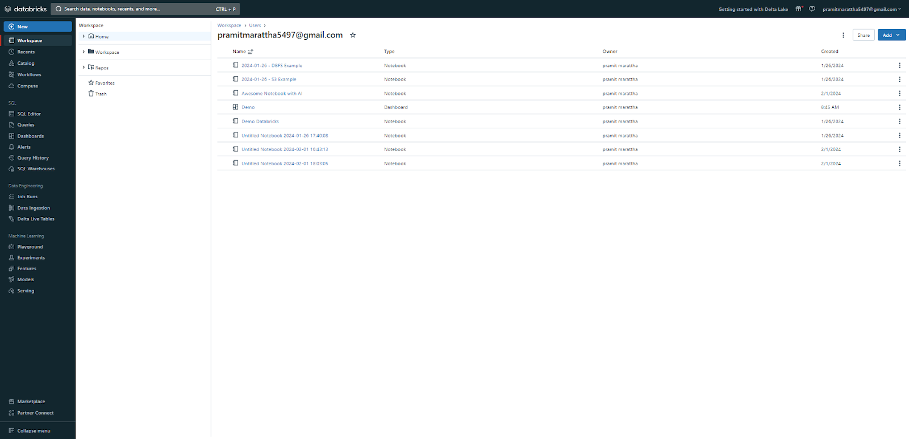

---
tags:
  - databricks
  - workspace
  - fundamentals
aliases:
  - Workspace
---

# Databricks Workspace

A Databricks Workspace is the environment where you interact with Databricks services. It provides a unified interface for data engineering, data science, and analytics workflows.

## Workspace Components





*The Databricks workspace sidebar provides access to all major features*

## Navigation Overview

| Section          | Purpose                                             |
| ---------------- | --------------------------------------------------- |
| **Workspace**    | Browse and manage notebooks, folders, and files     |
| **Repos**        | Git integration for version control                 |
| **Data**         | Access to catalogs, schemas, tables (Unity Catalog) |
| **Compute**      | Manage clusters and SQL warehouses                  |
| **Workflows**    | Create and monitor jobs and pipelines               |
| **Machine Learning** | Experiments, models, feature store              |

## Notebooks

### What are Notebooks?

Interactive documents that combine code, visualizations, and text. Support multiple languages.

### Supported Languages

| Language | Magic Command       | Use Case                      |
| -------- | ------------------- | ----------------------------- |
| Python   | `%python` (default) | Data engineering, ML, general |
| SQL      | `%sql`              | Queries, analytics            |
| Scala    | `%scala`            | Performance-critical code     |
| R        | `%r`                | Statistical analysis          |
| Markdown | `%md`               | Documentation                 |

### Creating Notebooks

1. Navigate to Workspace
2. Click "Create" → "Notebook"
3. Name notebook and select default language
4. Attach to a cluster

### Cell Operations

```python
# Python cell
df = spark.read.table("my_catalog.my_schema.my_table")
df.display()
```

```sql
%sql
-- SQL cell
SELECT * FROM my_catalog.my_schema.my_table LIMIT 10
```

```markdown
%md
## Markdown Cell
Document your analysis with **formatted text**.
```

### Notebook Utilities (dbutils)

```python
# File system operations
dbutils.fs.ls("/mnt/data/")
dbutils.fs.cp("/source/file.csv", "/dest/file.csv")
dbutils.fs.rm("/path/to/delete/", recurse=True)

# Widgets (parameters)
dbutils.widgets.text("input_path", "/default/path")
dbutils.widgets.dropdown("env", "dev", ["dev", "staging", "prod"])
input_path = dbutils.widgets.get("input_path")

# Secrets
password = dbutils.secrets.get(scope="my-scope", key="db-password")

# Notebook chaining
dbutils.notebook.run("/path/to/notebook", timeout_seconds=600, arguments={"param": "value"})

# Exit notebook with value
dbutils.notebook.exit("Success")
```

## Clusters

### Cluster Types

| Type             | Description                 | Use Case                 |
| ---------------- | --------------------------- | ------------------------ |
| **All-Purpose**  | Interactive, shared compute | Development, exploration |
| **Job**          | Created per job run         | Production workloads     |
| **SQL Warehouse** | Optimized for SQL queries  | BI, SQL analytics        |

### Creating a Cluster

1. Navigate to Compute
2. Click "Create Cluster"
3. Configure:
   - Name
   - Cluster mode (Single Node, Standard, High Concurrency)
   - Databricks Runtime version
   - Node type and autoscaling
   - Advanced options (Spark config, init scripts)

### Cluster Configuration

| Setting             | Example Value                       |
| ------------------- | ----------------------------------- |
| Runtime Version     | 14.3 LTS (Spark 3.5.0, Scala 2.12)  |
| Node Type           | i3.xlarge                           |
| Driver              | Same as worker                      |
| Workers             | Min 2, Max 8 (autoscaling)          |
| Auto-termination    | 120 minutes                         |
| Spark Config        | `spark.sql.shuffle.partitions 200`  |

### Access Modes

| Mode                    | Description                             |
| ----------------------- | --------------------------------------- |
| **Single User**         | Dedicated to one user, full access      |
| **Shared**              | Multiple users, Unity Catalog isolation |
| **No Isolation Shared** | Multiple users, no isolation (legacy)   |

## SQL Warehouses

Serverless or classic compute optimized for SQL workloads.

### Creating a SQL Warehouse

1. Navigate to SQL Warehouses
2. Click "Create SQL Warehouse"
3. Configure:
   - Name
   - Size (2X-Small to 4X-Large)
   - Type (Serverless, Pro, Classic)
   - Auto-stop settings

### Warehouse Sizing

| Size     | Best For                   |
| -------- | -------------------------- |
| 2X-Small | Light queries, development |
| Small    | Small dashboards           |
| Medium   | Production dashboards      |
| Large+   | Heavy concurrent queries   |

## Repos (Git Integration)

### Connecting a Repository

1. Navigate to Repos
2. Click "Add Repo"
3. Enter Git URL
4. Select Git provider and authenticate

### Git Operations

| Operation | How to                                |
| --------- | ------------------------------------- |
| Pull      | Click "Pull" button or use Git dialog |
| Commit    | Click "Commit & Push"                 |
| Branch    | Create/switch via branch dropdown     |
| Merge     | Use Git dialog or PR in Git provider  |

### Supported Providers

- GitHub
- GitLab
- Azure DevOps
- Bitbucket
- AWS CodeCommit

## Jobs and Workflows

### Creating a Job

1. Navigate to Workflows
2. Click "Create Job"
3. Configure tasks:
   - Notebook task
   - Python script
   - JAR
   - SQL
   - dbt

### Task Types




*Task dependencies visualized in the Databricks Workflows UI*

### Job Scheduling

| Schedule Type    | Description                           |
| ---------------- | ------------------------------------- |
| Manual           | On-demand execution                   |
| Scheduled (cron) | e.g., `0 0 * * *` (daily at midnight) |
| Continuous       | Runs indefinitely                     |
| File arrival     | Triggered by new files                |

### Job Parameters

```python
# Access job parameters in notebook
dbutils.widgets.text("date", "")
date = dbutils.widgets.get("date")

# Or from task context
date = spark.conf.get("spark.databricks.job.parameters.date")
```

## Delta Live Tables (DLT)

Declarative ETL framework for building reliable data pipelines.

```python
import dlt

@dlt.table
def bronze_orders():
    return spark.read.format("json").load("/data/orders/")

@dlt.table
def silver_orders():
    return dlt.read("bronze_orders").filter("amount > 0")

@dlt.table
def gold_daily_summary():
    return (
        dlt.read("silver_orders")
        .groupBy("order_date")
        .agg(sum("amount").alias("total"))
    )
```

## Catalog Explorer

Browse and manage data assets:

- View catalogs, schemas, tables
- Check table details and sample data
- View lineage
- Manage permissions
- Add tags and comments

## Workspace Organization

### Folder Structure Best Practices





*Example folder organization in a Databricks workspace*

### Permissions

| Level     | Permissions                             |
| --------- | --------------------------------------- |
| Workspace | Can Manage, Can Edit, Can Run, Can Read |
| Folder    | Can Manage, Can Edit, Can Run, Can Read |
| Notebook  | Can Manage, Can Edit, Can Run, Can Read |

## Secrets Management

### Creating Secrets

```bash
# Using Databricks CLI
databricks secrets create-scope --scope my-scope

databricks secrets put --scope my-scope --key db-password
# Enter secret value when prompted
```

### Using Secrets

```python
# In notebook
password = dbutils.secrets.get(scope="my-scope", key="db-password")

# Secrets are redacted in output
print(password)  # Shows [REDACTED]
```

## Use Cases

| Use Case           | Workspace Components                  |
| ------------------ | ------------------------------------- |
| Data Engineering   | Notebooks, Jobs, DLT, Clusters        |
| Data Analysis      | SQL Warehouses, Notebooks, Dashboards |
| Machine Learning   | MLflow, Experiments, Model Registry   |
| BI/Reporting       | SQL Warehouses, Dashboards            |

## Common Issues

| Issue                 | Cause                        | Solution                                 |
| --------------------- | ---------------------------- | ---------------------------------------- |
| Cluster won't start   | Resource limits, permissions | Check quotas, verify IAM roles           |
| Notebook won't attach | Cluster terminated/starting  | Wait for cluster, check auto-termination |
| Can't access table    | Missing permissions          | Request access via Unity Catalog         |
| Job fails             | Resource issues, code errors | Check logs, increase cluster size        |

## Practice Questions

### Question 1: Cluster Types

**Question**: Which cluster type should be used for a scheduled production ETL job?

A) All-purpose cluster
B) Job cluster
C) SQL warehouse
D) Single-node cluster

> [!success]- Answer
> **Correct Answer: B**
>
> Job clusters are created specifically for a job run and terminated when the job completes. They are more cost-effective for production workloads. All-purpose clusters are designed for interactive development. SQL warehouses are for SQL analytics queries and dashboards.

---

### Question 2: Notebook Languages

**Question**: A data engineer has a Python notebook but needs to run a SQL query in one cell. How can they do this?

A) Create a separate SQL notebook and link them
B) Use the `%sql` magic command at the top of the cell
C) Convert the entire notebook to SQL
D) Use `spark.sql()` only; magic commands are not supported

> [!success]- Answer
> **Correct Answer: B**
>
> Databricks notebooks support magic commands (`%sql`, `%python`, `%scala`, `%r`, `%md`) that allow switching languages within individual cells. While `spark.sql()` also works for running SQL from Python, the `%sql` magic command provides native SQL support with formatted result display.

---

### Question 3: SQL Warehouses

**Question**: What is the key difference between a SQL warehouse and an all-purpose cluster?

A) SQL warehouses can only run SQL; clusters support all languages
B) SQL warehouses are serverless; clusters are not
C) SQL warehouses are optimized for SQL analytics and BI; clusters for development and ETL
D) SQL warehouses do not support Delta Lake

> [!success]- Answer
> **Correct Answer: C**
>
> SQL warehouses (formerly SQL endpoints) are optimized specifically for SQL analytics workloads, BI tool connectivity, and dashboards. All-purpose clusters support multiple languages and are designed for interactive development and ETL. Both can be serverless, and both support Delta Lake.

## Referenced By

- [Data Engineer Associate](../../certifications/data-engineer-associate/README.md)
- [Data Engineer Professional](../../certifications/data-engineer-professional/README.md)
- [Data Analyst Associate](../../certifications/data-analyst-associate/README.md)
- [GenAI Engineer Associate](../../certifications/genai-engineer-associate/README.md)

## Related Topics

- [Unity Catalog Basics](unity-catalog-basics.md)
- [Spark Fundamentals](spark-fundamentals.md)
- [Delta Lake Basics](delta-lake-basics.md)

## Official Documentation

- [Databricks Workspace](https://docs.databricks.com/workspace/index.html)
- [Clusters](https://docs.databricks.com/clusters/index.html)
- [SQL Warehouses](https://docs.databricks.com/sql/admin/sql-endpoints.html)
- [Jobs](https://docs.databricks.com/workflows/jobs/jobs.html)
