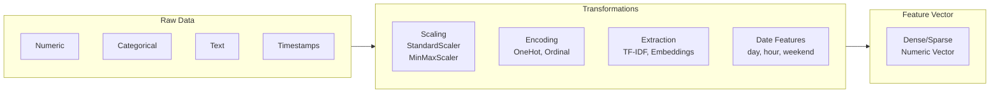
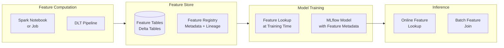

---
tags:
  - feature-engineering
  - machine-learning
  - spark-ml
  - fundamentals
  - ml-associate
  - ml-professional
aliases:
  - Feature Engineering
  - Feature Store
---

# Feature Engineering Basics

Feature engineering is the process of transforming raw data into numerical representations (features) that machine learning models can learn from effectively.

## What is Feature Engineering?

Raw data (text, timestamps, categorical values, nested JSON) must be converted to numerical form before most ML algorithms can use it. Feature engineering includes:

- **Transformations** — encode categories, scale numerics, extract date parts
- **Aggregations** — rolling averages, counts, ratios
- **Interactions** — combinations of existing features
- **Embeddings** — dense representations of high-cardinality categories

Good features often matter more than model choice. A simple model with good features consistently outperforms a complex model with poor features.

## Feature Engineering Pipeline



## Numeric Feature Transformations

### Scaling

Many ML algorithms (linear models, SVMs, neural networks) are sensitive to feature scale.

```python
from pyspark.ml.feature import StandardScaler, MinMaxScaler
from pyspark.ml.feature import VectorAssembler

# Assemble numeric columns into a vector first
assembler = VectorAssembler(
    inputCols=["age", "income", "num_purchases"],
    outputCol="features_raw"
)

# StandardScaler: zero mean, unit variance
scaler = StandardScaler(
    inputCol="features_raw",
    outputCol="features_scaled",
    withMean=True,
    withStd=True
)

# MinMaxScaler: scale to [0, 1]
minmax = MinMaxScaler(
    inputCol="features_raw",
    outputCol="features_scaled",
    min=0.0,
    max=1.0
)
```

### Binning / Bucketization

```python
from pyspark.ml.feature import Bucketizer, QuantileDiscretizer

# Fixed splits
bucketizer = Bucketizer(
    splits=[0, 18, 35, 55, 65, float("inf")],
    inputCol="age",
    outputCol="age_bucket"
)

# Automatic quantile-based buckets
quantile = QuantileDiscretizer(
    numBuckets=4,
    inputCol="income",
    outputCol="income_quartile"
)
```

## Categorical Feature Encoding

### String Indexing + One-Hot Encoding

```python
from pyspark.ml.feature import StringIndexer, OneHotEncoder

# Step 1: Convert string categories to numeric indices
indexer = StringIndexer(
    inputCol="country",
    outputCol="country_index",
    handleInvalid="keep"  # handle unseen categories at predict time
)

# Step 2: One-hot encode the indices
encoder = OneHotEncoder(
    inputCols=["country_index"],
    outputCols=["country_ohe"],
    dropLast=True  # avoid multicollinearity
)
```

### When to Use Each Encoding

| Encoding | Algorithm | Notes |
| :--- | :--- | :--- |
| **One-Hot** | Linear models, neural nets | No ordinal relationship implied |
| **Ordinal / Index** | Tree-based models (RF, XGBoost) | Trees handle integers directly |
| **Target encoding** | Any | Use mean of target per category; risk of leakage |
| **Hashing** | High-cardinality categories | Fixed-size output, some collisions |

## Text Feature Extraction

```python
from pyspark.ml.feature import Tokenizer, HashingTF, IDF, Word2Vec

# Classic TF-IDF pipeline
tokenizer = Tokenizer(inputCol="review_text", outputCol="words")

hashing_tf = HashingTF(
    inputCol="words",
    outputCol="raw_features",
    numFeatures=10000
)

idf = IDF(inputCol="raw_features", outputCol="tfidf_features")

# Word2Vec embeddings
word2vec = Word2Vec(
    vectorSize=100,
    inputCol="words",
    outputCol="w2v_features"
)
```

## Date and Time Features

```python
from pyspark.sql.functions import (
    hour, dayofweek, month, year,
    datediff, unix_timestamp
)

df = (
    df
    .withColumn("hour_of_day", hour("event_timestamp"))
    .withColumn("day_of_week", dayofweek("event_timestamp"))  # 1=Sun, 7=Sat
    .withColumn("month", month("event_timestamp"))
    .withColumn("is_weekend", (dayofweek("event_timestamp").isin([1, 7])).cast("int"))
    .withColumn(
        "days_since_signup",
        datediff("event_timestamp", "signup_date")
    )
)
```

## Aggregated / Computed Features

Window functions are powerful for computing historical features:

```python
from pyspark.sql.functions import avg, count, col
from pyspark.sql import Window

# 7-day rolling average spend per user
window_7d = (
    Window
    .partitionBy("user_id")
    .orderBy("event_date")
    .rowsBetween(-6, 0)
)

df = (
    df
    .withColumn("avg_spend_7d", avg("purchase_amount").over(window_7d))
    .withColumn("purchase_count_7d", count("purchase_id").over(window_7d))
)
```

## ML Pipelines

Spark ML's `Pipeline` API chains transformers and estimators for reproducible preprocessing:

```python
from pyspark.ml import Pipeline
from pyspark.ml.classification import RandomForestClassifier

pipeline = Pipeline(stages=[
    assembler,    # VectorAssembler
    scaler,       # StandardScaler
    indexer,      # StringIndexer
    encoder,      # OneHotEncoder
    RandomForestClassifier(
        featuresCol="features_scaled",
        labelCol="label",
        numTrees=100
    )
])

# Fit on training data
pipeline_model = pipeline.fit(train_df)

# Transform test data (applies same preprocessing)
predictions = pipeline_model.transform(test_df)
```

**Key benefit:** The fitted pipeline stores all transformation statistics (mean, std dev, category mappings) from the training set and applies them consistently to new data.

## Databricks Feature Store

The Databricks Feature Store is a centralized repository for computed features that enables feature reuse across teams and models.



```python
from databricks.feature_engineering import FeatureEngineeringClient

fe = FeatureEngineeringClient()

# Create a feature table
fe.create_table(
    name="prod_catalog.features.user_behavior",
    primary_keys=["user_id"],
    schema=feature_df.schema,
    description="7-day and 30-day behavioral features per user"
)

# Write features
fe.write_table(
    name="prod_catalog.features.user_behavior",
    df=feature_df,
    mode="merge"
)
```

## Use Cases

| Use Case | Features Needed |
| :--- | :--- |
| Fraud detection | Time-since-last-transaction, rolling spend, geo-distance |
| Churn prediction | Days since login, support tickets, usage trend |
| Recommendation | User embedding, item embedding, interaction history |
| Demand forecasting | Day of week, holiday flag, price, promotions |

## Common Exam Pitfalls

1. **Training/serving skew** — Features computed differently at training vs serving time cause silent model degradation. Feature Store solves this.
2. **Data leakage** — Including features that encode future information into training (e.g., using post-event data to predict the event)
3. **StringIndexer `handleInvalid`** — Default is `"error"`; set to `"keep"` or `"skip"` to handle unseen categories at prediction time
4. **Pipeline vs manual transforms** — Always use `Pipeline` so that fit-time statistics (scaling params, index mappings) are stored and applied consistently
5. **Target encoding leakage** — If computing target encoding on the full dataset before splitting, you leak label information into the features

## Practice Questions

### Question 1: Imputation Strategy

**Question**: A numeric feature has 5% missing values and a highly skewed distribution with several outliers. Which imputation strategy is most appropriate?

A) Mean imputation — fills with the arithmetic average
B) Median imputation — fills with the middle value, robust to outliers
C) Constant imputation — fills all missing values with zero
D) Drop rows — remove all rows with missing values

> [!success]- Answer
> **Correct Answer: B**
>
> Median imputation is preferred when a distribution is skewed or contains outliers,
> because the median is not affected by extreme values the way the mean is. Mean
> imputation would pull the imputed value toward the outliers, distorting the
> feature. Constant imputation (e.g., zero) is appropriate only when missing means
> "none occurred" — not when the data is simply absent. Dropping 5% of rows is
> wasteful and can introduce bias if missingness is not random.

---

### Question 2: Feature Store Benefit

**Question**: A data scientist trains a churn model using features computed in a notebook. A month later, the production pipeline computes the same features differently due to a code change. Which Databricks tool best prevents this training/serving skew?

A) MLflow Model Registry — version and stage-gate production models
B) Databricks Feature Store — store computed features once, reuse at training and serving
C) Delta Lake time travel — roll back feature data to training time
D) Unity Catalog — audit who accessed feature data

> [!success]- Answer
> **Correct Answer: B**
>
> The Databricks Feature Store stores computed features in Delta tables with metadata
> and lineage. At training time, `FeatureEngineeringClient` retrieves features and
> records which feature table and version was used. At serving time, the same feature
> lookup is replayed automatically, guaranteeing consistency. MLflow Registry governs
> model promotion but does not solve feature computation consistency. Delta time travel
> helps with data versioning but does not enforce consistent feature logic.

---

### Question 3: Pipeline vs Manual Transforms

**Question**: Why should you use Spark ML's `Pipeline` instead of applying transformers manually in sequence?

A) `Pipeline` is faster because it uses native JVM code
B) `Pipeline` stores fit-time statistics and applies them consistently to new data
C) `Pipeline` automatically selects the best features for the model
D) `Pipeline` is required; applying transformers manually raises an exception

> [!success]- Answer
> **Correct Answer: B**
>
> The key benefit of `Pipeline` is that `pipeline.fit(train_df)` learns and stores all
> transformation parameters — scaling means and standard deviations, string index
> mappings, IDF weights, etc. — from the training data. When `pipeline_model.transform(test_df)`
> is called, the exact same parameters are applied, preventing training/serving skew.
> Applying transformers manually risks accidentally re-fitting on test data (leakage)
> or using inconsistent parameters at inference time.

## Referenced By

- [ML Associate](../../certifications/ml-associate/README.md)
- [ML Professional](../../certifications/ml-professional/README.md)

## Related Topics

- [ML Associate Certification](../../certifications/ml-associate/README.md)
- [ML Professional Certification](../../certifications/ml-professional/README.md)
- [MLflow Basics](mlflow-basics.md)
- [Python Essentials](python-essentials.md)
- [Spark Fundamentals](spark-fundamentals.md)

## Official Documentation

- [Databricks Feature Engineering (Feature Store)](https://docs.databricks.com/en/machine-learning/feature-store/index.html)
- [Spark ML Pipelines](https://spark.apache.org/docs/latest/ml-pipeline.html)
- [Spark ML Feature Transformers](https://spark.apache.org/docs/latest/ml-features.html)
- [MLlib Feature Engineering Guide](https://spark.apache.org/docs/latest/ml-features.html#feature-transformers)
