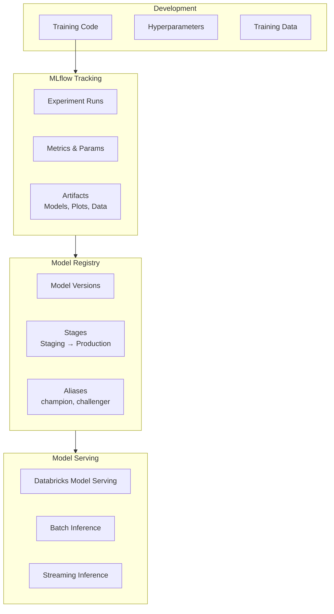

---
tags:
  - mlflow
  - machine-learning
  - fundamentals
  - ml-associate
  - ml-professional
aliases:
  - MLflow
  - MLflow Basics
---

# MLflow Basics

MLflow is an open-source platform for managing the end-to-end machine learning lifecycle — experiment tracking, model packaging, model registry, and model deployment.

## What is MLflow?

MLflow provides four core components:

| Component | Purpose |
| :--- | :--- |
| **Tracking** | Log and query experiments (parameters, metrics, artifacts) |
| **Projects** | Reproducible ML code packaging format |
| **Models** | Standard format for packaging and loading models |
| **Model Registry** | Central model store with versioning and lifecycle stages |

Databricks integrates MLflow natively — every cluster has it pre-installed, and the Tracking Server is managed automatically.

## Core Architecture



## Experiment Tracking

### Logging a Run

```python
import mlflow
import mlflow.sklearn
from sklearn.ensemble import RandomForestClassifier
from sklearn.metrics import accuracy_score, f1_score

# Set the experiment (creates it if it doesn't exist)
mlflow.set_experiment("/Users/team/fraud-detection")

with mlflow.start_run(run_name="rf-baseline"):
    # Log hyperparameters
    params = {"n_estimators": 100, "max_depth": 5, "random_state": 42}
    mlflow.log_params(params)

    # Train model
    model = RandomForestClassifier(**params)
    model.fit(X_train, y_train)
    y_pred = model.predict(X_test)

    # Log metrics
    mlflow.log_metric("accuracy", accuracy_score(y_test, y_pred))
    mlflow.log_metric("f1_score", f1_score(y_test, y_pred))

    # Log the model
    mlflow.sklearn.log_model(
        model,
        artifact_path="model",
        registered_model_name="fraud-detector"
    )
```

### Autologging

MLflow autolog automatically captures parameters, metrics, and model artifacts for supported frameworks:

```python
# Enable autologging for sklearn, XGBoost, PyTorch, etc.
mlflow.autolog()

with mlflow.start_run():
    model = RandomForestClassifier(n_estimators=100)
    model.fit(X_train, y_train)
    # Parameters, metrics, and model are logged automatically
```

Supported frameworks: scikit-learn, XGBoost, LightGBM, PyTorch, TensorFlow, Keras, Spark ML, Hugging Face.

### Logging Artifacts

```python
with mlflow.start_run():
    # Log a file
    mlflow.log_artifact("feature_importance.png")

    # Log a directory
    mlflow.log_artifacts("plots/")

    # Log a dataset reference
    dataset = mlflow.data.from_spark(training_df, table="training_data_v2")
    mlflow.log_input(dataset, context="training")
```

## Model Registry

The Model Registry provides versioning, lifecycle stages, and collaboration around model promotion.

### Registering a Model

```python
# Register during logging
mlflow.sklearn.log_model(
    model,
    artifact_path="model",
    registered_model_name="fraud-detector"
)

# Register an existing run
result = mlflow.register_model(
    model_uri="runs:/abc123/model",
    name="fraud-detector"
)
print(f"Model version: {result.version}")
```

### Model Aliases (MLflow 2.x — recommended)

Aliases are flexible pointers to specific model versions, replacing lifecycle stages:

```python
from mlflow import MlflowClient

client = MlflowClient()

# Set alias "champion" to version 3
client.set_registered_model_alias(
    name="fraud-detector",
    alias="champion",
    version=3
)

# Load by alias
model = mlflow.pyfunc.load_model("models:/fraud-detector@champion")
```

### Legacy Lifecycle Stages (older APIs)

| Stage | Description |
| :--- | :--- |
| None | Newly registered, under development |
| Staging | Testing and validation environment |
| Production | Serving live traffic |
| Archived | Retired, kept for reference |

```python
# Transition to production (legacy)
client.transition_model_version_stage(
    name="fraud-detector",
    version=3,
    stage="Production"
)
```

## Loading Models for Inference

```python
# Load as generic Python function (framework-agnostic)
model = mlflow.pyfunc.load_model("models:/fraud-detector@champion")
predictions = model.predict(new_data)

# Load as sklearn model
model = mlflow.sklearn.load_model("models:/fraud-detector/3")

# Batch inference with Spark
predict_udf = mlflow.pyfunc.spark_udf(spark, "models:/fraud-detector@champion")
predictions = df.withColumn("prediction", predict_udf(*feature_cols))
```

## Comparing Runs

```python
# Query experiment runs
runs = mlflow.search_runs(
    experiment_names=["/Users/team/fraud-detection"],
    filter_string="metrics.f1_score > 0.85",
    order_by=["metrics.f1_score DESC"],
    max_results=10
)

# Returns a pandas DataFrame
best_run = runs.iloc[0]
print(f"Best run ID: {best_run.run_id}")
print(f"Best F1: {best_run['metrics.f1_score']}")
```

## MLflow on Databricks

| Feature | Databricks Behavior |
| :--- | :--- |
| Tracking server | Managed, always available — no setup needed |
| Artifact storage | Stored in DBFS or Unity Catalog volumes |
| Experiment UI | Accessible from the Databricks workspace sidebar |
| Model Registry | Integrated with Unity Catalog (UC model registry) |
| Model Serving | One-click deployment from the registry UI |

### Unity Catalog Model Registry

In Databricks with Unity Catalog, models are registered using three-level namespace: `catalog.schema.model_name`:

```python
# Register to Unity Catalog
mlflow.set_registry_uri("databricks-uc")

mlflow.sklearn.log_model(
    model,
    artifact_path="model",
    registered_model_name="prod_catalog.ml_models.fraud-detector"
)
```

## Use Cases

| Use Case | MLflow Component |
| :--- | :--- |
| Compare 20 hyperparameter experiments | Tracking UI, `search_runs()` |
| Reproduce a past model exactly | Tracking — log parameters + data version |
| Promote a model to production safely | Model Registry + aliases |
| Serve a model as a REST endpoint | Databricks Model Serving |
| Batch scoring with Spark | `mlflow.pyfunc.spark_udf()` |

## Common Exam Pitfalls

1. **`mlflow.start_run()` context manager** — Always use `with mlflow.start_run():` to ensure the run is properly ended, even if an exception occurs
2. **Autolog limitations** — Autolog captures what the framework exposes; custom metrics still need explicit `log_metric()` calls
3. **Model URI formats** — `runs:/<run_id>/artifact_path` vs `models:/<name>/<version>` vs `models:/<name>@<alias>`
4. **Aliases vs stages** — In MLflow 2.x/Databricks, aliases are preferred over lifecycle stages (None/Staging/Production/Archived)
5. **Unity Catalog registry** — UC models use `catalog.schema.model` naming; set `mlflow.set_registry_uri("databricks-uc")` first

## Practice Questions

### Question 1: Runs vs. Experiments

**Question**: What is the relationship between an MLflow Experiment and a Run?

A) An experiment is a single training execution; a run is a collection of experiments
B) An experiment is a named container; each run within it records one training execution
C) They are synonyms — experiment and run refer to the same concept
D) A run is a deployment unit; an experiment tracks serving metrics

> [!success]- Answer
> **Correct Answer: B**
>
> An **experiment** is a logical grouping (like a project or model type) that contains
> many **runs**. Each run captures one training execution: the hyperparameters used,
> metrics produced, and artifacts created. You create an experiment once
> (`mlflow.set_experiment(...)`) and generate many runs within it as you iterate on
> hyperparameters, features, or algorithms.

---

### Question 2: Aliases vs. Lifecycle Stages

**Question**: You are using Databricks with Unity Catalog. You want to designate version 5 of `prod_catalog.ml_models.fraud-detector` as the current production model. What is the recommended approach?

A) Call `transition_model_version_stage(version=5, stage="Production")`
B) Set an alias `champion` pointing to version 5 using `set_registered_model_alias`
C) Delete all other versions so only version 5 remains
D) Use `mlflow.register_model()` with `stage="Production"` as a parameter

> [!success]- Answer
> **Correct Answer: B**
>
> In MLflow 2.x and Databricks Unity Catalog, **aliases** (`champion`, `challenger`,
> etc.) replace legacy lifecycle stages (Staging/Production/Archived). Aliases are
> flexible named pointers that can be updated independently of version numbering.
> Load the model with `mlflow.pyfunc.load_model("models:/fraud-detector@champion")`.
> The legacy `transition_model_version_stage` API still works but is deprecated for
> UC-registered models.

---

### Question 3: MLflow Autolog

**Question**: A data scientist enables `mlflow.autolog()` before training an XGBoost model. Which of the following is NOT automatically captured?

A) Model hyperparameters passed to the `XGBClassifier` constructor
B) Training and validation metrics at each boosting round
C) The trained model artifact
D) Business KPIs computed after the model is deployed to production

> [!success]- Answer
> **Correct Answer: D**
>
> `mlflow.autolog()` intercepts training framework APIs and automatically logs what
> the framework exposes: hyperparameters, in-training metrics (loss, eval scores per
> round), and the final model artifact. It has no visibility into post-deployment
> business metrics — those must be logged explicitly with `mlflow.log_metric()`.
> Supported frameworks include scikit-learn, XGBoost, LightGBM, PyTorch, TensorFlow,
> Keras, Spark ML, and Hugging Face Transformers.

## Referenced By

- [ML Associate](../../certifications/ml-associate/README.md)
- [ML Professional](../../certifications/ml-professional/README.md)
- [GenAI Engineer Associate](../../certifications/genai-engineer-associate/README.md)

## Related Topics

- [ML Associate Certification](../../certifications/ml-associate/README.md)
- [ML Professional Certification](../../certifications/ml-professional/README.md)
- [Python Essentials](python-essentials.md)
- [Spark Fundamentals](spark-fundamentals.md)

## Official Documentation

- [MLflow Tracking — Databricks](https://docs.databricks.com/en/mlflow/tracking.html)
- [MLflow Model Registry — Databricks](https://docs.databricks.com/en/mlflow/model-registry.html)
- [MLflow Autologging](https://mlflow.org/docs/latest/tracking/autolog.html)
- [Unity Catalog Model Registry](https://docs.databricks.com/en/machine-learning/manage-model-lifecycle/index.html)
- [MLflow Model Serving — Databricks](https://docs.databricks.com/en/machine-learning/model-serving/index.html)
