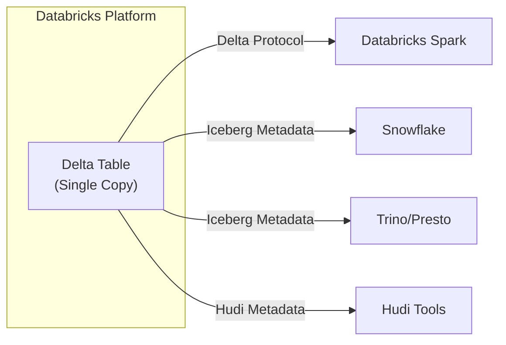
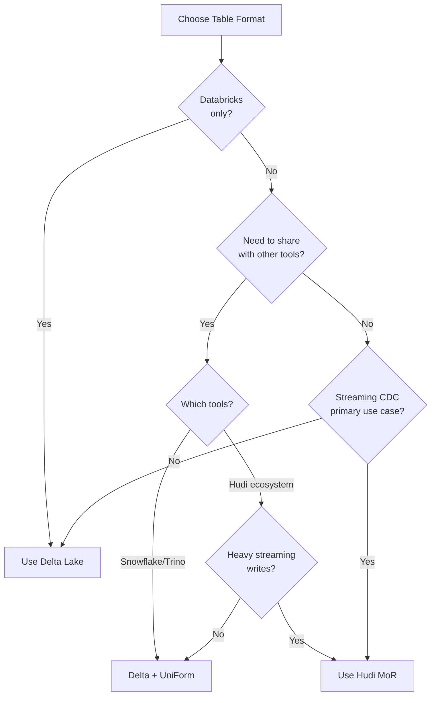

---
tags:
  - databricks
  - iceberg
  - hudi
  - fundamentals
aliases:
  - Open Table Formats
---

# Open Table Formats

Open table formats bring ACID transactions, schema evolution, and time travel to data lakes. Understanding these formats is essential for modern data engineering.

## The Three Major Formats

| Format | Creator | Primary Strength |
| ------ | ------- | ---------------- |
| **Delta Lake** | Databricks | Default on Databricks, strong ACID |
| **Apache Iceberg** | Netflix | Hidden partitioning, multi-engine |
| **Apache Hudi** | Uber | Streaming ingestion, CDC |

## Format Comparison

| Feature | Delta Lake | Apache Iceberg | Apache Hudi |
| ------- | ---------- | -------------- | ----------- |
| ACID Transactions | Yes | Yes | Yes |
| Time Travel | Yes | Yes | Yes |
| Schema Evolution | Yes | Yes | Yes |
| Partition Evolution | Liquid Clustering | Native | Limited |
| Default on Databricks | Yes | Via UniForm | Via UniForm |
| Optimized for | General workloads | Analytics | Streaming/CDC |
| Transaction Log | JSON files | Metadata files | Timeline |

## Apache Iceberg

### What is Iceberg?

Apache Iceberg is an open table format for large analytic datasets, originally created by Netflix.

Key characteristics:

- **Hidden partitioning** - Queries don't need to know partition structure
- **Snapshot isolation** - Concurrent reads and writes without conflicts
- **Multi-engine support** - Works with Spark, Trino, Presto, Flink, Snowflake

### Iceberg Architecture

```text
iceberg_table/
├── metadata/
│   ├── v1.metadata.json      # Table metadata
│   ├── v2.metadata.json
│   └── snap-xxx.avro         # Manifest lists
├── data/
│   └── *.parquet             # Data files
```

### Iceberg Key Features

**Partition Evolution**

Change partitioning without rewriting data:

```sql
-- Initial partitioning by day
CREATE TABLE events (
  event_time TIMESTAMP,
  event_type STRING
) USING ICEBERG
PARTITIONED BY (days(event_time));

-- Later, change to hourly partitioning (no rewrite needed)
ALTER TABLE events ADD PARTITION FIELD hours(event_time);
```

**Schema Evolution**

```sql
-- Add columns
ALTER TABLE events ADD COLUMN user_id STRING;

-- Rename columns
ALTER TABLE events RENAME COLUMN user_id TO customer_id;

-- Reorder columns
ALTER TABLE events ALTER COLUMN customer_id FIRST;
```

**Hidden Partitioning**

Users query data without knowing partition structure:

```sql
-- Iceberg automatically prunes partitions
SELECT * FROM events
WHERE event_time BETWEEN '2025-01-01' AND '2025-01-31';
```

### Reading Iceberg on Databricks

```sql
-- Read Iceberg tables directly
SELECT * FROM iceberg.`s3://bucket/path/to/iceberg_table`;

-- Create catalog reference
CREATE TABLE iceberg_events
USING ICEBERG
LOCATION 's3://bucket/iceberg_table';
```

```python
# Python
df = spark.read.format("iceberg").load("s3://bucket/iceberg_table")
```

### Iceberg Use Cases

- Multi-cloud analytics with different query engines
- Organizations using Snowflake alongside Databricks
- Scenarios requiring partition evolution without downtime

## Apache Hudi

### What is Hudi?

Apache Hudi (Hadoop Upserts Deletes and Incrementals) is optimized for streaming data ingestion and change data capture (CDC).

Key characteristics:

- **Record-level updates** - Efficient upserts without full table scans
- **Incremental processing** - Query only changed data
- **Two table types** - Copy-on-Write (CoW) and Merge-on-Read (MoR)

### Hudi Architecture

```text
hudi_table/
├── .hoodie/
│   ├── hoodie.properties     # Table config
│   └── timeline/             # Commit timeline
├── partition=value/
│   ├── *.parquet             # Base files
│   └── *.log                 # Log files (MoR only)
```

### Hudi Table Types

| Type | Write Speed | Read Speed | Best For |
| ---- | ----------- | ---------- | -------- |
| Copy-on-Write (CoW) | Slower | Faster | Read-heavy workloads |
| Merge-on-Read (MoR) | Faster | Slower | Write-heavy workloads |

**Copy-on-Write (CoW)**

- Rewrites entire file on update
- No read-time merge overhead
- Best for batch updates, read-heavy workloads

**Merge-on-Read (MoR)**

- Writes changes to log files
- Merges at read time
- Best for streaming, write-heavy workloads

### Hudi Key Features

**Incremental Queries**

Process only changed records:

```python
# Read only records changed since last commit
df = (spark.read.format("hudi")
    .option("hoodie.datasource.query.type", "incremental")
    .option("hoodie.datasource.read.begin.instanttime", "20250101000000")
    .load("/path/to/hudi_table"))
```

**Record Keys and Precombine**

```python
# Write with record key for upserts
(df.write.format("hudi")
    .option("hoodie.table.name", "orders")
    .option("hoodie.datasource.write.recordkey.field", "order_id")
    .option("hoodie.datasource.write.precombine.field", "updated_at")
    .option("hoodie.datasource.write.operation", "upsert")
    .mode("append")
    .save("/path/to/hudi_table"))
```

### Reading Hudi on Databricks

```sql
-- Read Hudi tables
SELECT * FROM hudi.`s3://bucket/path/to/hudi_table`;
```

```python
# Python
df = spark.read.format("hudi").load("s3://bucket/hudi_table")
```

### Hudi Use Cases

- Real-time CDC from databases
- Streaming data lakes with frequent updates
- Near real-time analytics dashboards

## Delta Lake UniForm

UniForm enables reading Delta tables as Apache Iceberg or Apache Hudi without data conversion.

### Why UniForm?



Benefits:

- **No data duplication** - Single copy of data, multiple format access
- **Cross-platform sharing** - Share with Snowflake, Trino, Presto
- **Maintain Delta benefits** - Keep ACID, time travel, optimization

### Enabling UniForm

```sql
-- Enable for new table (Iceberg)
CREATE TABLE my_table (
    id INT,
    name STRING,
    updated_at TIMESTAMP
) USING DELTA
TBLPROPERTIES ('delta.universalFormat.enabledFormats' = 'iceberg');

-- Enable on existing table
ALTER TABLE my_table
SET TBLPROPERTIES ('delta.universalFormat.enabledFormats' = 'iceberg');

-- Enable both Iceberg and Hudi
ALTER TABLE my_table
SET TBLPROPERTIES ('delta.universalFormat.enabledFormats' = 'iceberg,hudi');

-- Check UniForm status
DESCRIBE EXTENDED my_table;
```

### Requirements

| Requirement | Details |
| ----------- | ------- |
| Delta Lake Version | 3.1+ (GA) |
| Databricks Runtime | 14.1+ |
| Column Mapping | Must be enabled |
| Recommended | Unity Catalog managed tables |

### Enabling Column Mapping

UniForm requires column mapping:

```sql
-- Enable column mapping (required for UniForm)
ALTER TABLE my_table
SET TBLPROPERTIES (
    'delta.columnMapping.mode' = 'name',
    'delta.minReaderVersion' = '2',
    'delta.minWriterVersion' = '5'
);
```

### Trade-offs

| Aspect | Impact |
| ------ | ------ |
| Storage | Additional metadata overhead (~1-5%) |
| Write Latency | Slight increase (generates extra metadata) |
| Read Performance | No impact |
| Compatibility | Iceberg v2, Hudi 0.14+ |

### Accessing UniForm Tables

From Snowflake (Iceberg):

```sql
-- Create Iceberg catalog in Snowflake pointing to Delta table location
CREATE ICEBERG TABLE my_snowflake_table
  CATALOG = 'my_iceberg_catalog'
  EXTERNAL_VOLUME = 'my_volume'
  CATALOG_TABLE_NAME = 'my_table';
```

From Trino (Iceberg):

```sql
-- Query Delta table as Iceberg
SELECT * FROM iceberg.my_catalog.my_table;
```

## When to Use Each Format

| Scenario | Recommended | Reason |
| -------- | ----------- | ------ |
| Databricks-only workloads | Delta Lake | Native optimization, best performance |
| Share with Snowflake | Delta + UniForm | Single source of truth |
| Multi-engine analytics | Iceberg | Widest engine support |
| High-frequency CDC | Hudi (MoR) | Optimized for streaming upserts |
| Batch ETL pipelines | Delta Lake | MERGE, OPTIMIZE, VACUUM |
| Mixed read/write workloads | Delta Lake | Balanced performance |
| Existing Hudi investment | Hudi or Delta + UniForm | Migration flexibility |

## Decision Flowchart



## Common Exam Topics

1. **UniForm enables interoperability** without duplicating data
2. **Iceberg hidden partitioning** means queries don't specify partition columns
3. **Hudi CoW vs MoR** - CoW for reads, MoR for writes
4. **UniForm requires** Delta Lake 3.1+, column mapping enabled
5. **Delta Lake is default** on Databricks, others accessible via UniForm
6. **Partition evolution** is native in Iceberg, achieved via Liquid Clustering in Delta

## Practice Questions

### Question 1: UniForm

**Question**: What does Delta Lake UniForm enable?

A) Converting Delta tables permanently to Iceberg format
B) Reading Delta tables as Iceberg or Hudi without data duplication
C) Merging multiple table formats into a single unified format
D) Automatically migrating Hudi tables to Delta Lake

> [!success]- Answer
> **Correct Answer: B**
>
> UniForm generates Iceberg and Hudi metadata alongside the Delta Lake transaction log, allowing external tools (like Snowflake, Trino, Presto) to read Delta tables using Iceberg or Hudi protocols. No data is duplicated; only metadata is generated.

---

### Question 2: Iceberg Partitioning

**Question**: How does Apache Iceberg handle partition evolution differently from traditional Hive-style partitioning?

A) Iceberg does not support partitioning
B) Iceberg uses hidden partitioning, so queries do not need to specify partition columns in filters
C) Iceberg requires a full table rewrite to change partition columns
D) Iceberg only supports date-based partitions

> [!success]- Answer
> **Correct Answer: B**
>
> Iceberg uses hidden partitioning where the engine automatically applies partition pruning based on source columns. Users write queries using the original columns (e.g., `WHERE event_date = '2025-01-15'`), and Iceberg handles partition mapping internally. Partition columns can also be evolved without rewriting data.

---

### Question 3: Hudi Table Types

**Question**: Which Hudi table type is optimized for write-heavy workloads with streaming upserts?

A) Copy on Write (CoW)
B) Merge on Read (MoR)
C) Append Only
D) Write Optimized

> [!success]- Answer
> **Correct Answer: B**
>
> Merge on Read (MoR) writes data to log files first and compacts later, making writes fast and efficient for streaming CDC workloads. Copy on Write (CoW) rewrites entire files on each update, making it better for read-heavy workloads but slower for writes.

## Referenced By

- [Data Engineer Associate](../../certifications/data-engineer-associate/README.md)
- [Data Engineer Professional](../../certifications/data-engineer-professional/README.md)

## Related Topics

- [Delta Lake Basics](delta-lake-basics.md) - Core Delta Lake concepts
- [Delta Lake Operations](../../certifications/data-engineer-professional/01-data-processing/06-delta-lake-operations-part1.md) - Advanced operations
- [Version History](../appendix/version-history.md) - Delta Lake version features

## Official Documentation

- [Delta Lake UniForm](https://docs.databricks.com/delta/uniform.html)
- [Apache Iceberg](https://iceberg.apache.org/docs/latest/)
- [Apache Hudi](https://hudi.apache.org/docs/overview)
