---
tags:
  - databricks
  - architecture
  - fundamentals
aliases:
  - Platform Architecture
---

# Databricks Platform Architecture

Databricks uses a split architecture model that separates the management layer (control plane) from the compute and storage layer (data plane). Understanding this architecture is essential for security, networking, and compliance decisions.

## Overview

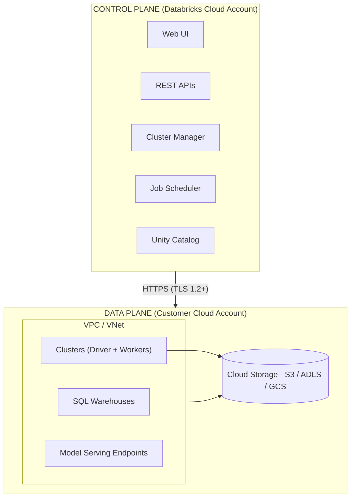

## Control Plane

The control plane is the management layer hosted and managed by Databricks in their cloud account.

### What It Does

- Hosts the web application (UI)
- Manages authentication and authorization
- Orchestrates cluster lifecycle
- Schedules and monitors jobs
- Stores workspace metadata
- Provides REST APIs

### Control Plane Components

| Component               | Description                                       |
| ----------------------- | ------------------------------------------------- |
| **Web Application**     | Browser-based UI for notebooks, jobs, clusters    |
| **REST APIs**           | Programmatic access to all Databricks features    |
| **Cluster Manager**     | Provisions and terminates compute resources       |
| **Job Scheduler**       | Manages workflow execution and scheduling         |
| **Unity Catalog**       | Metadata store for data governance (account-level)|
| **Identity Management** | SSO, SCIM provisioning, authentication            |
| **Audit Logging**       | Tracks user activities and API calls              |

### What the Control Plane Stores

| Stored                 | Not Stored                    |
| ---------------------- | ----------------------------- |
| Notebook code          | Customer data                 |
| Job definitions        | Query results                 |
| Cluster configurations | Processed data                |
| User permissions       | Cloud credentials (encrypted) |
| Workspace metadata     | Raw data files                |

## Data Plane

The data plane is where your compute resources run and your data is processed. It can be deployed in two models.

### Classic Data Plane (Customer-Managed)

In the classic deployment, compute resources run in your cloud account.

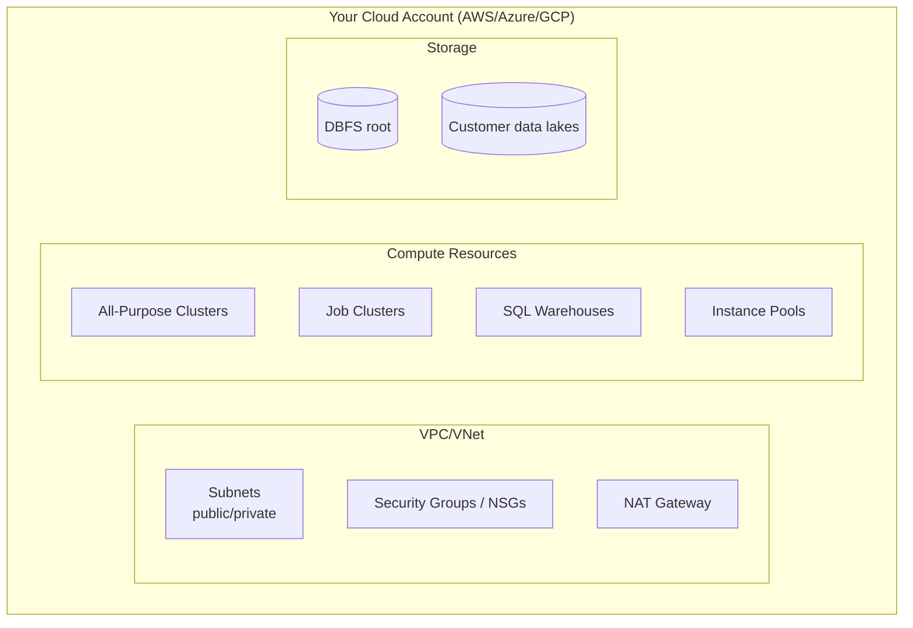

**Benefits:**

- Data never leaves your cloud account
- Full network control
- Use existing security policies
- Customer-managed encryption keys

### Serverless Data Plane (Databricks-Managed)

In serverless deployment, Databricks manages the compute infrastructure.

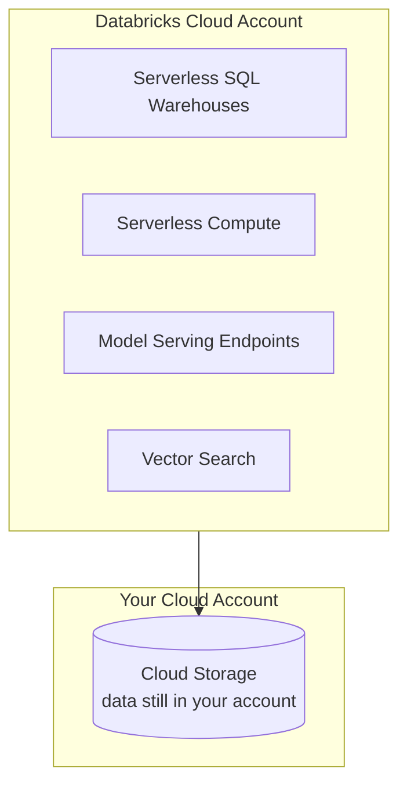

**Benefits:**

- No infrastructure management
- Instant startup times
- Automatic scaling
- Pay only for usage

### Classic vs Serverless Comparison

| Aspect           | Classic             | Serverless         |
| ---------------- | ------------------- | ------------------ |
| Compute Location | Your cloud account  | Databricks cloud   |
| Startup Time     | Minutes             | Seconds            |
| Network Control  | Full control        | Managed            |
| Data Processing  | Your VPC/VNet       | Databricks VPC     |
| Data Storage     | Your account        | Your account       |
| Scaling          | Manual/Autoscale    | Automatic          |
| Management       | You manage          | Databricks manages |

## Control Plane and Data Plane Interaction

### Communication Flow

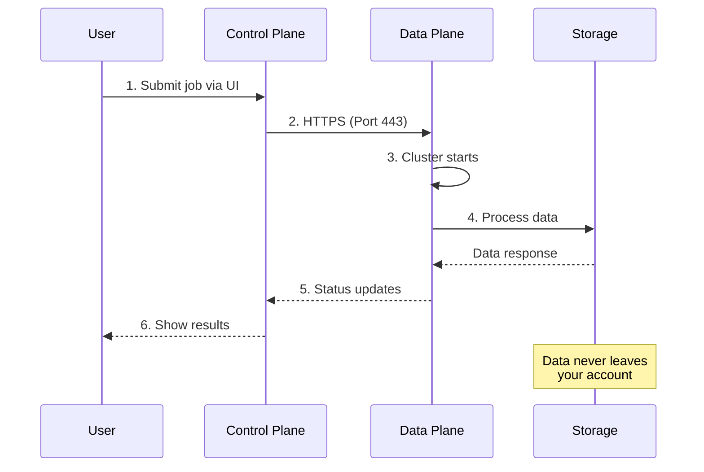

### Secure Cluster Connectivity (SCC)

With SCC enabled, clusters have no public IP addresses. All communication initiates from the data plane to the control plane.

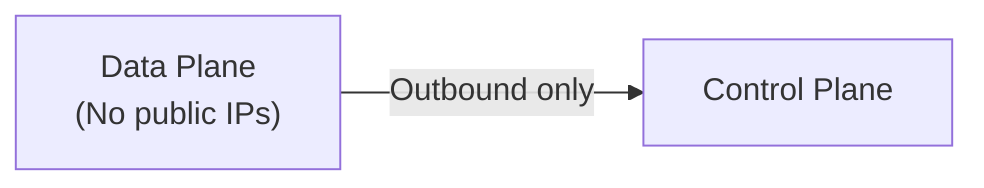

**Benefits:**

- Reduced attack surface
- No inbound firewall rules needed
- Clusters not directly accessible from internet

### Data Flow

Your actual data never passes through the control plane:

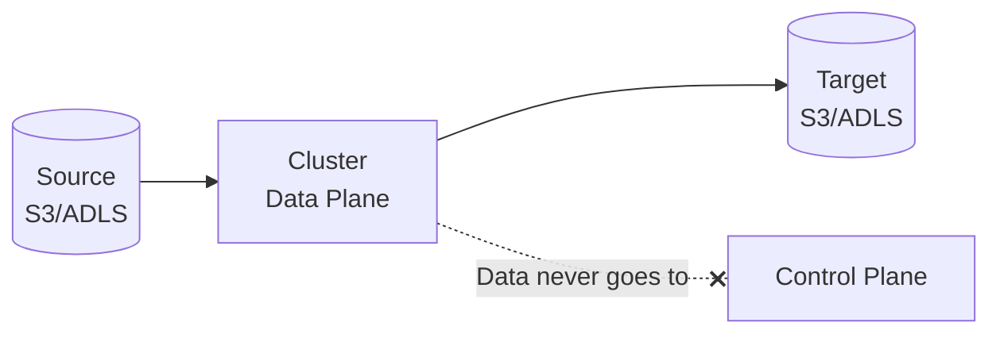

## Cloud Provider Deployments

### AWS

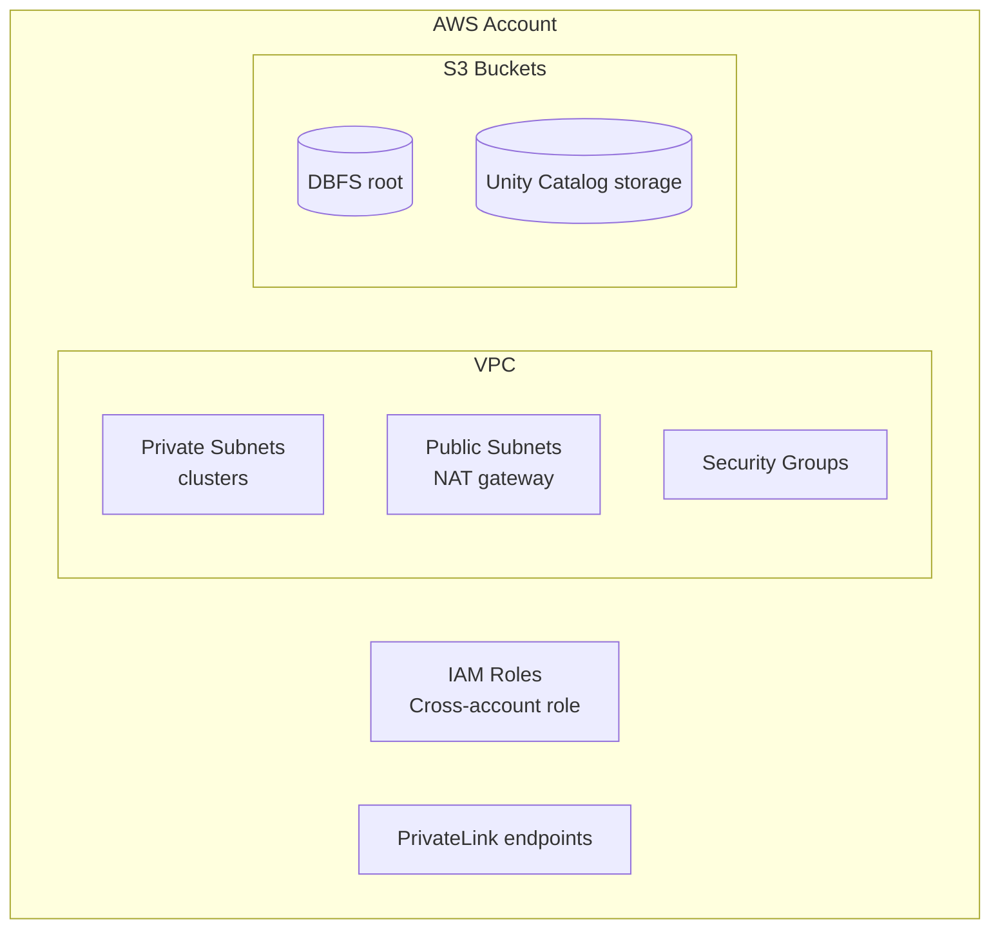

### Azure

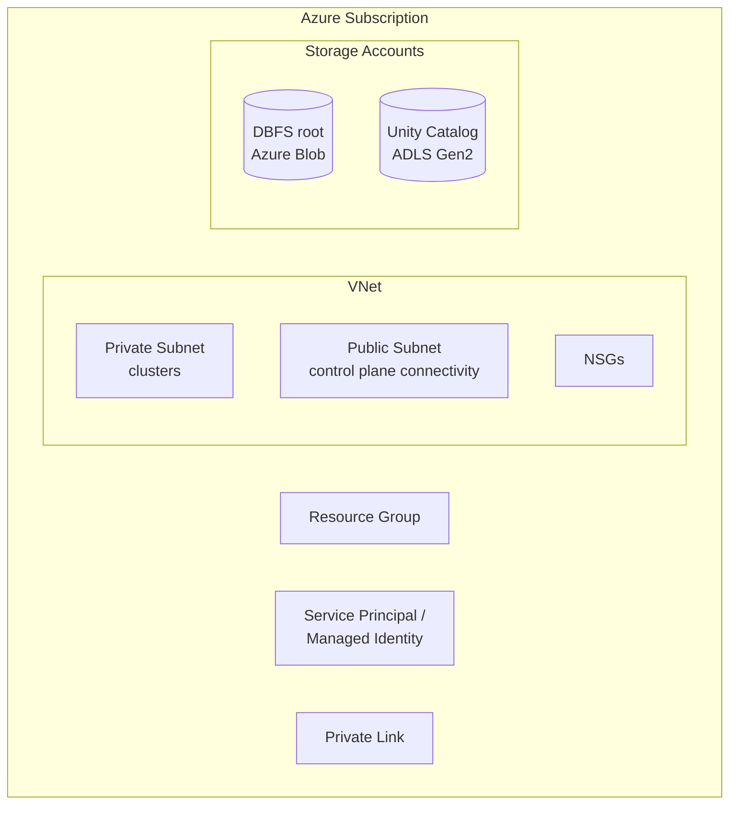

### GCP

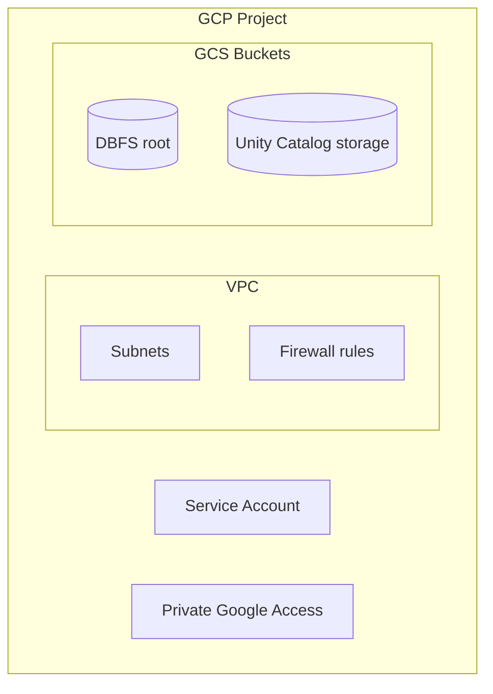

### Cloud Comparison

| Feature              | AWS         | Azure                                | GCP                   |
| -------------------- | ----------- | ------------------------------------ | --------------------- |
| Network              | VPC         | VNet                                 | VPC                   |
| Private Connectivity | PrivateLink | Private Link                         | Private Google Access |
| Storage              | S3          | ADLS Gen2 / Blob                     | GCS                   |
| Identity             | IAM Roles   | Service Principal / Managed Identity | Service Account       |
| Encryption           | KMS         | Key Vault                            | Cloud KMS             |

## Network Architecture

### Network Connectivity Options

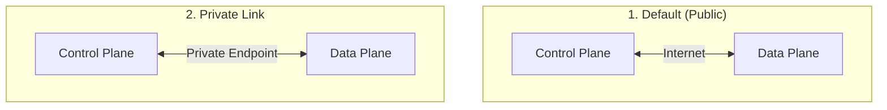

### Private Link / Private Endpoints

Connect to Databricks without traversing the public internet.

| Type                       | Purpose                                   |
| -------------------------- | ----------------------------------------- |
| **Front-end Private Link** | Web UI and REST API access                |
| **Back-end Private Link**  | Control plane to data plane communication |

### IP Access Lists

Restrict which IP addresses can access the workspace.

| CIDR              | Description       |
| ----------------- | ----------------- |
| `10.0.0.0/8`      | Corporate network |
| `192.168.1.0/24`  | VPN range         |
| `203.0.113.50/32` | Specific IP       |

### VPC/VNet Peering

Connect your data plane to other resources in your cloud.

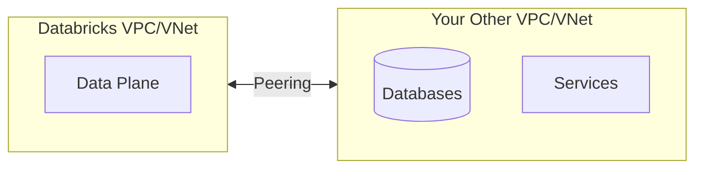

## Security Implications

### Encryption

| Layer                        | Method                                  |
| ---------------------------- | --------------------------------------- |
| **In Transit**               | TLS 1.2+ for all communication          |
| **At Rest (Control Plane)**  | Databricks-managed encryption           |
| **At Rest (Data Plane)**     | Cloud provider encryption (S3/ADLS/GCS) |
| **Customer-Managed Keys**    | Optional: Use your own KMS keys         |

### Data Residency

| Component       | Location                                |
| --------------- | --------------------------------------- |
| Notebook code   | Control plane (Databricks region)       |
| Job definitions | Control plane                           |
| Actual data     | Your cloud account (your chosen region) |
| Query results   | Data plane (your account)               |

### Network Security Best Practices

1. **Enable Secure Cluster Connectivity** - No public IPs on clusters
2. **Use Private Link** - Eliminate public internet exposure
3. **Configure IP Access Lists** - Restrict workspace access
4. **Use Customer-Managed VPC/VNet** - Full network control
5. **Enable Audit Logging** - Track all access and changes

## Use Cases

| Use Case                 | Architecture Consideration                                         |
| ------------------------ | ------------------------------------------------------------------ |
| **Regulated Industries** | Private Link, customer-managed keys, audit logging                 |
| **Data Sovereignty**     | Deploy data plane in required region, verify control plane location|
| **Low Latency**          | Co-locate data plane with data sources                             |
| **Cost Optimization**    | Serverless for variable workloads                                  |
| **Security-First**       | Customer-managed VPC, SCC, Private Link                            |
| **Rapid Development**    | Serverless for fast iteration                                      |

## Common Issues

| Issue                         | Cause                                 | Solution                        |
| ----------------------------- | ------------------------------------- | ------------------------------- |
| Cluster fails to start        | Subnet exhaustion                     | Use larger CIDR ranges          |
| Cannot reach external service | Missing NAT gateway or firewall rules | Configure egress routes         |
| Slow cluster startup          | Network configuration issues          | Check VPC/VNet peering, DNS     |
| API timeout                   | IP access list blocking               | Add your IP to allow list       |
| Cannot access Unity Catalog   | Network isolation                     | Configure Private Link for UC   |
| Cross-region latency          | Data plane far from storage           | Co-locate in same region        |

## Practice Questions

### Question 1: Control Plane vs Data Plane

**Question**: Which component runs in the Databricks-managed control plane?

A) Customer data storage (S3, ADLS, GCS)
B) Spark clusters processing data
C) Web UI, REST APIs, and notebook management
D) Delta Lake transaction logs

> [!success]- Answer
> **Correct Answer: C**
>
> The control plane is managed by Databricks and hosts the web application, REST APIs, notebook management, and job scheduling. The data plane (clusters, storage) runs in the customer's cloud account, keeping data under customer control.

---

### Question 2: Serverless Compute

**Question**: What is the key benefit of serverless compute in Databricks?

A) It eliminates the need for Unity Catalog
B) Clusters are managed by Databricks, reducing infrastructure overhead and startup time
C) It provides unlimited compute resources at no cost
D) It only works with SQL workloads

> [!success]- Answer
> **Correct Answer: B**
>
> Serverless compute runs clusters in the Databricks-managed data plane, eliminating the need for customers to manage cloud infrastructure. This reduces cluster startup time and operational overhead. Serverless is available for SQL warehouses, notebooks, and jobs.

---

### Question 3: Network Security

**Question**: Which feature ensures that cluster nodes communicate only through private IP addresses and do not require public IP addresses?

A) Unity Catalog
B) IP Access Lists
C) Secure Cluster Connectivity (SCC / No Public IP)
D) Customer-Managed Keys

> [!success]- Answer
> **Correct Answer: C**
>
> Secure Cluster Connectivity (also called No Public IP) ensures cluster nodes only have private IP addresses. Communication with the control plane happens through a secure tunnel initiated from the data plane, eliminating the need for public IPs and reducing the attack surface.

## Referenced By

- [Data Engineer Associate](../../certifications/data-engineer-associate/README.md)
- [Data Engineer Professional](../../certifications/data-engineer-professional/README.md)
- [ML Associate](../../certifications/ml-associate/README.md)
- [Data Analyst Associate](../../certifications/data-analyst-associate/README.md)
- [GenAI Engineer Associate](../../certifications/genai-engineer-associate/README.md)

## Related Topics

- [Databricks Workspace](databricks-workspace.md) - UI and workspace features
- [Unity Catalog Basics](unity-catalog-basics.md) - Data governance architecture
- [Security & Governance](../../certifications/data-engineer-professional/04-security-governance/README.md) - Advanced security topics

## Official Documentation

- [Databricks Architecture Overview](https://docs.databricks.com/getting-started/overview.html)
- [Secure Cluster Connectivity](https://docs.databricks.com/security/network/classic/secure-cluster-connectivity.html)
- [Private Link](https://docs.databricks.com/security/network/classic/privatelink.html)
- [AWS Deployment](https://docs.databricks.com/administration-guide/cloud-configurations/aws/index.html)
- [Azure Deployment](https://docs.databricks.com/administration-guide/cloud-configurations/azure/index.html)
- [GCP Deployment](https://docs.databricks.com/administration-guide/cloud-configurations/gcp/index.html)
