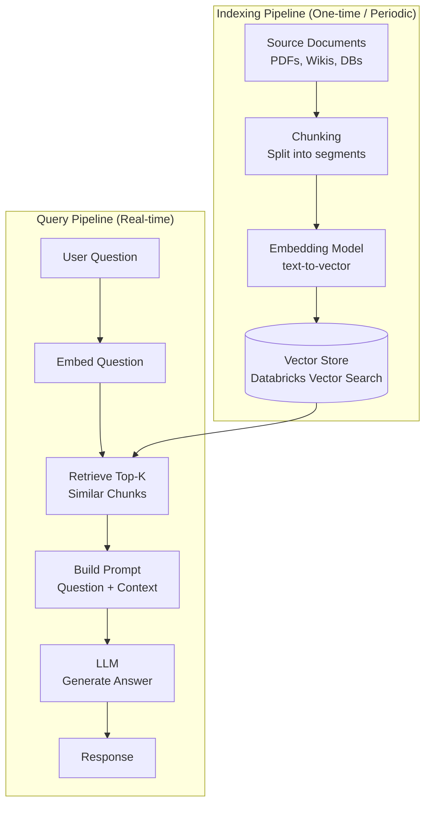
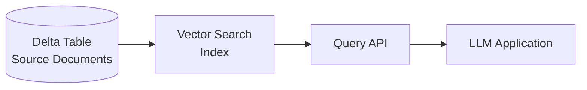

---
tags:
  - rag
  - vector-search
  - embeddings
  - generative-ai
  - fundamentals
  - genai-engineer-associate
aliases:
  - RAG
  - Retrieval-Augmented Generation
  - Vector Search
---

# RAG & Vector Search Basics

Retrieval-Augmented Generation (RAG) is an architectural pattern that enhances Large Language Model (LLM) responses by retrieving relevant context from a knowledge base before generating an answer.

## What is RAG?

Without RAG, an LLM can only answer based on its training data (which has a knowledge cutoff). RAG extends the model's knowledge by:

1. Storing domain-specific documents as vector embeddings in a vector database
2. At query time, converting the user's question to an embedding
3. Retrieving the most semantically similar document chunks
4. Providing those chunks as context to the LLM alongside the question

This enables LLMs to answer accurately from private, up-to-date, or domain-specific knowledge without expensive fine-tuning.

## RAG Architecture



## Key Concepts

### Embeddings

An **embedding** is a dense numerical vector that represents the semantic meaning of text. Semantically similar text produces similar vectors (measured by cosine similarity or dot product).

```python
# Using Databricks-hosted embedding model
from databricks.vector_search.client import VectorSearchClient

# Or using sentence-transformers locally
from sentence_transformers import SentenceTransformer

model = SentenceTransformer("all-MiniLM-L6-v2")
embeddings = model.encode(["What is Delta Lake?", "How do I optimize queries?"])
# Returns (2, 384) numpy array
```

### Chunking Strategies

How you split documents significantly affects retrieval quality:

| Strategy | Description | Best For |
| :--- | :--- | :--- |
| Fixed-size | Split every N characters/tokens | Simple documents |
| Sentence | Split at sentence boundaries | Conversational text |
| Recursive | Try paragraph → sentence → word boundaries | General purpose |
| Semantic | Split based on topic changes | Technical documents |
| Document-specific | Split at headers/sections | Structured docs (PDFs, Markdown) |

**Recommended:** 512-1024 tokens per chunk with 10-20% overlap between adjacent chunks to preserve context across boundaries.

### Similarity Search

Vector search finds the K nearest vectors to a query embedding:

| Metric | Formula | When to Use |
| :--- | :--- | :--- |
| Cosine similarity | `dot(a, b) / (\|a\| * \|b\|)` | Text embeddings (normalized) |
| Dot product | `sum(a * b)` | When vectors are normalized |
| Euclidean (L2) | `sqrt(sum((a-b)²))` | Image embeddings |

## Databricks Vector Search

Databricks Vector Search is a serverless vector database integrated directly into the Lakehouse.



### Index Types

| Type | Description | Auto-Sync |
| :--- | :--- | :--- |
| **Delta Sync** | Syncs automatically from a Delta table | Yes — on update |
| **Direct Vector Access** | You manage updates via API | No |

### Creating a Vector Search Endpoint and Index

```python
from databricks.vector_search.client import VectorSearchClient

client = VectorSearchClient()

# 1. Create an endpoint (shared compute for vector search)
client.create_endpoint(
    name="my-vs-endpoint",
    endpoint_type="STANDARD"
)

# 2. Create a Delta Sync index (auto-syncs from Delta table)
client.create_delta_sync_index(
    endpoint_name="my-vs-endpoint",
    index_name="prod_catalog.ml.docs_index",
    source_table_name="prod_catalog.ml.docs_chunked",
    pipeline_type="TRIGGERED",
    primary_key="chunk_id",
    embedding_source_column="chunk_text",
    embedding_model_endpoint_name="databricks-gte-large-en"
)
```

### Querying the Index

```python
results = client.get_index(
    endpoint_name="my-vs-endpoint",
    index_name="prod_catalog.ml.docs_index"
).similarity_search(
    query_text="How do I configure Auto Loader?",
    columns=["chunk_text", "source_url", "chunk_id"],
    num_results=5,
    filters={"doc_type": "tutorial"}  # optional metadata filters
)

# results.get("result", {}).get("data_array", [])
```

## Building a RAG Pipeline

```python
from databricks.vector_search.client import VectorSearchClient
import mlflow.deployments

vs_client = VectorSearchClient()
deploy_client = mlflow.deployments.get_deploy_client("databricks")

def rag_query(user_question: str, top_k: int = 3) -> str:
    """Retrieve relevant context and generate an answer."""

    # 1. Retrieve relevant chunks
    results = vs_client.get_index(
        endpoint_name="my-vs-endpoint",
        index_name="prod_catalog.ml.docs_index"
    ).similarity_search(
        query_text=user_question,
        columns=["chunk_text"],
        num_results=top_k
    )

    context_chunks = [
        row[0]
        for row in results.get("result", {}).get("data_array", [])
    ]
    context = "\n\n".join(context_chunks)

    # 2. Build prompt with context
    prompt = f"""You are a helpful assistant. Use the following context to answer the question.
If the context doesn't contain the answer, say "I don't know."

Context:
{context}

Question: {user_question}

Answer:"""

    # 3. Call LLM
    response = deploy_client.predict(
        endpoint="databricks-meta-llama-3-1-70b-instruct",
        inputs={"messages": [{"role": "user", "content": prompt}]}
    )

    return response["choices"][0]["message"]["content"]
```

## RAG Evaluation

| Metric | Measures | Tool |
| :--- | :--- | :--- |
| **Faithfulness** | Is the answer grounded in retrieved context? | MLflow evaluate, RAGAS |
| **Answer Relevance** | Is the answer relevant to the question? | RAGAS |
| **Context Recall** | Did retrieval find the right chunks? | RAGAS |
| **Context Precision** | Are retrieved chunks actually useful? | RAGAS |

```python
import mlflow

with mlflow.start_run():
    results = mlflow.evaluate(
        model=rag_query,
        data=eval_dataset,  # DataFrame with "question" and "ground_truth" columns
        model_type="question-answering",
        evaluators="default"
    )
```

## Use Cases

| Use Case | Description |
| :--- | :--- |
| Enterprise knowledge base | Answer employee questions from internal wikis and documentation |
| Customer support | Route and answer support tickets using past resolution history |
| Code assistant | Retrieve relevant code snippets from a private codebase |
| Document Q&A | Answer questions from legal, compliance, or technical documents |
| Product search | Semantic search over product catalog using natural language |

## Common Exam Pitfalls

1. **RAG vs fine-tuning** — RAG adds knowledge at inference time (no model retraining); fine-tuning changes model weights (expensive, for behavior/style changes)
2. **Chunking matters** — Chunks too large lose precision; chunks too small lose context
3. **Embedding model consistency** — The same model must be used for indexing and querying; mixing models produces incomparable vectors
4. **Vector Search requires Delta Sync** — The source table must be a Delta table for automatic sync; non-Delta sources require Direct Vector Access
5. **Hallucination risk** — RAG reduces hallucinations but does not eliminate them; always evaluate faithfulness

## Related Topics

- [GenAI Engineer Associate Certification](../../certifications/genai-engineer-associate/README.md)
- [MLflow Basics](mlflow-basics.md)
- [Python Essentials](python-essentials.md)
- [Platform Architecture](platform-architecture.md)
