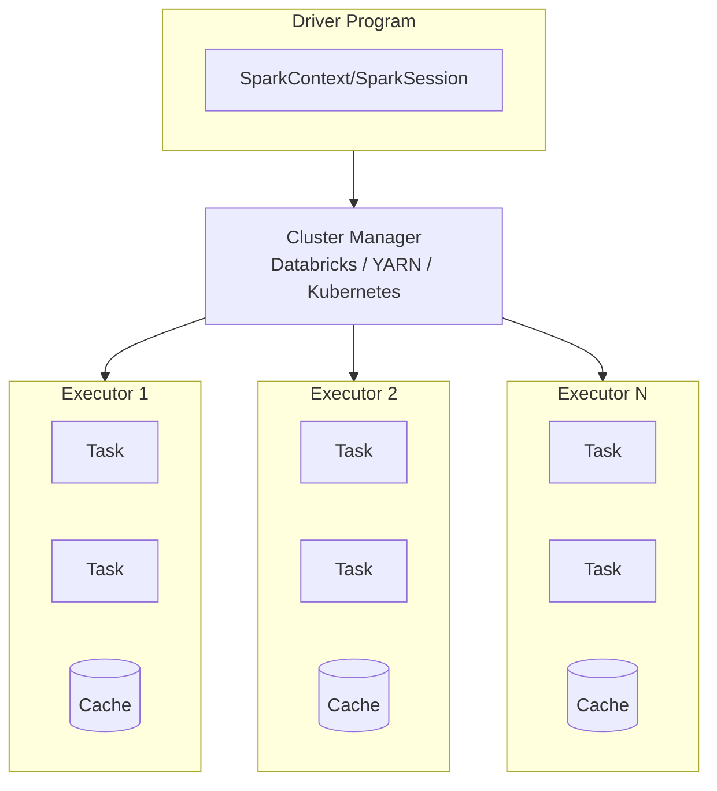

---
tags:
  - databricks
  - spark
  - fundamentals
aliases:
  - Spark
---

# Spark Fundamentals

Apache Spark is a unified analytics engine for large-scale data processing. Databricks provides a fully managed Spark environment.

## Spark Architecture

### Cluster Components



### Key Components

| Component           | Description                                                        |
| ------------------- | ------------------------------------------------------------------ |
| **Driver**          | Runs the main program, creates SparkContext, coordinates executors |
| **Executor**        | Worker process that runs tasks and stores data                     |
| **Task**            | Unit of work sent to executor                                      |
| **Cluster Manager** | Allocates resources across applications                            |

## SparkSession

The entry point for Spark functionality:

```python
from pyspark.sql import SparkSession

# In Databricks, SparkSession is pre-configured as 'spark'
spark = (SparkSession.builder
    .appName("MyApp")
    .getOrCreate())

# Access SparkContext
sc = spark.sparkContext
```

## DataFrames

### Creating DataFrames

```python
# From a list
data = [(1, "Alice", 30), (2, "Bob", 25)]
df = spark.createDataFrame(data, ["id", "name", "age"])

# From a file
df = spark.read.csv("/path/to/file.csv", header=True, inferSchema=True)
df = spark.read.json("/path/to/file.json")
df = spark.read.parquet("/path/to/file.parquet")

# From a Delta table
df = spark.read.format("delta").load("/path/to/delta")
df = spark.table("my_catalog.my_schema.my_table")
```

### Basic Operations

```python
# Show data
df.show()
df.display()  # Databricks-specific

# Schema
df.printSchema()
df.schema

# Column selection
df.select("name", "age")
df.select(df.name, df.age + 1)

# Filtering
df.filter(df.age > 25)
df.where("age > 25")

# Adding columns
df.withColumn("age_plus_10", df.age + 10)

# Renaming columns
df.withColumnRenamed("name", "full_name")

# Dropping columns
df.drop("age")

# Distinct values
df.distinct()
df.dropDuplicates(["name"])
```

### Aggregations

```python
from pyspark.sql.functions import count, sum, avg, max, min

# Group by
df.groupBy("department").count()
df.groupBy("department").agg(
    count("*").alias("total"),
    avg("salary").alias("avg_salary"),
    max("salary").alias("max_salary")
)

# Window functions
from pyspark.sql.window import Window
from pyspark.sql.functions import row_number, rank

window = Window.partitionBy("department").orderBy("salary")
df.withColumn("rank", rank().over(window))
```

### Joins

```python
# Inner join (default)
df1.join(df2, df1.id == df2.id)

# Left join
df1.join(df2, df1.id == df2.id, "left")

# Join types: inner, left, right, outer, left_semi, left_anti, cross
df1.join(df2, "id", "left_outer")

# Multiple conditions
df1.join(df2, (df1.id == df2.id) & (df1.date == df2.date))
```

## Transformations vs Actions

### Transformations (Lazy)

Transformations create a new DataFrame but don't execute until an action is called:

| Transformation | Description       |
| -------------- | ----------------- |
| `select()`     | Select columns    |
| `filter()`     | Filter rows       |
| `groupBy()`    | Group by columns  |
| `join()`       | Join DataFrames   |
| `withColumn()` | Add/modify column |
| `orderBy()`    | Sort data         |
| `distinct()`   | Remove duplicates |

### Actions (Eager)

Actions trigger computation and return results:

| Action      | Description               |
| ----------- | ------------------------- |
| `show()`    | Display rows              |
| `count()`   | Count rows                |
| `collect()` | Return all rows to driver |
| `take(n)`   | Return first n rows       |
| `write`     | Save data                 |
| `first()`   | Return first row          |

## Spark SQL

```python
# Register DataFrame as temp view
df.createOrReplaceTempView("my_view")

# Run SQL queries
result = spark.sql("""
    SELECT department, COUNT(*) as count
    FROM my_view
    GROUP BY department
    ORDER BY count DESC
""")

# Global temp views (accessible across sessions)
df.createOrReplaceGlobalTempView("global_view")
spark.sql("SELECT * FROM global_temp.global_view")
```

## Caching and Persistence

```python
# Cache in memory
df.cache()

# Persist with storage level
from pyspark import StorageLevel
df.persist(StorageLevel.MEMORY_AND_DISK)

# Unpersist
df.unpersist()
```

| Storage Level       | Description                            |
| ------------------- | -------------------------------------- |
| `MEMORY_ONLY`       | Store in memory (default for cache)    |
| `MEMORY_AND_DISK`   | Spill to disk if doesn't fit in memory |
| `DISK_ONLY`         | Store only on disk                     |
| `MEMORY_ONLY_SER`   | Serialized in memory (more compact)    |

## Partitioning

### Understanding Partitions

```python
# Check number of partitions
df.rdd.getNumPartitions()

# Repartition (shuffle)
df.repartition(10)
df.repartition("column_name")

# Coalesce (no shuffle, only decrease)
df.coalesce(5)
```

### Partition Pruning

```python
# Write with partitioning
df.write.partitionBy("year", "month").parquet("/path/to/output")

# Read with partition filter (only reads relevant partitions)
spark.read.parquet("/path/to/output").filter("year = 2025")
```

## Broadcast Variables

For small lookup data that needs to be shared across executors:

```python
# Broadcast a small DataFrame
small_df = spark.read.table("lookup_table")
broadcast_df = spark.broadcast(small_df)

# Use in join (Spark auto-broadcasts small tables)
large_df.join(broadcast(small_df), "key")
```

## UDFs (User-Defined Functions)

```python
from pyspark.sql.functions import udf
from pyspark.sql.types import StringType

# Define UDF
@udf(returnType=StringType())
def upper_case(s):
    return s.upper() if s else None

# Use UDF
df.withColumn("name_upper", upper_case(df.name))

# Pandas UDF (vectorized, faster)
from pyspark.sql.functions import pandas_udf
import pandas as pd

@pandas_udf(StringType())
def pandas_upper(s: pd.Series) -> pd.Series:
    return s.str.upper()

df.withColumn("name_upper", pandas_upper(df.name))
```

## Spark Execution Engine (Tungsten)

Project Tungsten (Spark 1.5+) is Spark's in-memory execution engine. It delivers
near-bare-metal performance by eliminating JVM overhead through three optimizations:
off-heap memory management, Whole-Stage Code Generation, and vectorized execution.

### Core Components

| Component | Description |
| --- | --- |
| **Off-Heap Memory (UnsafeRow)** | Binary row format stored outside the JVM heap; eliminates GC pressure |
| **Whole-Stage Code Generation** | Fuses multiple operators into one compiled Java function; removes virtual call overhead |
| **Vectorized Execution** | Reads Parquet/ORC in columnar batches (default 4096 rows) instead of row-by-row |

### Off-Heap Memory Management

Tungsten stores rows using `UnsafeRow` — a compact binary format written directly to
off-heap memory, bypassing JVM garbage collection for large in-memory datasets.

```python
# Enable off-heap memory for Tungsten
spark.conf.set("spark.memory.offHeap.enabled", "true")
spark.conf.set("spark.memory.offHeap.size", "4g")
```

### Whole-Stage Code Generation (WSCG)

WSCG compiles a chain of operators (filter → project → aggregate) into a single bytecode
function using the Janino compiler. Operators marked `*(N)` in `explain()` are fused
into one compiled stage:

```text
*(1) HashAggregate(keys=[dept], functions=[sum(salary)])
+- *(1) Filter (age > 30)
   +- *(1) FileScan parquet [dept,salary,age]

The *(1) prefix means all three operators compile to a single stage.
```

```python
# Enabled by default; disable only for debugging
spark.conf.set("spark.sql.codegen.wholeStage", "true")

# Inspect generated Java code
df.explain(mode="codegen")
```

### Vectorized Execution

Column-batch reading allows SIMD-style CPU operations, significantly reducing per-row overhead:

```python
# Both enabled by default
spark.conf.get("spark.sql.parquet.enableVectorizedReader")  # "true"
spark.conf.get("spark.sql.orc.enableVectorizedReader")      # "true"

# Tune batch size (default 4096 rows)
spark.conf.set("spark.sql.parquet.columnarReaderBatchSize", "8192")
```

### Tungsten vs. Photon

Photon (Databricks runtime) extends and replaces Tungsten's JVM execution for supported
operations. See the [Comparison Tables](../appendix/comparison-tables.md) for a full
side-by-side breakdown.

| Feature | Tungsten | Photon |
| --- | --- | --- |
| **Language** | JVM bytecode (Janino) | Native C++ |
| **Execution model** | Whole-Stage Code Generation | Vectorized columnar |
| **GC overhead** | Reduced (off-heap UnsafeRow) | Eliminated (no JVM) |
| **Speedup** | Baseline Spark performance | 2–8× over Tungsten |
| **Availability** | All Spark clusters | Photon-enabled Databricks runtimes only |

## Use Cases

| Use Case             | Relevant Spark Features                 |
| -------------------- | --------------------------------------- |
| ETL Pipelines        | DataFrames, SQL, Delta Lake integration |
| Data Analysis        | SQL, aggregations, window functions     |
| Machine Learning     | MLlib, feature engineering              |
| Real-time Processing | Structured Streaming                    |
| Graph Processing     | GraphFrames                             |

## Common Issues

| Issue                          | Cause                    | Solution                                                    |
| ------------------------------ | ------------------------ | ----------------------------------------------------------- |
| `OutOfMemoryError` on driver   | Collecting too much data | Use `take()` instead of `collect()`, increase driver memory |
| Slow joins                     | Data skew                | Use broadcast for small tables, salting for skewed keys     |
| Too many small files           | Many partitions          | Use `coalesce()` before writing                             |
| `AnalysisException`            | Column not found         | Check column names with `printSchema()`                     |

## Practice Questions

### Question 1: Lazy Evaluation

**Question**: What happens when you call `df.filter(col("age") > 30)` in PySpark?

A) The data is immediately filtered and returned
B) A new DataFrame is created with the filter applied, but no computation occurs
C) The filter is applied and the result is cached in memory
D) The query is sent to the driver for execution

> [!success]- Answer
> **Correct Answer: B**
>
> Spark uses lazy evaluation. Transformations like `filter`, `select`, and `groupBy` create a new DataFrame that records the operation but do not trigger computation. Computation only occurs when an action (like `collect`, `count`, or `show`) is called.

---

### Question 2: Broadcast Joins

**Question**: When should you use a broadcast join in Spark?

A) When both tables are very large
B) When one table is small enough to fit in executor memory
C) When performing a cross join
D) When the join key has high cardinality

> [!success]- Answer
> **Correct Answer: B**
>
> Broadcast joins send a copy of the small table to all executors, avoiding shuffle. This is effective when one table is small (default threshold: 10 MB). Broadcasting large tables causes `OutOfMemoryError`. Spark can auto-broadcast tables under the threshold set by `spark.sql.autoBroadcastJoinThreshold`.

---

### Question 3: Actions vs Transformations

**Question**: Which of the following is a Spark action (not a transformation)?

A) `select()`
B) `groupBy()`
C) `count()`
D) `withColumn()`

> [!success]- Answer
> **Correct Answer: C**
>
> `count()` is an action that triggers computation and returns a result to the driver. `select()`, `groupBy()`, and `withColumn()` are transformations that build up a logical plan but do not trigger execution.

---

### Question 4: Repartitioning

**Question**: A DataFrame has 1,000 partitions but needs to be written as 10 files. Which approach is most efficient?

A) `df.repartition(10)`
B) `df.coalesce(10)`
C) `df.write.option("maxFilesPerPartition", 10)`
D) `df.repartition(10).coalesce(1)`

> [!success]- Answer
> **Correct Answer: B**
>
> `coalesce(10)` reduces partitions without a full shuffle, making it more efficient than `repartition` for decreasing partition count. `repartition` performs a full shuffle, which is unnecessary when only reducing partitions. Option D would create a single file, not 10.

## Referenced By

- [Data Engineer Associate](../../certifications/data-engineer-associate/README.md)
- [Data Engineer Professional](../../certifications/data-engineer-professional/README.md)
- [ML Associate](../../certifications/ml-associate/README.md)
- [ML Professional](../../certifications/ml-professional/README.md)
- [Data Analyst Associate](../../certifications/data-analyst-associate/README.md)

## Related Topics

- [Delta Lake Basics](delta-lake-basics.md)
- [Databricks Workspace](databricks-workspace.md)
- [SQL Essentials](sql-essentials.md)

## Official Documentation

- [Apache Spark Documentation](https://spark.apache.org/docs/latest/)
- [Databricks Spark Guide](https://docs.databricks.com/spark/index.html)
- [PySpark API Reference](https://spark.apache.org/docs/latest/api/python/)
