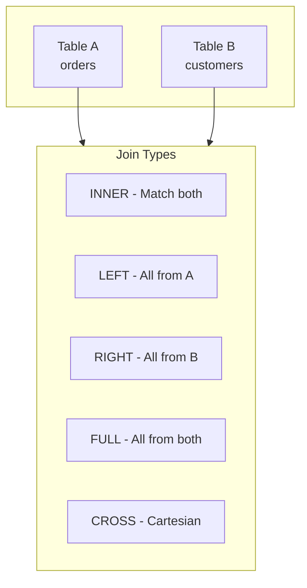

---
tags:
  - databricks
  - sql
  - fundamentals
aliases:
  - SQL Essentials
---

# SQL Essentials

This guide covers essential SQL concepts for working with Databricks SQL and Spark SQL. These fundamentals are particularly important for the Data Analyst Associate certification.

## Databricks SQL Overview

Databricks SQL (DB SQL) provides:

- SQL-native interface for analytics
- SQL Warehouses (serverless compute)
- Dashboards and visualizations
- Query history and profiling
- Integration with BI tools

## Basic Queries

### SELECT Statement

```sql
-- Basic select
SELECT * FROM catalog.schema.table;

-- Select specific columns
SELECT customer_id, name, email
FROM prod.silver.customers;

-- With alias
SELECT
  customer_id AS id,
  UPPER(name) AS customer_name
FROM prod.silver.customers;

-- Limit results
SELECT * FROM prod.silver.orders LIMIT 100;
```

### Filtering with WHERE

```sql
-- Basic filter
SELECT * FROM prod.silver.orders
WHERE status = 'completed';

-- Multiple conditions
SELECT * FROM prod.silver.orders
WHERE status = 'completed'
  AND amount > 100
  AND order_date >= '2025-01-01';

-- IN clause
SELECT * FROM prod.silver.orders
WHERE status IN ('pending', 'processing', 'shipped');

-- BETWEEN
SELECT * FROM prod.silver.orders
WHERE amount BETWEEN 100 AND 500;

-- LIKE pattern matching
SELECT * FROM prod.silver.customers
WHERE email LIKE '%@gmail.com';

-- NULL handling
SELECT * FROM prod.silver.customers
WHERE phone IS NULL;

SELECT * FROM prod.silver.customers
WHERE phone IS NOT NULL;
```

### Sorting with ORDER BY

```sql
-- Ascending (default)
SELECT * FROM prod.silver.orders
ORDER BY order_date;

-- Descending
SELECT * FROM prod.silver.orders
ORDER BY amount DESC;

-- Multiple columns
SELECT * FROM prod.silver.orders
ORDER BY customer_id ASC, order_date DESC;

-- NULL handling in sort
SELECT * FROM prod.silver.orders
ORDER BY ship_date NULLS LAST;
```

## Aggregations

### Basic Aggregations

```sql
-- Count
SELECT COUNT(*) AS total_orders FROM prod.silver.orders;
SELECT COUNT(DISTINCT customer_id) AS unique_customers FROM prod.silver.orders;

-- Sum
SELECT SUM(amount) AS total_revenue FROM prod.silver.orders;

-- Average
SELECT AVG(amount) AS avg_order_value FROM prod.silver.orders;

-- Min/Max
SELECT
  MIN(amount) AS min_order,
  MAX(amount) AS max_order
FROM prod.silver.orders;
```

### GROUP BY

```sql
-- Basic grouping
SELECT
  status,
  COUNT(*) AS order_count,
  SUM(amount) AS total_amount
FROM prod.silver.orders
GROUP BY status;

-- Multiple grouping columns
SELECT
  YEAR(order_date) AS year,
  MONTH(order_date) AS month,
  COUNT(*) AS orders,
  SUM(amount) AS revenue
FROM prod.silver.orders
GROUP BY YEAR(order_date), MONTH(order_date)
ORDER BY year, month;

-- Group by expression
SELECT
  CASE
    WHEN amount < 100 THEN 'Small'
    WHEN amount < 500 THEN 'Medium'
    ELSE 'Large'
  END AS order_size,
  COUNT(*) AS count
FROM prod.silver.orders
GROUP BY 1;  -- Reference by position
```

### HAVING (Filter Aggregations)

```sql
-- Filter after aggregation
SELECT
  customer_id,
  COUNT(*) AS order_count,
  SUM(amount) AS total_spent
FROM prod.silver.orders
GROUP BY customer_id
HAVING COUNT(*) >= 5
  AND SUM(amount) > 1000
ORDER BY total_spent DESC;
```

## Joins

### Join Types



### Join Examples

```sql
-- INNER JOIN (only matching rows)
SELECT
  o.order_id,
  o.amount,
  c.name AS customer_name
FROM prod.silver.orders o
INNER JOIN prod.silver.customers c
  ON o.customer_id = c.customer_id;

-- LEFT JOIN (all orders, matching customers)
SELECT
  o.order_id,
  o.amount,
  c.name AS customer_name
FROM prod.silver.orders o
LEFT JOIN prod.silver.customers c
  ON o.customer_id = c.customer_id;

-- Multiple joins
SELECT
  o.order_id,
  c.name AS customer_name,
  p.product_name
FROM prod.silver.orders o
JOIN prod.silver.customers c ON o.customer_id = c.customer_id
JOIN prod.silver.products p ON o.product_id = p.product_id;

-- Self join
SELECT
  e.name AS employee,
  m.name AS manager
FROM prod.silver.employees e
LEFT JOIN prod.silver.employees m
  ON e.manager_id = m.employee_id;
```

## Subqueries and CTEs

### Subqueries

```sql
-- Subquery in WHERE
SELECT * FROM prod.silver.customers
WHERE customer_id IN (
  SELECT DISTINCT customer_id
  FROM prod.silver.orders
  WHERE amount > 1000
);

-- Subquery in FROM
SELECT
  dept,
  AVG(total_orders) AS avg_orders_per_customer
FROM (
  SELECT
    customer_id,
    department AS dept,
    COUNT(*) AS total_orders
  FROM prod.silver.orders
  GROUP BY customer_id, department
) sub
GROUP BY dept;

-- Correlated subquery
SELECT
  c.customer_id,
  c.name,
  (SELECT COUNT(*) FROM prod.silver.orders o
   WHERE o.customer_id = c.customer_id) AS order_count
FROM prod.silver.customers c;
```

### CTEs (Common Table Expressions)

```sql
-- Single CTE
WITH customer_orders AS (
  SELECT
    customer_id,
    COUNT(*) AS order_count,
    SUM(amount) AS total_spent
  FROM prod.silver.orders
  GROUP BY customer_id
)
SELECT
  c.name,
  co.order_count,
  co.total_spent
FROM prod.silver.customers c
JOIN customer_orders co ON c.customer_id = co.customer_id
WHERE co.total_spent > 5000;

-- Multiple CTEs
WITH
monthly_sales AS (
  SELECT
    DATE_TRUNC('month', order_date) AS month,
    SUM(amount) AS revenue
  FROM prod.silver.orders
  GROUP BY 1
),
monthly_growth AS (
  SELECT
    month,
    revenue,
    LAG(revenue) OVER (ORDER BY month) AS prev_revenue
  FROM monthly_sales
)
SELECT
  month,
  revenue,
  prev_revenue,
  ROUND((revenue - prev_revenue) / prev_revenue * 100, 2) AS growth_pct
FROM monthly_growth;
```

## Window Functions

### Syntax

```sql
function(column) OVER (
  [PARTITION BY partition_column]
  [ORDER BY order_column]
  [ROWS/RANGE frame_specification]
)
```

### Ranking Functions

```sql
-- ROW_NUMBER: Unique sequential number
SELECT
  customer_id,
  order_date,
  amount,
  ROW_NUMBER() OVER (
    PARTITION BY customer_id
    ORDER BY order_date DESC
  ) AS order_rank
FROM prod.silver.orders;

-- RANK: Same rank for ties, gaps in sequence
SELECT
  customer_id,
  total_spent,
  RANK() OVER (ORDER BY total_spent DESC) AS rank
FROM prod.gold.customer_metrics;

-- DENSE_RANK: Same rank for ties, no gaps
SELECT
  customer_id,
  total_spent,
  DENSE_RANK() OVER (ORDER BY total_spent DESC) AS dense_rank
FROM prod.gold.customer_metrics;

-- NTILE: Divide into buckets
SELECT
  customer_id,
  total_spent,
  NTILE(4) OVER (ORDER BY total_spent DESC) AS quartile
FROM prod.gold.customer_metrics;
```

### Analytic Functions

```sql
-- LAG: Previous row value
SELECT
  order_date,
  amount,
  LAG(amount, 1) OVER (ORDER BY order_date) AS prev_amount
FROM prod.silver.orders;

-- LEAD: Next row value
SELECT
  order_date,
  amount,
  LEAD(amount, 1) OVER (ORDER BY order_date) AS next_amount
FROM prod.silver.orders;

-- Running total
SELECT
  order_date,
  amount,
  SUM(amount) OVER (
    ORDER BY order_date
    ROWS BETWEEN UNBOUNDED PRECEDING AND CURRENT ROW
  ) AS running_total
FROM prod.silver.orders;

-- Moving average
SELECT
  order_date,
  amount,
  AVG(amount) OVER (
    ORDER BY order_date
    ROWS BETWEEN 6 PRECEDING AND CURRENT ROW
  ) AS moving_avg_7day
FROM prod.silver.orders;
```

## Date Functions

```sql
-- Current date/time
SELECT CURRENT_DATE();
SELECT CURRENT_TIMESTAMP();

-- Extract parts
SELECT
  order_date,
  YEAR(order_date) AS year,
  MONTH(order_date) AS month,
  DAY(order_date) AS day,
  DAYOFWEEK(order_date) AS dow,
  QUARTER(order_date) AS quarter
FROM prod.silver.orders;

-- Date arithmetic
SELECT
  order_date,
  DATE_ADD(order_date, 30) AS plus_30_days,
  DATE_SUB(order_date, 7) AS minus_7_days,
  DATEDIFF(CURRENT_DATE(), order_date) AS days_ago
FROM prod.silver.orders;

-- Truncate to period
SELECT
  DATE_TRUNC('month', order_date) AS month_start,
  DATE_TRUNC('quarter', order_date) AS quarter_start,
  DATE_TRUNC('year', order_date) AS year_start
FROM prod.silver.orders;

-- Format dates
SELECT
  DATE_FORMAT(order_date, 'yyyy-MM-dd') AS formatted,
  DATE_FORMAT(order_date, 'MMMM dd, yyyy') AS long_format
FROM prod.silver.orders;

-- Parse strings to dates
SELECT TO_DATE('2025-01-15', 'yyyy-MM-dd');
SELECT TO_TIMESTAMP('2025-01-15 10:30:00', 'yyyy-MM-dd HH:mm:ss');
```

## String Functions

```sql
-- Case conversion
SELECT
  UPPER(name),
  LOWER(email),
  INITCAP(name)
FROM prod.silver.customers;

-- Concatenation
SELECT CONCAT(first_name, ' ', last_name) AS full_name;
SELECT first_name || ' ' || last_name AS full_name;

-- Substring
SELECT
  SUBSTRING(phone, 1, 3) AS area_code,
  LEFT(name, 1) AS initial,
  RIGHT(email, 10) AS email_end
FROM prod.silver.customers;

-- Trim
SELECT
  TRIM(name),
  LTRIM(name),
  RTRIM(name)
FROM prod.silver.customers;

-- Replace
SELECT REPLACE(phone, '-', '') AS clean_phone;

-- Split and array
SELECT
  SPLIT(email, '@')[0] AS username,
  SPLIT(email, '@')[1] AS domain
FROM prod.silver.customers;

-- Length
SELECT LENGTH(name) AS name_length;

-- Pattern matching
SELECT * FROM prod.silver.customers
WHERE REGEXP_LIKE(email, '^[a-z]+@');
```

## Conditional Logic

```sql
-- CASE expression
SELECT
  order_id,
  amount,
  CASE
    WHEN amount < 100 THEN 'Small'
    WHEN amount < 500 THEN 'Medium'
    WHEN amount < 1000 THEN 'Large'
    ELSE 'Enterprise'
  END AS order_tier
FROM prod.silver.orders;

-- COALESCE (first non-null)
SELECT COALESCE(phone, email, 'No contact') AS contact;

-- NULLIF (returns null if equal)
SELECT NULLIF(status, 'unknown') AS status;

-- IF function
SELECT IF(amount > 100, 'Large', 'Small') AS size;

-- IIF (same as IF)
SELECT IIF(amount > 100, 'Large', 'Small') AS size;
```

## Creating Objects

### Tables

```sql
-- Create table with schema
CREATE TABLE prod.silver.customers (
  customer_id INT,
  name STRING,
  email STRING,
  created_at TIMESTAMP
)
USING DELTA;

-- Create from query
CREATE TABLE prod.gold.daily_sales AS
SELECT
  DATE_TRUNC('day', order_date) AS date,
  SUM(amount) AS revenue
FROM prod.silver.orders
GROUP BY 1;

-- Create or replace
CREATE OR REPLACE TABLE prod.gold.customer_metrics AS
SELECT * FROM customer_aggregation_query;
```

### Views

```sql
-- Standard view
CREATE VIEW prod.gold.active_customers AS
SELECT * FROM prod.silver.customers
WHERE status = 'active';

-- Replace existing
CREATE OR REPLACE VIEW prod.gold.active_customers AS
SELECT * FROM prod.silver.customers
WHERE status = 'active';
```

## Use Cases

| SQL Feature      | Use Case                                     |
| ---------------- | -------------------------------------------- |
| CTEs             | Breaking complex queries into readable parts |
| Window Functions | Rankings, running totals, period comparisons |
| Joins            | Combining data from multiple tables          |
| Aggregations     | Summary statistics, metrics                  |
| Date Functions   | Time-based analysis                          |

## Common Issues

| Issue                   | Cause           | Solution                       |
| ----------------------- | --------------- | ------------------------------ |
| `Column not found`      | Typo or wrong table | Check column names with DESCRIBE |
| Slow query              | Full table scan | Add filters, check query plan  |
| Wrong results from JOIN | Duplicate keys  | Verify join keys, add DISTINCT |
| NULL in aggregation     | NULLs excluded  | Use COALESCE or filter NULLs   |

## Practice Questions

### Question 1: Window Functions

**Question**: Which window function assigns a unique sequential number to rows within a partition, with no gaps even for ties?

A) `RANK()`
B) `DENSE_RANK()`
C) `ROW_NUMBER()`
D) `NTILE()`

> [!success]- Answer
> **Correct Answer: C**
>
> `ROW_NUMBER()` assigns a unique sequential integer to each row within a partition, with no gaps or duplicates. `RANK()` can produce gaps (e.g., 1, 2, 2, 4), `DENSE_RANK()` has no gaps but allows ties (e.g., 1, 2, 2, 3), and `NTILE()` divides rows into buckets.

---

### Question 2: CTEs

**Question**: What is the scope of a Common Table Expression (CTE) defined with the `WITH` clause?

A) The entire session until the connection is closed
B) Only the single SQL statement that immediately follows it
C) All queries in the current notebook cell
D) The CTE persists until explicitly dropped

> [!success]- Answer
> **Correct Answer: B**
>
> A CTE defined with `WITH` is scoped to the single SELECT, INSERT, UPDATE, or DELETE statement that immediately follows it. It does not persist beyond that statement and cannot be referenced by subsequent queries.

---

### Question 3: MERGE Statement

**Question**: Which clause in a MERGE statement handles records that exist in the target table but not in the source?

A) `WHEN MATCHED THEN UPDATE`
B) `WHEN NOT MATCHED THEN INSERT`
C) `WHEN NOT MATCHED BY SOURCE THEN DELETE`
D) `WHEN NOT MATCHED BY TARGET THEN INSERT`

> [!success]- Answer
> **Correct Answer: C**
>
> `WHEN NOT MATCHED BY SOURCE` matches rows in the target that have no corresponding row in the source. This is commonly used to DELETE or UPDATE records that are no longer present in the source data. `WHEN NOT MATCHED` (or `WHEN NOT MATCHED BY TARGET`) handles rows in the source not in the target.

---

### Question 4: COALESCE Function

**Question**: What does `SELECT COALESCE(NULL, NULL, 'default', 'other')` return?

A) `NULL`
B) `'default'`
C) `'other'`
D) An error

> [!success]- Answer
> **Correct Answer: B**
>
> `COALESCE` returns the first non-NULL argument from its list. It evaluates arguments left to right: `NULL`, `NULL`, `'default'` (first non-NULL, returned). The `'other'` value is never evaluated.

## Referenced By

- [Data Engineer Associate](../../certifications/data-engineer-associate/README.md)
- [Data Analyst Associate](../../certifications/data-analyst-associate/README.md)

## Related Topics

- [Spark Fundamentals](spark-fundamentals.md)
- [Delta Lake Basics](delta-lake-basics.md)
- [Unity Catalog Basics](unity-catalog-basics.md)

## Official Documentation

- [Databricks SQL Reference](https://docs.databricks.com/sql/language-manual/index.html)
- [SQL Functions](https://docs.databricks.com/sql/language-manual/sql-ref-functions.html)
- [Databricks SQL Best Practices](https://docs.databricks.com/sql/admin/best-practices.html)
